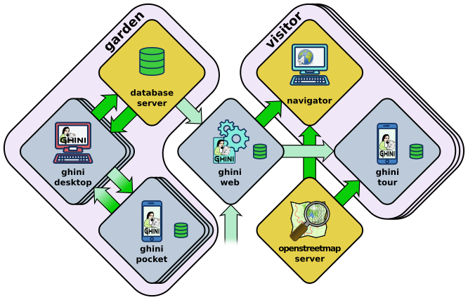
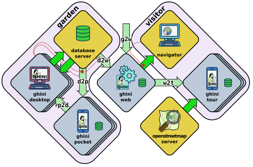

Developer's Manual
========================

Helping Ghini development
--------------------------

Installing Ghini always includes downloading the sources, connected to the
github repository. This is so because in our eyes, every user is always
potentially also a developer.

If you want to contribute to Ghini, you can do so in quite a few different ways:

 * Use the software, note the things you don't like, `open an issue
   <http://github.com/Ghini/ghini.desktop/issues/new>`_ for each of them. A
   developer will react sooner than you can imagine.
 * If you have an idea of what you miss in the software but can't quite
   formalize it into separate issues, you could consider hiring a
   professional. This is the best way to make sure that something happens
   quickly on Ghini. Do make sure the developer opens issues and publishes
   their contribution on github.
 * Translate! Any help with translations will be welcome, so please do! you
   can do this without installing anything on your computer, just using the
   on-line translation service offered by http://hosted.weblate.org/
 * fork the respository, choose an issue, solve it, open a pull request. See
   the `bug solving workflow`_ below.

If you haven't yet installed Ghini, and want to have a look at its code
history, you can open our `github project page
<http://github.com/Ghini/ghini.desktop>`_ and see all that has been going on
around Ghini since its inception as Bauble, back in the year 2004.

Software source, versions, branches
-------------------------------------------------------------

If you want a particular version of Ghini, we release and maintain versions
as branches. You should ``git checkout`` the branch corresponding to the
version of your choice.

production line
^^^^^^^^^^^^^^^^^^^^^^^^^^^^^^^^^^^^^^^^^^^^^^^^^^

Branch names for Ghini stable (production) versions are of the form
``ghini-x.y`` (eg: ghini-3.1); branch names where Ghini testing versions are
published are of the form ``ghini-x.y-dev`` (eg: ghini-3.1-dev).

Development Workflow
-------------------------------------------------------------

Our workflow is to continuously commit to the testing branch, to often push
them to github, to let travis-ci and coveralls.io check the quality of the
pushed testing branches, finally, from time to time, to merge the testing
branch into the corresponding release.

When working at larger issues, which seem to take longer than a couple of
days, I might open a branch associated to the issue. I don't do this very
often.

larger issues
^^^^^^^^^^^^^^^^^^^^^^^^^^^^^^^^^^^^^^^^^^^^^^^^^^

When facing a single larger issue, create a branch tag at the tip of a main
development line (e.g.: ``ghini-3.1-dev``), and follow the workflow
described at

https://git-scm.com/book/en/v2/Git-Branching-Basic-Branching-and-Merging

in short::

    git up
    git checkout -b issue-xxxx
    git push origin issue-xxxx

Work on the new temporary branch. When ready, go to github, merge the branch
with the main development line from which you branched, solve conflicts
where necessary, delete the temporary branch.

When ready for publication, merge the development line into the
corresponding production line.

Commit message convention
^^^^^^^^^^^^^^^^^^^^^^^^^^^^^^^^^^^^^^^^^^^^^^^^^^

We follow the `Conventional Commits <https://www.conventionalcommits.org/>`_
specification. Commit messages should be of the form::

    type(scope): short description

The ``scope`` is optional and indicates the part of the codebase affected,
for example ``fix(search):``, ``test(garden):``, ``build(docker):``.
Common scopes include: ``search``, ``garden``, ``plants``, ``gui``,
``db``, ``imex``, ``report``, ``docker``, ``deps``.

Types in use:

============  ========  =====================================================
type          standard  description
============  ========  =====================================================
``fix``       ✓         bug fix
``feat``      ✓         new feature
``refactor``  ✓         code change with no functional impact
``test``      ✓         adding or updating tests
``docs``      ✓         documentation only
``build``     ✓         build system or dependency changes
``chore``     ✓         maintenance work with no functional impact
``dev``                 development environment configuration (vscode, etc.)
``tools``               development scripts and utilities
``merge``               explicit merge commits
============  ========  =====================================================

Updating the set of translatable strings
-------------------------------------------------------------

From time to time, during the process of updating the software, you will be
adding or modifying strings in the python sources, in the documentation, in
the glade sources. Most of our strings are translatable, and are offered to
weblate for people to contribute, in the form of several ``.po`` files.

A ``po`` is mostly composed of pairs of text portions, original and
translation, and is specific to a target language. When a translator adds a
translation on weblate, this reaches our repository on github. When a
programmer adds a string to the software, this reaches weblate as "to be
translated".

Weblate hosts the `Ghini <https://hosted.weblate.org/projects/ghini/>`_
project. Within this project we have components, each of which corresponds
to a branch of a repository on github. Each component accepts translations
in several languages.

================== =========================== ==================
component          repository                  branch
================== =========================== ==================
Desktop 1.0        ghini.desktop               ghini-1.0-dev
Desktop 3.1        ghini.desktop               ghini-3.1-dev
Documentation 1.0  ghini.desktop-docs.i18n     ghini-1.0-dev
Documentation 3.1  ghini.desktop-docs.i18n     ghini-3.1-dev
Web 1.2            ghini.web                   master
Pocket             ghini.pocket                master
================== =========================== ==================

To update the ``po`` files relative to the *software*, you set the working
directory to the root of your checkout of *ghini.desktop*, and you run the
script::

  ./scripts/i18n.sh

To update the ``po`` files relative to the *documentation*, you set the
working directory to the root of your checkout of *ghini.desktop-docs.i18n*,
and you run the script::

  ./doc/runme.sh

When you run either of the above mentioned scripts, chances are you need to
commit *all* ``po`` files in the project. You may want to review the changes
before committing them to the respository. This is most important when you
perform a marginal correction to a string, like removing a typo.

Something that happens: running into a conflict. Solving conflicts is not
difficult once you know how to do that. First of all, add weblate as remote::

  git remote add weblate-doc10 https://hosted.weblate.org/git/ghini/documentation-10/

Then make sure we are in the correct repository, on the correct branch,
update the remote, merge with it::

  git checkout ghini-3.1-dev
  git remote update
  git merge weblate-doc10/ghini-3.1-dev

`Our documentation <https://readthedocs.org/projects/ghini/>`_ on
readthedocs has an original English version, and several translations. We
just follow the `description of localisation
<http://docs.readthedocs.io/en/latest/localization.html>`_, there's nothing
that we invented ourselves here.

Readthedocs checks the project's *Language* setting, and invokes
``sphinx-intl`` to produce the formatted documentation in the target
language. With the default configuration —which we did not alter—
``sphinx-intl`` expects one ``po`` file per source document, named as the
source document, and that they all reside in the directory
``local/$(LANG)/LC_MESSAGES/``.

On the other hand, Weblate (and ourselves) prefers a single ``po`` file per
language, and keeps them all in the same ``/po`` directory, just as we do
for the software project: ``/po/$(LANG).po``.

In order not to repeat information, and to let both systems work their
natural way, we have two sets of symbolic links (git honors them).

To summarise: when a file in the documentation is updated, the ``runme.sh``
script will:

1. copy the ``rst`` files from the software to the documentation;
2. create a new ``pot`` file for each of the documentation files;
3. merge all ``pot`` files into one ``doc.pot``;
4. use the updated ``doc.pot`` to update all ``doc.po`` files (one per language);
5. create all symbolic links:
      
   a. those expected by ``sphinx-intl`` in ``/local/$(LANG)/LC_MESSAGES/``
   b. those used by weblate in ``/po/$(LANG).po``

We could definitely write the above in a Makefile, or even better include it
in ``/doc/Makefile``. Who knows, maybe we will do that.

Producing the docs locally
------------------------------------------------

The above description is about how we help external sites produce our
documentation so that it is online for all to see.  But what if you want to
have the documentation locally, for example if you want to edit and review
before pushing your commits to the cloud?

In order to run sphinx locally, you need to install it **within** the same
virtual environment as ghini, and to install it there, you need to have a
sphinx version whose dependencies don not conflict with ghini.desktop's
dependecies.

What we do to keep this in order?

We state this extra dependency in the ``setup.py`` file, as an
``extras_require`` entry.  Create and activate the virtual environment, then
run ``easy_install ghini.desktop[docs]``.  This gets you the sphinx version
as declared in the ``setup.py`` file.

If all you want is the html documentation built locally, run ``./setup.py
install docs``.  For more options, enter the ``doc`` directory and run
``make``.

Which way do the translated strings reach our users?
-------------------------------------------------------

A new translator asked the question, adding: »Is this an automated process
from Weblate --> GIT --> Ghini Desktop installed on users computers, or does
this require manual steps?

The aswer is that the whole interaction is quite complex, and it depends on
the component.

When it comes to ``ghini.desktop``, when you do a global installation, you
don't know which language your users will set up their environment, and a
user can change the language configuration any time.  So what we do is to
install the software in English together with a translation table from
English to whatever else, in particular Italian or Hungarian. Then the GUI
libraries (Android or GTK) know where to look for the translation strings.
These translation tables are generated during the installation or upgrade
process, based on the strings you see on Weblate.

Before any of the above gets activated, the path followed by your
translations is as you describe: Weblate pushes the strings to github,
directly into the development line `ghini-3.1-dev`; I see them, if I
understand at least the structure of that language I review them, maybe I
look them up in wikipedia or get them translated back to Italian, Spanish or
English by some automatic translation service; sometimes I need to solve
conflicts arising because of changed context, not too often fortunately;
from time to time I publish the development line `ghini-3.1-dev` to the
production line `ghini-3.1`, and this is the moment when the new
translations finally make it to the distributed software.

users will notice a `new version available` warning and can decide to ignore
it, or to update.

For ``ghini.pocket``, there is no notification to end users, since we're not
yet using the google app store.

For ``ghini.web``, we haven't yet defined how to distribute it.

For ghini's documentation, it's completely automatic, and all is handled by
readthedocs.org.

Adding missing unit tests
-------------------------------------------------------------

If you are interested contributing to development of Ghini, a good way to
do so would be by helping us finding and writing the missing unit tests.

A well tested function is one whose behaviour you cannot change without
breaking at least one unit test.

We all agree that in theory theory and practice match perfectly and that one
first writes the tests, then implements the function. In practice, however,
practice does not match theory and we have been writing tests after writing
and even publishing the functions.

This section describes the process of adding unit tests for
``bauble.plugins.plants.family.remove_callback``.

What to test
^^^^^^^^^^^^^^^^^^^^^^^^^^^^^^^^^^^^^^^^^^^^^^^^^^

First of all, open the coverage report index, and choose a file with low
coverage.

For this example, run in October 2015, we landed on
``bauble.plugins.plants.family``, at 33%.

https://coveralls.io/builds/3741152/source?filename=bauble%2Fplugins%2Fplants%2Ffamily.py

The first two functions which need tests, ``edit_callback`` and
``add_genera_callback``, include creation and activation of an object
relying on a custom dialog box. We should really first write unit tests for
that class, then come back here.

The next function, ``remove_callback``, also activates a couple of dialog
and message boxes, but in the form of invoking a function requesting user
input via yes-no-ok boxes. These functions we can easily replace with a
function mocking the behaviour.

how to test
^^^^^^^^^^^^^^^^^^^^^^^^^^^^^^^^^^^^^^^^^^^^^^^^^^

So, having decided what to describe in unit test, we look at the code and we
see it needs discriminate a couple of cases:

**parameter correctness**
  * the list of families has no elements.
  * the list of families has more than one element.
  * the list of families has exactly one element.

**cascade**
  * the family has no genera
  * the family has one or more genera

**confirm**
  * the user confirms deletion
  * the user does not confirm deletion

**deleting**
  * all goes well when deleting the family
  * there is some error while deleting the family

I decide I will only focus on the **cascade** and the **confirm**
aspects. Two binary questions: 4 cases.

where to put the tests
^^^^^^^^^^^^^^^^^^^^^^^^^^^^^^^^^^^^^^^^^^^^^^^^^^

Test class names must start with ``Test`` to be collected by pytest.

Locate the test script and choose the class where to put the extra unit tests.

https://coveralls.io/builds/3741152/source?filename=bauble%2Fplugins%2Fplants%2Ftest.py#L273

.. admonition:: what about skipped tests
   :class: note

           The ``TestFamily`` class contains a skipped test, implementing
           it will be quite a bit of work because we need rewrite the
           FamilyEditorPresenter, separate it from the FamilyEditorView and
           reconsider what to do with the FamilyEditor class, which I think
           should be removed and replaced with a single function.

writing the tests
^^^^^^^^^^^^^^^^^^^^^^^^^^^^^^^^^^^^^^^^^^^^^^^^^^

After the last test in the TestFamily class, I add the four cases I want to
describe, and I make sure they fail, and since I'm lazy, I write the most
compact code I know for generating an error::

        def test_remove_callback_no_genera_no_confirm(self):
            1/0

        def test_remove_callback_no_genera_confirm(self):
            1/0

        def test_remove_callback_with_genera_no_confirm(self):
            1/0

        def test_remove_callback_with_genera_confirm(self):
            1/0

One test, step by step
^^^^^^^^^^^^^^^^^^^^^^^^^^^^^^^^^^^^^^^^^^^^^^^^^^

Let's start with the first test case.

When writing tests, I generally follow the pattern: 

* T₀ (initial condition), 
* action, 
* T₁ (testing the result of the action given the initial conditions)

.. admonition:: what's in a name — unit tests
   :class: note
        
           There's a reason why unit tests are called unit tests. Please
           never test two actions in one test.

So let's describe T₀ for the first test, a database holding a family without
genera::

        def test_remove_callback_no_genera_no_confirm(self):
            f5 = Family(family=u'Arecaceae')
            self.session.add(f5)
            self.session.flush()

We do not want the function being tested to invoke the interactive
``utils.yes_no_dialog`` function, we want ``remove_callback`` to invoke a
non-interactive replacement function. We achieve this simply by making
``utils.yes_no_dialog`` point to a ``lambda`` expression which, like the
original interactive function, accepts one parameter and returns a
boolean. In this case: ``False``::

        def test_remove_callback_no_genera_no_confirm(self):
            # T_0
            f5 = Family(family=u'Arecaceae')
            self.session.add(f5)
            self.session.flush()

            # action
            utils.yes_no_dialog = lambda x: False
            from bauble.plugins.plants.family import remove_callback
            remove_callback(f5)

Next we test the result.

Well, we don't just want to test whether or not the object Arecaceae was
deleted, we also should test the value returned by ``remove_callback``, and
whether ``yes_no_dialog`` and ``message_details_dialog`` were invoked or
not.

A ``lambda`` expression is not enough for this. We do something apparently
more complex, which will make life a lot easier.

Let's first define a rather generic function::

    def mockfunc(msg=None, name=None, caller=None, result=None):
        caller.invoked.append((name, msg))
        return result

and we grab ``partial`` from the ``functools`` standard module, to partially
apply the above ``mockfunc``, leaving only ``msg`` unspecified, and use this
partial application, which is a function accepting one parameter and
returning a value, to replace the two functions in ``utils``. The test
function now looks like this::

    def test_remove_callback_no_genera_no_confirm(self):
        # T_0
        f5 = Family(family=u'Arecaceae')
        self.session.add(f5)
        self.session.flush()
        self.invoked = []

        # action
        utils.yes_no_dialog = partial(
            mockfunc, name='yes_no_dialog', caller=self, result=False)
        utils.message_details_dialog = partial(
            mockfunc, name='message_details_dialog', caller=self)
        from bauble.plugins.plants.family import remove_callback
        result = remove_callback([f5])
        self.session.flush()

The test section checks that ``message_details_dialog`` was not invoked,
that ``yes_no_dialog`` was invoked, with the correct message parameter, that
Arecaceae is still there::

        # effect
        self.assertFalse('message_details_dialog' in
                         [f for (f, m) in self.invoked])
        self.assertTrue(('yes_no_dialog', u'Are you sure you want to '
                         'remove the family <i>Arecaceae</i>?')
                        in self.invoked)
        self.assertEquals(result, None)
        q = self.session.query(Family).filter_by(family=u"Arecaceae")
        matching = q.all()
        self.assertEquals(matching, [f5])

And so on
^^^^^^^^^^^^^^^^^^^^^^^^^^^^^^^^^^^^^^^^^^^^^^^^^^

    `there are two kinds of people, those who complete what they start, and
    so on`

Next test is almost the same, with the difference that the
``utils.yes_no_dialog`` should return ``True`` (this we achieve by
specifying ``result=True`` in the partial application of the generic
``mockfunc``). 

With this action, the value returned by ``remove_callback`` should be
``True``, and there should be no Arecaceae Family in the database any more::

    def test_remove_callback_no_genera_confirm(self):
        # T_0
        f5 = Family(family=u'Arecaceae')
        self.session.add(f5)
        self.session.flush()
        self.invoked = []

        # action
        utils.yes_no_dialog = partial(
            mockfunc, name='yes_no_dialog', caller=self, result=True)
        utils.message_details_dialog = partial(
            mockfunc, name='message_details_dialog', caller=self)
        from bauble.plugins.plants.family import remove_callback
        result = remove_callback([f5])
        self.session.flush()

        # effect
        self.assertFalse('message_details_dialog' in
                         [f for (f, m) in self.invoked])
        self.assertTrue(('yes_no_dialog', u'Are you sure you want to '
                         'remove the family <i>Arecaceae</i>?')
                        in self.invoked)
        self.assertEquals(result, True)
        q = self.session.query(Family).filter_by(family=u"Arecaceae")
        matching = q.all()
        self.assertEquals(matching, [])

have a look at commit 734f5bb9feffc2f4bd22578fcee1802c8682ca83 for the other
two test functions.

Testing logging
^^^^^^^^^^^^^^^^^^^^^^^^^^^^^^^^^^^^^^^^^^^^^^^^^^

Our ``bauble.test.BaubleTestCase`` objects use handlers of the class
``bauble.test.MockLoggingHandler``.  Every time an individual unit test is
started, the ``setUp`` method will create a new ``handler`` and associate it
to the root logger.  The ``tearDown`` method takes care of removing it.

You can check for presence of specific logging messages in
``self.handler.messages``. ``messages`` is a dictionary, initially empty,
with two levels of indexation. First the name of the logger issuing the
logging record, then the name of the level of the logging record. Keys are
created when needed. Values hold lists of messages, formatted according to
whatever formatter you associate to the handler, defaulting to
``logging.Formatter("%(message)s")``.

You can explicitly empty the collected messages by invoking
``self.handler.clear()``.

Putting all together
^^^^^^^^^^^^^^^^^^^^^^^^^^^^^^^^^^^^^^^^^^^^^^^^^^

From time to time you want to activate the test class you're working at::

    nosetests bauble/plugins/plants/test.py:TestFamily

And at the end of the process you want to update the statistics::

    ./scripts/update-coverage.sh

Structure of user interface
------------------------------------

The user interface is built according to the **Model** — **View** —
**Presenter** architectural pattern.  For much of the interface, **Model**
is a SQLAlchemy database object, but we also have interface elements where
there is no corresponding database model.  In general:

* The **View** is described as part of a **glade** file. This should include
  the signal-callback and ListStore-TreeView associations. Just reuse the
  base class ``GenericEditorView`` defined in ``bauble.editor``. When you
  create your instance of this generic class, pass it the **glade** file
  name and the root widget name, then hand this instance over to the
  **presenter** constructor.

  In the glade file, in the ``action-widgets`` section closing your
  GtkDialog object description, make sure every ``action-widget`` element
  has a valid ``response`` value.  Use `valid GtkResponseType values
  <http://gtk.php.net/manual/en/html/gtk/gtk.enum.responsetype.html>`_, for
  example:

  * GTK_RESPONSE_OK, -5
  * GTK_RESPONSE_CANCEL, -6
  * GTK_RESPONSE_YES, -8
  * GTK_RESPONSE_NO, -9

  There is no easy way to unit test a subclassed view, so please don't
  subclass views, there's really no need to.

  In the glade file, every input widget should define which handler is
  activated on which signal.  The generic Presenter class offers generic
  callbacks which cover the most common cases.

  * GtkEntry (one-line text entry) will handle the ``changed`` signal, with
    either ``on_text_entry_changed`` or ``on_unique_text_entry_changed``.
  * GtkTextView: associate it to a GtkTextBuffer. To handle the ``changed``
    signal on the GtkTextBuffer, we have to define a handler which invokes
    the generic ``on_textbuffer_changed``, the only role for this function
    is to pass our generic handler the name of the model attribute that
    receives the change. This is a workaroud for an `unresolved bug in GTK
    <http://stackoverflow.com/questions/32106765/>`_.
  * GtkComboBox with translated texts can't be easily handled from the glade
    file, so we don't even try.  Use the ``init_translatable_combo`` method
    of the generic ``GenericEditorView`` class, but please invoke it from
    the **presenter**.

* The **Model** is just an object with known attributes. In this
  interaction, the **model** is just a passive data container, it does
  nothing more than to let the **presenter** modify it.

* The subclassed **Presenter** defines and implements:

  * ``widget_to_field_map``, a dictionary associating widget names to name
    of model attributes,
  * ``view_accept_buttons``, the list of widget names which, if
    activated by the user, mean that the view should be closed,
  * all needed callbacks,
  * optionally, it plays the **model** role, too.

  The **presenter** continuously updates the **model** according to changes
  in the **view**. If the **model** corresponds to a database object, the
  **presenter** commits all **model** updates to the database when the
  **view** is closed successfully, or rolls them back if the **view** is
  canceled. (this behaviour is influenced by the parameter ``do_commit``)

  If the **model** is something else, then the **presenter** will do
  something else.

  .. note::
     
     A well behaved **presenter** uses the **view** api to query the values
     inserted by the user or to forcibly set widget statuses. Please do not
     learn from the practice of our misbehaving presenters, some of which
     directly handle fields of ``view.widgets``. By doing so, these
     presenters prevents us from writing unit tests.

The base class for the presenter, ``GenericEditorPresenter`` defined in
``bauble.editor``, implements many useful generic callbacks.  There is a
``MockView`` class, that you can use when writing tests for your presenters.

Examples
^^^^^^^^^^^^^

``Contact`` and ``ContactPresenter`` are implemented following the above
lines.  The view is defined in the ``contact.glade`` file.

A good example of Presenter/View pattern (no model) is given by the
connection manager.

We use the same architectural pattern for non-database interaction, by
setting the presenter also as model. We do this, for example, for the JSON
export dialog box. The following command will give you a list of
``GenericEditorView`` instantiations::

  grep -nHr -e GenericEditorView\( bauble

Data streams between software components
-----------------------------------------------

Let's start by recalling the composition of the Ghini family, as shown in the diagram:

When we first introduced the diagram, we did not explain the reason why
different arrows representing different data flows, had different colours:
some are deep green, some in a lighter tint.  If you suspected this bore a
meaning then you were quite right:

Deeper green streams are constant flows of data, representing the core
activity of a component, eg: the interaction between ghini.desktop and its
database server, or your internet browser and ghini.web.

Lighter green streams are import/export actions, initiated by the user at the
command panel of ghini.desktop, or in the ghini.tour settings page.

This is the same graph, in which all import data streams have been given an identifier.

.. list-table:: Stream role description
   :widths: 15 85
   :header-rows: 1
   :class: tight-table

   * - name
     - description
   * - **d2p**
     - This is ghini.desktop's :menuselection:`Tools-->Export-->export to
       pocket`.
   * - **p2d**
     - Import from the ghini.pocket log file and pictures into the central
       database.
   * - **d2w**
     - Offer a selection of your garden data to a central ghini.web site, so
       online virtual visitors can browse it.  This includes plant
       identification and their geographic location.
   * - **g2w**
     - Write geographic information about non-botanic data (ie: point of
       interest within the garden, required by ghini.tour) in the central
       ghini.web site.
   * - **w2t**
     - Importing locations and points of interest from ghini.web to tour.

We formally define all named streams, so our we know we are talking about.
Moreover, streams impacting the desktop and web databases require extra
thought and attention from your database manager.
   
Extending Ghini with Plugins
-----------------------------

Nearly everything about Ghini is extensible through plugins. Plugins
can create tables, define custom searchs, add menu items, create
custom commands and more.

To create a new plugin you must extend the ``bauble.pluginmgr.Plugin``
class.

The ``Tag`` plugin is a good minimal example, even if the ``TagItemGUI``
falls outside the Model-View-Presenter architectural pattern.

Plugins structure
-------------------------------------------------------------

Ghini is a framework for handling collections, and is distributed along
with a set of plugins making Ghini a botanical collection manager. But
Ghini stays a framework and you could in theory remove all plugins we
distribute and write your own, or write your own plugins that extend or
complete the current Ghini behaviour.

Once you have selected and opened a database connection, you land in the
Search window. The Search window is an interaction between two objects:
SearchPresenter (SP) and SearchView (SV).

SV is what you see, SP holds the program status and handles the requests you
express through SV. Handling these requests affect the content of SV and the
program status in SP.

The search results shown in the largest part of SV are rows, objects that
are instances of classes registered in a plugin.

Each of these classes must implement an amount of functions in order to
properly behave within the Ghini framework. The Ghini framework reserves
space to pluggable classes.

SP knows of all registered (plugged in) classes, they are stored in a
dictionary, associating a class to its plugin implementation.  SV has a slot
(a gtk.Box) where you can add elements. At any time, at most only one
element in the slot is visible.

A plugin defines one or more plugin classes. A plugin class plays the role
of a partial presenter (pP - plugin presenter) as it implement the callbacks
needed by the associated partial view fitting in the slot (pV - plugin
view), and the MVP pattern is completed by the parent presenter (SP), again
acting as model. To summarize and complete:

* SP acts as model,
* the pV partial view is defined in a glade file.
* the callbacks implemented by pP are referenced by the glade file.
* a context menu for the SP row,
* a children property.

when you register a plugin class, the SP:

* adds the pV in the slot and makes it non-visible.
* adds an instance of pP in the registered plugin classes.
* tells the pP that the SP is the model.
* connects all callbacks from pV to pP.

when an element in pV triggers an action in pP, the pP can forward the
action to SP and can request SP that it updates the model and refreshes the
view.

When the user selects a row in SP, SP hides everything in the pluggable slot
and shows only the single pV relative to the type of the selected row, and
asks the pP to refresh the pV with whatever is relative to the selected row.

Apart from setting the visibility of the various pV, nothing needs be
disabled nor removed: an invisible pV cannot trigger events!

bug solving workflow
--------------------

normal development workflow
^^^^^^^^^^^^^^^^^^^^^^^^^^^^^^

* while using the software, you notice a problem, or you get an idea of
  something that could be better, you think about it good enough in order to
  have a very clear idea of what it really is, that you noticed. you open an
  issue and describe the problem. someone might react with hints.
* you open the issues site and choose one you want to tackle.
* assign the issue to yourself, this way you are informing the world that
  you have the intention to work at it. someone might react with hints.
* optionally fork the repository in your account and preferably create a
  branch, clearly associated to the issue.
* write unit tests and commit them to your branch (please do not push
  failing unit tests to github, run ``nosetests`` locally first).
* write more unit tests (ideally, the tests form the complete description of
  the feature you are adding or correcting).
* make sure the feature you are adding or correcting is really completely
  described by the unit tests you wrote.
* make sure your unit tests are atomic, that is, that you test variations on
  changes along one single variable. do not give complex input to unit
  tests or tests that do not fit on one screen (25 lines of code).
* write the code that makes your tests succeed.
* update the i18n files (run ``./scripts/i18n.sh``).
* whenever possible, translate the new strings you put in code or glade
  files.
* when you change strings, please make sure that old translations get re-used.
* commit your changes.
* push to github.
* open a pull request.

publishing to production
^^^^^^^^^^^^^^^^^^^^^^^^^^^^^^^^^

"publishing" here really means one thing: merging ``ghini-x.y-dev`` into
``ghini-x.y`` and pushing a ``vx.y.z`` tag on the result.  That tag is
the single release event — everything downstream (PyPI, the Docker
image, and in perspective a Windows installer via NSIS) is triggered by
it, no separate manual action needed.  It's also the reference for
anyone who tracks source directly instead of installing a package —
checking out a tag *is* installing a release, as far as they're
concerned.

That makes the tag the one thing worth checking from a running
ghini.desktop to notice an update is available.  The in-app "update
available" check compares against the latest ``vx.y.z`` tag (e.g. via
the GitHub releases/tags API), the same source everything else in this
section is keyed off (just not yet — 2026-08-12).

Please use the ``publish.sh`` script, in the ``scripts`` directory.
This one merges ``ghini-x.y-dev`` into ``ghini-x.y``, tags the result,
pushes the tag, and then bumps ``ghini-x.y-dev``'s version files
forward to prepare for the *next* publish - with recognizable,
consistent commit and tag messages, and in the right order.  Once the
script finishes, you're done; each artifact's own workflow takes it
from there.

You can also do this by hand:

* merge ``ghini-x.y-dev`` into ``ghini-x.y`` and push it.  A pull
  request works fine, or you can do this from the CLI::

      git checkout ghini-3.1
      git merge ghini-3.1-dev
      git push

* **only after that merge is pushed**, tag the resulting commit on
  ``ghini-x.y`` as ``vx.y.z`` and push the tag::

      git checkout ghini-3.1
      git tag v3.1.<patch>
      git push origin v3.1.<patch>

  The order matters: tagging before the merge, or merging after tagging,
  or tagging on the ``ghini-3.1-dev`` branch, leaves the tag pointing at
  the wrong commit, and the build will report a dirty
  ``x.y.z.postN+g<hash>`` version instead of a clean release.  Tag the
  merge commit itself, once it's already on ``ghini-x.y``.

* once the tag is pushed, prepare ``ghini-x.y-dev`` for the next
  release::

      git checkout ghini-3.1-dev
      scripts/bump_version.py +
      git push

  don't skip this - without it, ``PUBLISHING`` (and the tag you'd push
  next time) stays stuck on the version you just released.

Either way, neither the script nor the by-hand steps build or upload
anything, all is programmed as automatic GitHub Actions.  These are
documented in the corresponding section in this documentation page.

Pushing the tag is what triggers every release artifact - nothing else
to do.  Currently that means:

* ``.github/workflows/publish-pypi.yml``: refuses to publish anything
  that isn't a clean ``x.y.z`` version, builds the sdist and wheel, and
  publishes to PyPI using `Trusted Publishing
  <https://docs.pypi.org/trusted-publishers/>`_ (no PyPI token is stored
  anywhere - PyPI verifies the GitHub Actions run directly).  A
  one-time setup step, done by whoever administers the PyPI project:
  add a Trusted Publisher entry on the project's PyPI "Publishing"
  settings page, pointing at this repo, the ``publish-pypi.yml``
  workflow file, and the ``pypi`` environment name used in that
  workflow.
* ``.github/workflows/docker-release.yml``: builds and pushes the
  release Docker image (see "distributing via Docker" below).
* A Windows installer via NSIS is not yet (2026-08-12) wired to the
  tag - the build itself still needs porting to Python 3 first (tracked
  separately).  Once it is, it should trigger off the same tag, the same
  way the two above already do.

Don't forget to tell the world about the new release: on `facebook
<https://www.facebook.com/bauble.thesoftware/>`_, the `google group
<https://groups.google.com/forum/#!forum/bauble>`_, in any relevant linkedin
group, and on `our web page <http://ghini.github.io/>`_.

your own fork
^^^^^^^^^^^^^^^^^^^^^^^^^^^^^^^^^^^^^^^^^^^^^^^^^^

If you want to keep your own fork of the project, keep in mind this is full
force work in progress, so staying up to date will require some effort from
your side.

The best way to keep your own fork is to focus on some specific issue, work
relatively quickly, often open pull requests for your work, make sure that
you get it accepted.  Just follow Ghini's coding style, write unit tests,
concise and abundant, and there should be no problem in having your work
included in Ghini's upstream.

If your fork got out of sync with Ghini's upstream: read, understand, follow
the github guides `configuring a remote for a fork
<https://help.github.com/articles/configuring-a-remote-for-a-fork/>`_ and
`syncing a fork <https://help.github.com/articles/syncing-a-fork/>`_.

closing step
^^^^^^^^^^^^^^^^^^^^^^^^^^^^

* review this workflow. consider this as a guideline, to yourself and to
  your colleagues. please help make it better and matching the practice.

distributing for windows
--------------------------

For building a Windows installer or executable you will need an installation of 
Windows.  The methods described here has been used successfully on Windows 7, 
8 and 10.  Windows Vista should also work but has not been tested.

In the remainder of this section we assume you're using a Windows
workstation.  We also assume assume you do not use it as your software
development platform.  All steps described here are very similar to the
steps for a normal Windows :ref:`installation`.

.. admonition:: py2exe will not work with eggs
   :class: toggle

   Building a Windows executable with py2exe requires packages **not** be 
   installed as eggs.  There are several methods to accomplish this, including:

   - Using pip to install.  The easiest method is to install into a virtual 
     environment that doesn't currently have any modules installed as eggs 
     using ``pip install .`` as described below.  If you do wish to install over 
     the top of an install with eggs (e.g. the environment created by 
     ``devinstall.bat``) you can try ``pip install -I .`` but your mileage 
     may vary. 

   - By adding::

       [easy_install]
       zip_ok = False

     to setup.cfg (or similarly ``zip_safe = False`` to ``setuptools.setup()`` 
     in ``setup.py``) you can use ``python setup.py install`` but you will need 
     to download and install `Microsoft Visual C++ Compiler for Python 2.7 
     <http://aka.ms/vcpython27>`_ to get any of the C extensions and will need 
     a fresh virtual environment with no dependent packages installed as eggs.

#. Download and install git, Python 2.7 and PyGTK as outlined in the generic
   :ref:`installation` instructions.

#. Additionally, download and install `NSIS v3 <http://nsis.sourceforge.net/Download>`_.

#. A **reboot** is recommended.

   .. admonition:: we have a script that automates the remaining steps
      :class: toggle

      A batch file is available that can complete the last few steps.  To use 
      it use this command::

         scripts\build_win.bat

      ``build_win.bat`` accepts 2 arguments:

      #. ``/e`` will produce an executable only, skipping the extra step of 
         building an installer, and will copy ``win_gtk.bat`` into place.

      #. A path to the location for the virtual environment to use. (defaults 
         to ``"%HOMEDRIVE%%HOMEPATH%"\.virtualenvs\ghi2exe``)

      e.g. to produce an executable only and use a virtual environment in 
      a folder beside where you have ghini.desktop you could execute 
      ``scripts\build_win.bat /e ..\ghi2exe``

#. Clone ghini.desktop to wherever you want to keep it (replace 
   ``<path-to-keep-ghini>`` with the path of your choice, e.g. ``Local\github\Ghini\``) 
   and checkout a production branch (``ghini-3.1`` is recommended as 
   used in the example).  To do this, open a command prompt and type these 
   commands::

      cd <path-to-keep-ghini>
      git clone https://github.com/Ghini/ghini.desktop.git
      cd ghini.desktop
      git checkout ghini-3.1

#. Install virtualenv, create a virtual environment and activate it.  With only 
   Python 2.7 on your system (where ``<path-to-venv>`` is the path to where you 
   wish to keep the virtual environment) use::

      pip install virtualenv
      virtualenv --system-site-packages <path-to-venv>
      call <path-to-venv>\Scripts\activate.bat

   On systems where Python 3 is also installed you may need to either call pip 
   and virtualenv with absolute paths e.g.  ``C:\Python27\Scripts\pip`` or use 
   the Python launcher e.g. ``py -2.7 -m pip`` (run ``python --version`` first 
   to check.  If you get anything other than version 2.7 you'll need to use one 
   of these methods.)

#. Install dependencies and ghini.desktop into the virtual environment::

      pip install psycopg2 Pygments py2exe_py2
      pip install .

#. Build the executable::

      python setup.py py2exe

   The ``dist`` folder will now contain a full working copy of the software in 
   a frozen, self contained state, that can be transferred however you like and 
   will work in place.  (e.g. placed on a USB flash drive for demonstration 
   purposes or copied manually to ``C:\Program Files`` with a shortcut created 
   on the desktop).  To start ghini.desktop double click ``ghini.exe`` in 
   explorer (or create a shortcut to it). If you have issues with the UI not 
   displaying correctly you need to run the script ``win_gtk.bat`` from the 
   ``dist`` folder to set up paths to the GTK components correctly.  (Running 
   ``build_win /e`` will place this script in the dist folder for you or you 
   can copy it from the ``scripts`` folder yourself.)  You will only need to 
   run this once each time the location of the folder changes.  Thereafter 
   ``ghini.exe`` will run as expected.

#. Build the installer::

      python setup.py nsis

   This should leave a file named ``ghini.desktop-<version>-setup.exe`` in the 
   ``scripts`` folder.  This is your Windows installer.

.. admonition:: about the installer
   :class: toggle

   -  Capable of single user or global installs.

   -  The in-app update check (see "publishing to production" above)
      isn't wired up for an installer built this way yet - just not
      yet, 2026-08-12. You will need to check yourself in the
      meantime.

   -  Capable of downloading and installing optional extra components:

      -  Apache FOP - If you want to use xslt report templates install FOP.  
         FOP requires Java Runtime. If you do not currently have it installed 
         the installer will let you know and offer to open the Oracle web site 
         for you to download and install it from.

      -  MS Visual C runtime - You most likely don't need this but if you have 
         any trouble getting ghini.desktop to run try installing the MS Visual 
         C runtime (e.g. rerun the installer and select this component only).

   -  Can be run silently from the commandline (e.g. for remote deployment) 
      with the following arguments:

      - ``/S`` for silent;

      - ``/AllUser`` (when run as administrator) or ``/CurrentUser``

      - ``/C=[gFC]`` to specify components where:

            ``g`` = Deselect the main ghini.desktop component (useful for 
            adding optional component after an initial install)

            ``F`` = select Apache FOP

            ``C`` = select MS Visual C runtime

distributing via Docker
--------------------------

Unlike the Windows installer, the Docker release image is built and
published automatically — there is no local build step for you to run.

Two Docker images exist for very different purposes:

* ``Dockerfile.dev`` builds the **development** image: it bind-mounts your
  local checkout into the container, so source edits on the host take
  effect immediately without rebuilding. Use it via ``scripts/docker-dev``.
  It includes the full GUI-testing stack (``xvfb``, ``dogtail``, etc.) and
  is never published anywhere; it only ever exists on your own machine.

* ``Dockerfile`` (at the repository root) builds the **release** image: the
  application and all its runtime dependencies are baked in at a pinned
  version, and it is the one distributed to end users. Only configuration
  and the SQLite database file are expected to live on the host,
  bind-mounted in.

The release image is built and pushed by the ``docker-release`` GitHub
Action, triggered by the same ``v3.1.<patch>`` tag described in
"publishing to production" above — there's nothing Docker-specific to
do here. Run ``scripts/publish.sh`` (or the by-hand merge-and-tag
steps) once; that single tag push is what triggers this build too,
alongside the PyPI one. The image is published to GitHub's own
registry, not Docker Hub, as
``ghcr.io/ghini/ghini.desktop:3.1.<patch>`` (and additionally tagged
``latest``). The very first time this runs, a maintainer with admin rights
on the repository needs to visit the package's settings on GitHub
(:menuselection:`Packages --> ghini.desktop --> Package settings`) and set
its visibility to public — packages pushed via the workflow's own token are
private by default even on a public repository. This is a one-off step;
later pushes stay public automatically.

To run the published image::

    docker run --rm -it \
        -e DISPLAY=$DISPLAY \
        -v /tmp/.X11-unix:/tmp/.X11-unix \
        -v $HOME/.bauble/3.1:/home/ghini/.bauble/3.1 \
        ghcr.io/ghini/ghini.desktop:3.1.<patch>

See the comment block at the top of ``Dockerfile`` itself for the
equivalent manual ``docker buildx build`` invocation, useful when testing a
change to the image locally before it's tagged and released.

Importing SQLAlchemy exceptions
-------------------------------------------------------------

Always import the specific exception names you need, explicitly, from
their proper module — never a module alias (``as saexc``, ``as orm_exc``),
never the fully-qualified path used inline::

    from sqlalchemy.exc import IntegrityError
    from sqlalchemy.orm.exc import ObjectDeletedError, NoResultFound

Group multiple names from the same module on one line rather than
repeating the ``from ... import`` statement.

Note that ``sqlalchemy.exc`` and ``sqlalchemy.orm.exc`` are different
modules: some names (e.g. ``NoResultFound``) exist as a compatibility
alias in both, but always import from the canonical one,
``sqlalchemy.orm.exc``, since the alias is not guaranteed to survive
future SQLAlchemy versions.

Function-local imports remain acceptable only to avoid circular
imports, not as a stylistic shortcut.
