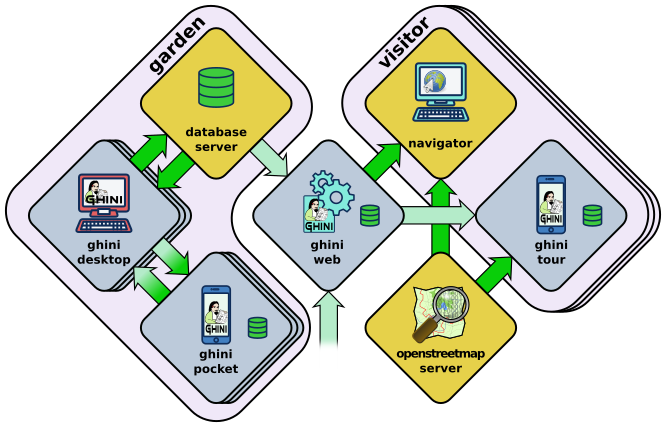

==================
 the Ghini family
==================

Let's start by recalling the composition of the Ghini family, as shown in the diagram:

You have learned how to use ghini.desktop, here we introduce the other
members of the family, and their interaction.

.. _ghini.pocket:

ghini.pocket
============

ghini.pocket is an Android app which you can install from the `play
store
<https://play.google.com/store/apps/details?id=me.ghini.pocket>`_.
ghini.pocket is definitely the tool you will use most, next to
ghini.desktop.

With ghini.pocket you always have the latest snapshot of your
database with you.

Type an accession number, or scan its barcode or QR label, and you know:

- the identification of the plant,
- whether it already has pictures,
- when it entered the garden and
- from which source.

Apart as a quick data viewer, you can use ghini.pocket for...

  ..  admonition:: data correction
      :class: toggle

         If by your judgement, some of the information is incorrect, or if
         the plant is flowering and you want to immediately take a picture
         and store it in the database, you do not need take notes on paper,
         nor follow convolute procedures: ghini.pocket lets you write your
         corrections in a log file, take pictures associated to the plant,
         and you will import this information straight into the database,
         with further minimal user intervention.

  ..  admonition:: inventory review
      :class: toggle

         The initial idea on which we based ghini.pocket is still one of its
         functionalities: inventory review.

         Using ghini.pocket, reviewing the inventory of a greenhouse, in
         particular if you have QR codes on plant labels, goes as fast as
         you can walk: simply enter the location code of your greenhouse,
         reset the log, then one by one scan the plant codes of the plants
         in the greenhouse.  No further data collection action is required.

         When you're done, import the log in ghini.desktop.  The procedure
         available in ghini.desktop includes adding unknown but labelled
         plants in the database, marking as lost/dead all plants that the
         database reports as alive and present in the inventoried location,
         but were not found during the inventory.

  ..  admonition:: taxonomic support
      :class: toggle

         As a bonus, ghini.pocket contains a phonetic genus search, and a
         quite complete database of botanic taxa with rank between order and
         genus, including tribes, and synonymies.

check further :any:`interaction among components`.

.. _ghini.web:

ghini.web
=========

ghini.web is a web server, written in nodejs.

Its most visible part runs at http://gardens.ghini.me and shows as a
map of the world, where you browse gardens and search their published
collection.

It also serves configuration data to ghini.tour instances.

check further :any:`interaction among components`.

.. _ghini.tour:

ghini.tour
==========

ghini.tour is an Android app which you can install from the `play
store
<https://play.google.com/store/apps/details?id=me.ghini.tour>`_.

People visiting your garden will install ghini.tour on their phone or
tablet, enjoy having a map of the garden, knowing where they are, and
will be able to listen to audio files that you have placed as virtual
information panels in strategic spots in your garden.

.. admonition:: world view
   :class: toggle

      at startup, you see the world and gardens.  select a garden, and enter.

.. admonition:: garden view
   :class: toggle

      when viewing at garden level, you see panels.  select a panel, and listen.

check further :any:`interaction among components`.

.. _interaction among components:

data streams between software components
========================================

.. note:: This section contains technical information for database managers and
          software developers.

In the diagram showing the composition of the Ghini family, the alert
reader noticed how different arrows representing different data
flows, had different colours: some are deep green, some have a
lighter tint.

       
Deeper green streams are constant flows of data, representing the core
activity of a component, eg: the interaction between ghini.desktop and its
database server, or your internet browser and ghini.web.

Lighter green streams are import/export actions, initiated by the user at the
command panel of ghini.desktop, or in the ghini.tour settings page.

This is the same graph, in which all import data streams have been given an
identifier.

.. image:: images/ghini-family-streams.png

..  admonition:: d2p: copy a snapshot of the desktop database to ghini.pocket
    :class: toggle

       - export the desktop database to a pocket snapshot
       - copy the snapshot to the handheld device

       ghini.pocket integrates closely with ghini.desktop, and it's not a
       tool for the casual nor the external user.  One task of your garden
       database manager is to regularly copy an updated database snapshot to
       your Android device.

       We advise enabling USB debugging on the device.  In perspective, this will
       allow ghini.desktop writing directily into the ghini.pocket device.

       Export the file from ghini.desktop, call the file pocket.db, copy it to the phone::

         adb -d push /tmp/pocket.db /sdcard/Android/data/me.ghini.pocket/files/

       The above location is valid even if your phone does not have a memory card.

       Other options include bluetooth, or whatever other way you normally use to
       copy regular files into your Android device.

..  admonition:: p2d: import from the ghini.pocket log file and pictures into the central database
    :class: toggle

       even if we're still calling it “inventory log”, ghini.pocket's log
       contains more than just inventory corrections.

       - produce a log on the handheld device
       - import the log in the desktop database

       first of all, copy the collected information from ghini.pocket into your computer::

         export DIR=/some/directory/on/your/computer
         adb -d pull /sdcard/Android/data/me.ghini.pocket/files/searches.txt $DIR
         adb -d pull -a /sdcard/Android/data/me.ghini.pocket/files/Pictures $DIR

       then use ghini.desktop to import this information into your database.

..  admonition:: d2w: send a selection of your garden data to ghini.web
    :class: toggle

       Offer a selection of your garden data to a central ghini.web site, so
       online virtual visitors can browse it.  This includes plant
       identification and their geographic location.

       content of this flow:

       - garden: coords, name, zoom level (for initial view)
       - plants: coords, identification, zoom level (for visibility)
       - species: binomial, phonetic approximation

..  admonition:: g2w: add geographic non-botanic data to ghini.web
    :class: toggle

     - Write geographic information about non-botanic data (ie: point of
       interest within the garden, required by ghini.tour) in the central
       ghini.web site.

       content of this flow:

       - virtual panels: coords, title, audio file
       - photos: coords, title, picture

       virtual panels don't necessarily have an associated photo, photos
       don't necessarily have an associated audio file.

..  admonition:: w2t: importing locations and POIs from ghini.web to tour
    :class: toggle

       content of this flow:

       - Garden (coords, name, zoom level)
       - Points of Interest (coords, title, audio file, photo)
