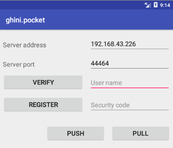

.. |ghini.pocket| replace:: :py:mod:`ghini.pocket`
.. |ghini.desktop| replace:: :py:mod:`ghini.desktop`
.. |verify| replace:: :py:obj:`verify`
.. |register| replace:: :py:obj:`register`
.. |push| replace:: :py:obj:`push`
.. |pull| replace:: :py:obj:`pull`
.. |desktop| replace:: :py:obj:`connect to g.desktop`
.. |OK| replace:: :py:obj:`OK`

==================
 the Ghini family
==================

Let's start by recalling the composition of the Ghini family, as shown in the diagram:

.. image:: images/ghini-family-clean.png

You have learned how to use ghini.desktop, here we introduce the other
members of the family, and their interaction.

.. _ghini.pocket:

ghini.pocket
============

.. image:: images/ghini-pocket-installed.png
   :align: left

ghini.pocket is an Android app which you can install from the `play
store
<https://play.google.com/store/apps/details?id=me.ghini.pocket>`_.
ghini.pocket is definitely the tool you will use most, next to
ghini.desktop.

With ghini.pocket you always have the latest snapshot of your
database with you.

Type an accession number, or scan its barcode or QR label, and you know:

- the identification of the plant,
- whether it already has pictures,
- when it entered the garden and
- from which source.

Apart as a quick data viewer, you can use ghini.pocket for...

  ..  admonition:: data correction
      :class: toggle

         If by your judgement, some of the information is incorrect, or if
         the plant is flowering and you want to immediately take a picture
         and store it in the database, you do not need take notes on paper,
         nor follow convolute procedures: ghini.pocket lets you write your
         corrections in a log file, take pictures associated to the plant,
         and you will import this information straight into the database,
         with further minimal user intervention.

  ..  admonition:: inventory review
      :class: toggle

         The initial idea on which we based ghini.pocket is still one of its
         functionalities: inventory review.

         Using ghini.pocket, reviewing the inventory of a greenhouse, in
         particular if you have QR codes on plant labels, goes as fast as
         you can walk: simply enter the location code of your greenhouse,
         reset the log, then one by one scan the plant codes of the plants
         in the greenhouse.  No further data collection action is required.

         When you're done, import the log in ghini.desktop.  The procedure
         available in ghini.desktop includes adding unknown but labelled
         plants in the database, marking as lost/dead all plants that the
         database reports as alive and present in the inventoried location,
         but were not found during the inventory.

  ..  admonition:: taxonomic support
      :class: toggle

         As a bonus, ghini.pocket contains a phonetic genus search, and a
         quite complete database of botanic taxa with rank between order and
         genus, including tribes, and synonymies.

check further :any:`pocket-desktop interaction`.

.. _ghini.web:

ghini.web
=========

.. image:: images/ghini-web-installed.png
   :align: left

ghini.web is a web server, written in nodejs.

Its most visible part runs at http://web.ghini.me and shows as a
map of the world, where you browse gardens and search their published
collection.

It also serves configuration data to ghini.tour instances.

check further :any:`interaction among components`.

.. _ghini.tour:

ghini.tour
==========

.. image:: images/ghini-tour-installed.png
   :align: left

ghini.tour is an Android app which you can install from the `play
store
<https://play.google.com/store/apps/details?id=me.ghini.tour>`_.

People visiting your garden will install ghini.tour on their phone or
tablet, enjoy having a map of the garden, knowing where they are, and
will be able to listen to audio files that you have placed as virtual
information panels in strategic spots in your garden.

.. admonition:: world view
   :class: toggle

      at startup, you see the world and gardens.  select a garden, and enter.

.. admonition:: garden view
   :class: toggle

      when viewing at garden level, you see panels.  select a panel, and listen.

check further :any:`interaction among components`.

.. _interaction among components:

data streams between components
========================================

.. image:: images/ghini-streams-installed.png
   :align: left

In the diagram showing the composition of the Ghini family, the alert reader noticed how
different arrows, corresponding to the different data flows, had different colours: some are
deep green, some have a lighter tint, while the two streams connecting ghini.pocket and
ghini.desktkop have a colour gradient, from light to deep green.

.. image:: images/ghini-family-clean.png

The colour choice for the arrows conveys a meaning: deeper green streams are constant flows
of data, representing the core activity of a component, eg: the interaction between
ghini.desktop and its database server, or your internet browser and ghini.web.

Lighter green streams are import/export actions, initiated by the user at the
command panel of ghini.desktop, or in the ghini.tour settings page.

The interaction between ghini.pocket and ghini.desktop seen from the desktop, it is a stream you
initiate when needed and stop as soon as you are done using it, for this reason it is light
green at the desktop end.  From the point of view of ghini.pocket however, it is an interaction
with a data server, and we make this visible by giving the arrows a deep green colour at the
pocket end.

This is again the same graph, but now all import data streams have been given an identifier, and
where we added thin red lines ending in a thick dot, to indicate the control line from the
controlling console to the controlled stream.

.. image:: images/ghini-family-streams.png

The interaction between ghini.pocket and ghini.desktop is one of the daily tasks of Ghini users,
and has an integrated, hopefully user-friendly interface, at both the ghini.pocket and the
ghini.desktop ends.  This is described in the next section.

All import/export actions relating to ghini.web are still rather low level actions, so their
description needs be of a rather technical type.  These are handled in the remainig expandable
sections, aimed mainly at database managers and possibly software developers.

..  admonition:: d2w: send a selection of your garden data to ghini.web
    :class: toggle

       Offer a selection of your garden data to a central ghini.web site, so
       online virtual visitors can browse it.  This includes plant
       identification and their geographic location.

       content of this flow:

       - garden: coords, name, zoom level (for initial view)
       - plants: coords, identification, zoom level (for visibility)
       - species: binomial, phonetic approximation

       There is a ``stream_d2w.py`` script for this, living in the ``scripts`` directory.  It
       should really be integrated in ghini.desktop, some day.

..  admonition:: g2w4t: add geographic non-botanic data to ghini.web
    :class: toggle

     - Write geographic information about non-botanic data (ie: point of
       interest within the garden, required by ghini.tour) in the central
       ghini.web site.

       content of this flow:

       - virtual panels: coords, title, audio file
       - photos: coords, title, picture

       virtual panels don't necessarily have an associated photo, photos
       don't necessarily have an associated audio file.

..  admonition:: w2t: importing locations and POIs from ghini.web to tour
    :class: toggle

       content of this flow:

       - Garden (coords, name, zoom level)
       - Points of Interest (coords, title, audio file, photo)

.. _pocket-desktop interaction:

Managing pocket/desktop interaction
============================================

Interaction between |ghini.pocket| and |ghini.desktop| is handled following a client server
scheme.  When you need to export a new database snapshot to pocket, or import the pocket log
into the main database, you put |ghini.desktop| in server mode, so that it awaits requests
from registered |ghini.pocket| clients.

|ghini.desktop| server mode
----------------------------------------

Select :menuselection:`Tools-->Pocket Server..` to activate server mode on |ghini.desktop|.
The Pocket Server console looks roughly like this, where it is creating a "snapshot":

.. image:: images/pocket-server-starting.png

While in server mode, |ghini.desktop| is not available for other uses, and |ghini.pocket|
clients will be able to register, request database snapshots, or send collected updates.

|ghini.pocket| works with a reduced database snapshot, containing only the most significant
elements, under a simplified schema.  |ghini.desktop| produces such a snapshot when it enters
server mode, automatically and in the background.  A typical Pocket Server session consists of:
validate your identity, push updates from |ghini.pocket| clients, refresh your snapshot on
|ghini.desktop|, pull the new snapshot to each of your clients.

Production of a snapshot is generally fast, surely for collections below the ten thousand
plants, so you may prefer to keep the automatic refresh option enabled: a refresh will be
triggered after receiving data from pocket clients and ghini.desktop will compute it while it is
still receiving pictures.  You will most likely not notice any delay.  With automatic refresh
enabled, the sequence reduces to: validate your identity, push updates, pull the new snapshot.

|ghini.desktop| and |ghini.pocket| need to be connected to the same (local) network.  The server
GUI includes an informative entry for the server IP address, this you obviously don't edit, and
an entry for the port number, which defaults to GHINI/44464.  Make sure that every configuration
on your clients matches the settings on the server, i.e.: please copy your Server IP address, as
shown by |ghini.desktop|, to all your |ghini.pocket| clients, and make sure that your clients
are talking to the port on which the server will be listening.

.. image:: images/pocket-server-settings.png

.. admonition:: I understand beans, what should I do?
   :class: toggle

      Right, you're a botanist, with little interest in learning network management, quite fair.
      
      Here are my three guesses for getting ghini.desktop (running on your computer) and
      ghini.pocket (running on your Android phone) to see each other:

      1) Easiest case: you have a local network at home, to which you connect both your phone
         and your computer.  Just make sure both your phone and computer are connected, and read
         further.  In most cases, it will just work.

         Beware: there's routers that will not let you talk from one system to the other, or
         that leave only a few ports open.  If your router has a 'guest' and a 'home' SSID, do
         use the 'home' signal for both systems.  But it all depends, and you should check with
         your router.  If you are using your home router and you still can't quite connect
         pocket to desktop, try the next option.

      2) Next easiest: configure a WiFi hotspot on your Android phone, and connect your computer
         to it.

         Make sure your ghini.desktop computer has no other active network connection.  You
         might want to disable mobile data on the phone, to avoid your computer to consume
         bandwith and make you incur in costs.  Without mobile data, Android might warn you that
         the hotspot will not be functional.  Ignore that: you're using the hotspot for local
         connections, not for getting on internet.

      3) Still easy enough: connect your Android phone to your computer using a USB cable, and
         activate USB tethering on the phone.

         Again, make sure your computer has no other active network connection, and again
         consider disabling mobile data on the phone.

      Any of the above three will put your two devices on the same network segment, and enable
      communication.  Minimal terminology you might still check: IP Address; IP Port; Network
      Segment.

      Check your phone IP address in :menuselection:`Settings --> About device --> Status`, no
      more to make sure that both addresses, desktop and pocket, belong to the same segment,
      roughly true if the first three of those four numbers are equal.

.. admonition:: Port Number, GHINI/44464?  What is that?
   :class: toggle

      44464 is a port number and a port, think of it like of a virtual plug that a server
      program can enable and listen to, and to which client programs may attach and speak into.
      This port number, 44464 makes some sense because it's like GHINI on a phone keyboard.
      There is nothing special with this 44464, you can choose just about any number from 1025
      to 65535, as long as it's `not already in use
      <https://en.wikipedia.org/wiki/List_of_TCP_and_UDP_port_numbers>`_ by other programs and
      it's the same on both ghini.desktop and ghini.pocket.

.. admonition:: localhost and your local network
   :class: toggle

      Is your ghini.desktop showing the ``127.0.0.1`` address, that means that it is not
      connected to any network.  That address is the numeric form of ``localhost``, and only
      useful for local connections.  You will **not** be able to connect pocket to desktop if
      this is what desktop reports as server IP address.

      Your local IP address is something starting with ``192.168.`` followed by two more numbers
      between 0 and 255, or maybe ``10.`` followed by three more such numbers, or still ``172.``
      followed by a number in the range 16 to 31, and again two more numbers between 0 and 255.

      Anything else is something else, not your local IP address, and will not work.

|ghini.desktop| holds a list of registered |ghini.pocket| clients.  (Check the below section on
the client user interface, for how to register a phone.)  The first time you activate
|ghini.pocket|, it will create a persistent custom phone code, high chance it is a unique code,
and this code will be used by both pocket and desktop to identify your phones.  The chance that
two of your 40 phones share the same code is smaller than a 2cm meteorite to strike your house
within the next 5 minutes.  Maybe not precisely this small, but definitely very small.  When
|ghini.desktop| receives a valid registration request for a phone code, the code is added to the
list of registered clients and associated to the remote user name.

The client registration is persistent, and is used as a basic identity check for all
client-server interaction.  If you need to use the same phone with a different user name, you
must overrule the existing registration, and to do so, you need the security code as shown in
the desktop server settings.

Start the server on |ghini.desktop| by clicking on that thick square push button with the
diagonal arrow: the button will stay pushed, the arrow slowly spinning, while the server is
active.  Decide if you prefer to enable automatic refresh, then move your attention focus to
your |ghini.pocket| client.  It is from the |ghini.pocket| clients that you handle the
communication.  After accepting updates from your |ghini.pocket| clients, refresh the snapshot
and update it on all your clients.

When done, stop the server, review the logs, close the Pocket Server window.

|ghini.pocket| user interface
----------------------------------------

With the pocket server running on ghini.desktop, grab now your Android phone with the latest
ghini.pocket version.

|ghini.pocket| options menu has a |desktop| item.  Use it to activate the
"desktop-client" window, which implements all interaction with the |ghini.desktop| server.

The "desktop-client" window contains data fields you have to edit in order to gain access to the
server, and buttons for server communication.  The communication buttons are not enabled unless
you validate (that is: register, or verify if already registered) your identity.

The above is |ghini.pocket|'s "desktop-client" on my virtual phone.  192.168.43.226 is my
laptop's IP address in my local network.  Please replace that with your own computer address as
previously explained.

|ghini.pocket| implements a very basic authentication check, trusting that your local
network is secure.  In fact the main goal of authentication between pocket and desktop is to
make sure that you know which user is going to be credited with the edits you are supplying
from pocket.

|verify| to check the communication parameters and the registered user name for your phone.
Enter the server IP address, edit if necessary the communication port, and verify whether
your phone is already registered.  If your phone id matches an already registered IMEI
number, the User Name widget will show you the currently registered user name, and the
bottom communication buttons will be enabled.  If no user is registered for your phone, a
notification will briefly flash on your phone, asking you to please register.

|register|, to associate your new user name to your phone IMEI code.  Enter both a User Name,
a Security Code, and press on |register|.  This informs the desktop server that your phone,
and through it all the information you push from your phone to desktop, is associated to your
user name.  Registration is permanent, so if you had already previously registered your phone
with your name, you don't need registering again.  You do need to register if you want to
assign the same phone to a different user.

|pull| to refresh the |ghini.pocket| database with the snapshot from the server.  This also
resets the log, which gets anyway overruled by the new snapshot.  Since this is a
potentially destructive operation, you need to confirm you really mean it.

|push| to send your collected information: inventory log, corrections, pictures.  In
particular if you are sending pictures, this operation will take time.  Please don't be
surprised if copying 20 high resolution pictures, over your high speed local network
connection, ghini is making you wait a couple of minutes: it's the sum that makes the total.

Exposed API
----------------------------------------

This is a technical reference section, you may safely ignore it if you aren't sure what it
is about.

|ghini.desktop| runs an XML-RPC server, exposing the following API1.  All functions but
``verify`` and ``get_snapshot`` return 0 on success; ``verify`` and ``get_snapshot``
return a string on success; for all functions, if the result is numeric, it is an error code.

.. admonition:: verify(client_id)
   :class: toggle

      Return the user name associated to the client.  The result is either a non-empty
      string, or a numeric error code.

.. admonition:: register(client_id, user_name, security_code)
   :class: toggle

      Register the client on the server, associating it to the given user_name, given that
      the provided security_code matches the expected one.

      Overwrite any previous registration of the same client.

      Return 0 if successful, otherwise a numeric error code.

.. admonition:: get_snapshot(client_id)
   :class: toggle

      Return the current ``pocket.db`` snapshot of the database.

      If client is not registered, return a numeric error code.

.. admonition:: put_change(client_id, content, baseline)
   :class: toggle

      Update the ghini database with the content of the collected pocket client logs.

      Content is a complete log file, to be handled as a block.

      Baseline is a timestamp, expressed as seconds since the Unix Epoch.

      Each change line applies to a single plant or accession.  Change lines are composed of
      change atoms, and atoms come in two flavours: additions (plant photos, accession
      verification) and overwrites (location name, location coordinates, quantity).  Photos
      need be sent separately, one per request.  Addition-atoms are always performed, while
      overwrite-atoms are approved, or rejected, based on their timestamp, the baseline
      value, and the last change of the affected object.  In particular, an overwrite-atom
      is rejected if the affected object had been changed since the baseline, except of
      course if the change was part of this put_change action.

      If client is not registered, return a numeric error code.

      Returns a list of numeric values, each corresponding to a log line, indicating whether
      the line was successfully applied, or (partially) rejected.

.. admonition:: put_picture(client_id, name, base64)
   :class: toggle

      Add a picture to the collection.  These are sent after the textual data has been
      updated.  There is no check whether or not the picture is indeed referred to in the
      database.

      If a picture by the same name already exists, the action fails with a numeric error
      code.

      If client is not registered, return a numeric error code.

