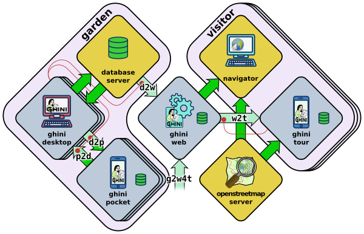

.. _ghini.web:

ghini.web
-----------------------------------------------

.. _ghini.pocket:

ghini.pocket
-----------------------------------------------

.. _ghini.tour:

ghini.tour
-----------------------------------------------

.. _interaction among components:
               
data streams between software components
-----------------------------------------------

Let's start by recalling the composition of the Ghini family, as shown in the diagram:

.. image:: images/ghini-family-clean.png

When we first introduced the diagram, we did not explain the reason why
different arrows representing different data flows, had different colours:
some are deep green, some in a lighter tint.  If you suspected this bore a
meaning then you were quite right:

Deeper green streams are constant flows of data, representing the core
activity of a component, eg: the interaction between ghini.desktop and its
database server, or your internet browser and ghini.web.

Lighter green streams are import/export actions, initiated by the user at the
command panel of ghini.desktop, or in the ghini.tour settings page.

This is the same graph, in which all import data streams have been given an identifier.

.. list-table:: Stream role description
   :widths: 15 85
   :header-rows: 1
   :class: tight-table   

   * - name
     - description
   * - **d2p**
     - This is ghini.desktop's :menuselection:`Tools-->Export-->export to
       pocket`.
   * - **p2d**
     - Import from the ghini.pocket log file and pictures into the central
       database.
   * - **d2w**
     - Offer a selection of your garden data to a central ghini.web site, so
       online virtual visitors can browse it.  This includes plant
       identification and their geographic location.
   * - **g2w**
     - Write geographic information about non-botanic data (ie: point of
       interest within the garden, required by ghini.tour) in the central
       ghini.web site.
   * - **w2t**
     - Importing locations and points of interest from ghini.web to tour.

We formally define all named streams, so our we know we are talking about.
Moreover, streams impacting the desktop and web databases require extra
thought and attention from your database manager.
