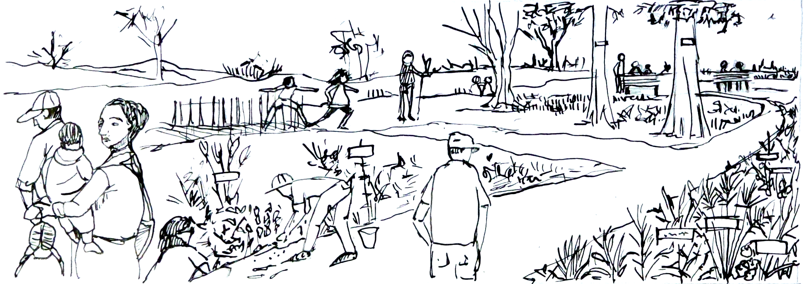
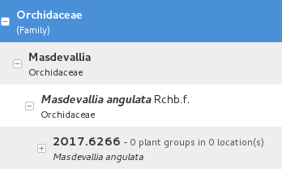
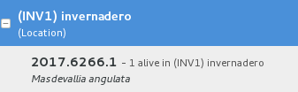

Ghini's goals and highlights
===============================

Should you use this software? This question is for you to answer. We trust
that if you manage a botanic collection, you will find Ghini overly useful
and we hope that this page will convince you about it.

This page shows how Ghini makes software meet the needs of a botanic garden.

If you already know, and all you want is to do something practical, check our `user-contributed recipes <use_cases.html>`_.

Botanic Garden
--------------------------------------------------------

According to the Wikipedia, »A botanic(al) garden is a garden dedicated to
the collection, cultivation and display of a wide range of plants labelled
with their botanical names«, and still according to the Wikipedia, »a
garden is a planned space, usually outdoors, set aside for the display,
cultivation, and enjoyment of plants and other forms of nature.«

So we have in a botanic garden both the physical space, the garden, as its
dynamic, the activities to which the garden is dedicated, activities which
makes us call the garden a botanic garden.

   **the physical garden**

   **collection related activities in the garden**

.. _botanic garden software:
   
Botanic Garden Software
-----------------------------------------------

At the other end of our reasoning we have the application program Ghini, and
again quoting the Wikipedia, »an application program is a computer program
designed to perform a group of coordinated functions, tasks, or activities
for the benefit of the user«, or, in short, »designed to help people perform
an activity«.

Data and algorithms within Ghini have been designed to represent the
physical space and the dynamic of a botanic garden.

.. figure:: images/schemas/ghini-10.svg

   **core structure of Ghini's database**

In the above figure, a simplified view on the database, the highlighted
blocks are those relative to objects you definitely need insert in the
database.

We distinguish three main sections in the database.  Start reading the graph
from the right hand side, with the relevant **Taxonomy** information, then
step to administering your **Collection**, and finally consider the physical
**Garden**.

The central element in Ghini's point of view is the ``Accession``. Following
its links to other database objects lets us better understand the structure:

**Accession links Planting to Species**

  An ``Accession`` represents the action of receiving plant material in
  the garden. As such, ``Accession`` is an abstract concept, it links
  physical living ``Plantings`` —groups of plants placed each at a
  ``Location`` in the garden— to the corresponding ``Species``. An
  ``Accession`` has zero or more ``Plantings`` associated to it (0..n), and
  it is at all times connected to exactly 1 ``Species``. Each ``Planting``
  belongs to exactly one ``Accession``, each ``Species`` may have multiple
  ``Accessions`` relating to it.

  An ``Accession`` stays in the database even if all of its ``Plantings``
  have been removed, sold, or have died. Identifying the ``Species`` of an
  ``Accession`` consistently connects all its ``Plantings`` to the
  ``Species``.

**Accession at the base of the history of your plants**

  ``Propagations`` and ``Contacts`` provide plant material for the garden;
  this information is optional and smaller collectors might prefer to leave this aside.
  A ``Propagation`` trial may be unsuccessful, most of the time it will result
  in exactly one accession, but it may also produce slightly different taxa,
  so the database allows for zero  or more ``Accessions`` per ``Propagation`` (0..n).
  Also a ``Contact`` may provide zero or more ``Accessions`` (0..n).

**Accession and Verification opinions**

  Specialists may formulate their opinion about the ``Species`` to which an
  ``Accession`` belongs, by providing a ``Verification``, signing it, and
  stating the applicable level of confidence.

**Accessing your own Propagations**

  If an ``Accession`` was obtained in the garden nursery from a successful
  ``Propagation``, the ``Propagation`` links the ``Accession`` and all of
  its ``Plantings`` to a single parent ``Planting``, the seed or the
  vegetative parent.

.. _accession explained:
  
Even after the above explanation, new users generally still ask why they
need pass through an ``Accession`` screen while all they want is to insert a
``Plant`` in the collection, and again: what is this "accession" thing
anyway?  Most discussions on the net don't make the concept any clearer.
One of our users gave an example which I'm glad to include in Ghini's
documentation.

:use case: #. At the beginning of 2007 we got five seedlings of *Heliconia
              longa* (a plant ``Species``) from our neighbour (the
              ``Contact`` source). Since it was the first acquisition of the
              year, we named them 2007.0001 (we gave them a single unique
              ``Accession`` code, with quantity 5) and we planted them all
              together at one ``Location`` as a single ``Planting``, also
              with quantity 5.

           #. At the time of writing, nine years later, ``Accession``
              2007.0001 has 6 distinct ``Plantings``, each at a different
              ``Locations`` in our garden, obtained vegetatively (asexually)
              from the original 5 plants. Our only intervention was
              splitting, moving, and of course writing this information in
              the database. Total plant quantity is above 40.

           #. New ``Plantings`` obtained by (assisted) sexual ``Propagation``
              come in our database under different ``Accession`` codes, where
              our garden is the ``Contact`` source and where we know which of
              our ``Plantings`` is the seed parent.

the above three cases translate into several short usage stories:

#. activate the menu Insert → Accession, verify the existence and
   correctness of the ``Species`` *Heliconia longa*, specify the initial
   quantity of the ``Accession``; add its ``Planting`` at the desired
   ``Location``.
#. edit ``Planting`` to correct the amount of living plants — repeat this as
   often as necessary.
#. edit ``Planting`` to split it at separate ``Locations`` — this produces a
   different ``Planting`` under the same ``Accession``.
#. edit ``Planting`` to add a (seed) ``Propagation``.
#. edit ``Planting`` to update the status of the ``Propagation``.
#. activate the menu Insert → Accession to associate an accession to a
   successful ``Propagation`` trial; add the ``Planting`` at the desired
   ``Location``.

In particular the ability to split a ``Planting`` at several different
``Locations`` and to keep all uniformly associated to one ``Species``, or
the possibility to keep information about ``Plantings`` that have been
removed from the collection, help justify the presence of the ``Accession``
abstraction level.

Hypersimplified view
-----------------------------------------------

People using Ghini only sporadically may prefer ignoring the database
structure and look at it as two nested sequences of objects, each element of
the sequence being necessary to add element at the next level.

In order to get down to an Accession, you will need four levels, as in this
example:

A quite complete set of Families and Genera are inserted in your database at
the moment Ghini initializes it. So all you need is adding Species and
Accessions, in this order.

When placing a physical Plant (relative to an Accession) somewhere in the
garden, you need to describe this "somewhere" digitally, as a Location in
the garden.

-----------------------------------------------

Highlights
-------------------------------------------------------------
not-so-brief list of highlights, meant to whet your appetite.

taxonomic information
.....................

When you first start Ghini, and connect to a database, Ghini will
initialize the database not only with all tables it needs to run, but it
will also populate the taxon tables for ranks family and genus, using the
data from the “RBG Kew's Family and Genera list from Vascular Plant Families
and Genera compiled by R. K. Brummitt and published by the Royal Botanic
Gardens, Kew in 1992”.  In 2015 we have reviewed the data regarding the
Orchidaceae, using “Tropicos, botanical information system at the Missouri
Botanical Garden - www.tropicos.org” as a source.

importing data
..............

Ghini will let you import any data you put in an intermediate json
format. What you import will complete what you already have in the
database. If you need help, you can ask some Ghini professional to help you
transform your data into Ghini's intermediate json format.

synonyms
........

Ghini will allow you define synonyms for species, genera, families. Also
this information can be represented in its intermediate json format and be
imported in an existing Ghini database.

scientific responsible
......................

Ghini implements the concept of 'accession', intermediate between physical
plant (or a group thereof) and abstract taxon. Each accession can associate
the same plants to different taxa, if two taxonomists do not agree on the
identification: each taxonomist can have their say and do not need overwrite
each other's work. All verifications can be found back in the database, with
timestamp and signature.

helps off-line identification
.............................

Ghini allows you associate pictures to physical plants, this can help
recognize the plant in case a sticker is lost, or help taxonomic
identification if a taxonomist is not available at all times.

exports and reports
...................

Ghini will let you export a report in whatever textual format you need. It
uses a powerful templating engine named 'mako', which will allow you export
the data in a selection to whatever format you need. Once installed, a
couple of examples are available in the mako subdirectory.

annotate your info
..................

You can associate notes to plants, accessions, species, .... Notes can be
categorized and used in searches or reports.

garden or herbarium
...................

Management of plant locations.

database history
................

All changes in the database is stored in the database, as history log. All
changes are 'signed' and time-stamped.  Ghini makes it easy to retrieve the
list of all changes in the last working day or week, or in any specific
period in the past.

simple and powerful search
..........................

Ghini allows you search the database using simple keywords, e.g.: the name
of the location or a genus name, or you can write more complex queries,
which do not reach the complexity of SQL but allow you a decent level of
detail localizing your data.

database agnostic
.................

Ghini is not a database management system, so it does not reinvent the
wheel. It works storing its data in a SQL database, and it will connect to
any database management system which accepts a SQLAlchemy connector. This
means any reasonably modern database system and includes MySQL, PostgreSQL,
Oracle. It can also work with sqlite, which, for single user purposes is
quite sufficient and efficient. If you connect Ghini to a real database
system, you can consider making the database part of a LAMP system
(Linux-Apache-MySQL-Php) and include your live data on your institution web
site.

language agnostic
.................

The program was born in English and all its technical and user documentation
is still only in that language, but the program itself has been translated
and can be used in various other languages, including Spanish (86%),
Portuguese (100%), French (42%), to name some Southern American languages,
as well as Swedish (100%) and Czech (100%).

platform agnostic
.................

Installing Ghini on Windows is an easy and linear process, it will not take
longer than 10 minutes. Ghini was born on Linux and installing it on ubuntu,
fedora or debian is consequently even easier. MacOSX being based on unix, it
is possible to successfully run the Linux installation procedure on any
recent Apple computer, after a few preparation steps.

easily updated
..............

The installation process will produce an updatable installation, where
updating it will take less than one minute. Depending on the amount of
feedback we receive, we will produce updates every few days or once in a
while. 

unit tested
...........

Ghini is continuously and extensively unit tested, something that makes
regression of functionality close to impossible. Every update is
automatically quality checked, on the Travis Continuous Integration
service. Integration of TravisCI with the github platform will make it
difficult for us to release anything which has a single failing unit test.

Most changes and additions we make, come with some extra unit test, which
defines the behaviour and will make any undesired change easily visible.

customizable/extensible
.......................

Ghini is extensible through plugins and can be customized to suit the needs
of the institution.
