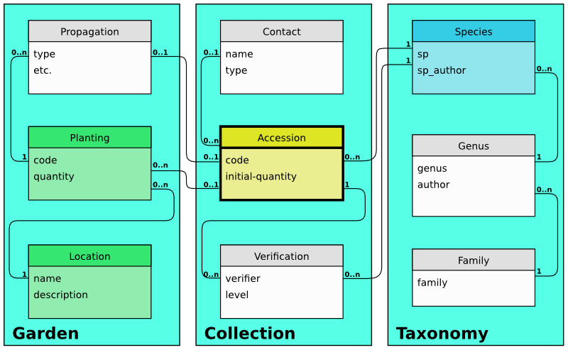

Ghini's goal
================

Should you use this software? This question is for you to answer. We trust
that if you manage a botanic collection, you will find Ghini overly useful
and we hope that this page will convince you about it.

This page shows how Ghini makes software meet the needs of a botanic garden.

Garden: Botanic
--------------------------------------------------------

According to the Wikipedia, »A botanic(al) garden is a garden dedicated to
the collection, cultivation and display of a wide range of plants labelled
with their botanical names.«, and still according to the Wikipedia, »a
garden is a planned space, usually outdoors, set aside for the display,
cultivation, and enjoyment of plants and other forms of nature.«

So we have in a botanic garden both the physical space, the garden, as its
dynamic, the activities to which the garden is dedicated, activities which
makes us call the garden a botanic garden.

.. figure:: images/garden_worries_1.png

   **the physical garden**

.. figure:: images/garden_worries_2.png

   **collection related activities in the garden**

Botanic Garden Software
-----------------------------------------------

On the other end of our reasoning we have the application program Ghini, and
again quoting the Wikipedia, »an application program is a computer program
designed to perform a group of coordinated functions, tasks, or activities
for the benefit of the user«, or, in short, »designed to help people perform
an activity«.

data and algorithms within Ghini have been designed to represent the
physical space and the dynamic of a botanic garden.

   **software view on garden data**

The above picture only shows the structure of Ghini's database. Let's have a
look at a few basic operations Ghini lets you perform.

organizing the garden in beds and greenhouses
.................................................

accepting a plant in the collection
.................................................

following the health status of a living plant
.................................................

managing contacts
.................................................

adding a taxonomist's opinion
.................................................

reproducing plants
.................................................

update taxonomy tree
.................................................

