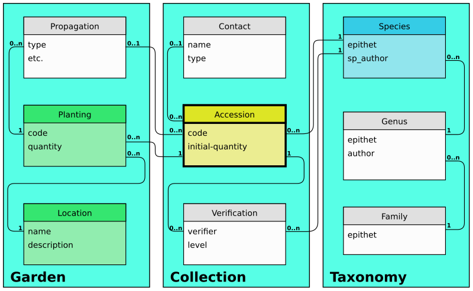

Ghini's goal
================

Should you use this software? This question is for you to answer. We trust
that if you manage a botanic collection, you will find Ghini overly useful
and we hope that this page will convince you about it.

This page shows how Ghini makes software meet the needs of a botanic garden.

Garden: Botanic
--------------------------------------------------------

According to the Wikipedia, »A botanic(al) garden is a garden dedicated to
the collection, cultivation and display of a wide range of plants labelled
with their botanical names.«, and still according to the Wikipedia, »a
garden is a planned space, usually outdoors, set aside for the display,
cultivation, and enjoyment of plants and other forms of nature.«

So we have in a botanic garden both the physical space, the garden, as its
dynamic, the activities to which the garden is dedicated, activities which
makes us call the garden a botanic garden.

.. figure:: images/garden_worries_1.png

   **the physical garden**

.. figure:: images/garden_worries_2.png

   **collection related activities in the garden**

Botanic Garden Software
-----------------------------------------------

At the other end of our reasoning we have the application program Ghini, and
again quoting the Wikipedia, »an application program is a computer program
designed to perform a group of coordinated functions, tasks, or activities
for the benefit of the user«, or, in short, »designed to help people perform
an activity«.

data and algorithms within Ghini have been designed to represent the
physical space and the dynamic of a botanic garden.

   **software view on garden data**

The above picture only shows the basic structure of Ghini's database. Let's
have a look at the basic operations Ghini lets you perform.

representing the planned space
.................................................

Botanic gardens are mostly organized in beds and greenhouses, and larger
beds are probably organized in smaller sections, while greenhouses might be
organized in tables, shelves, walls.

In the above software view on garden data, the numeric indications at either
end of the line connecting ``Location`` and ``Planting`` tells us that every
``Planting`` can only belong to exactly one (``1``) ``Location``, while every
``Location`` may contain zero or more (``0..n``) ``Plantings``.

A consequence of this constraint in the database is that your database needs
``Locations`` in order to place ``Plants`` in the garden, so a good practice
is to start by entering a database ``Location`` for every physical bed
section, greenhouse table, or whatever might be the basic location unit in
your garden.

accepting a plant in the collection
.................................................

when a plant (or a group of genetically identical plants) enters the collection, 

following the health status of a living plant
.................................................

managing contacts
.................................................

adding a taxonomist's opinion
.................................................

reproducing plants
.................................................

update taxonomy tree
.................................................

