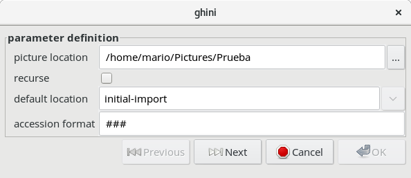
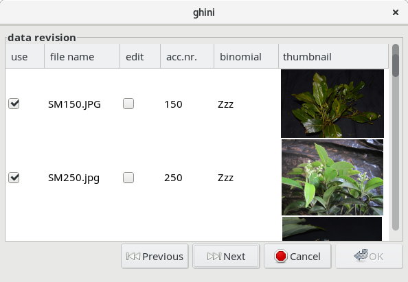
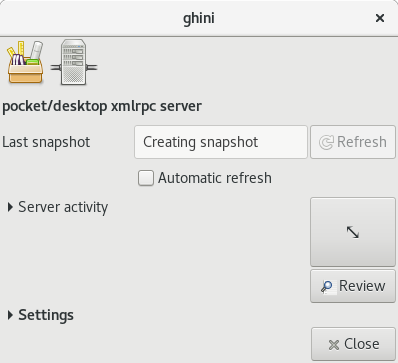
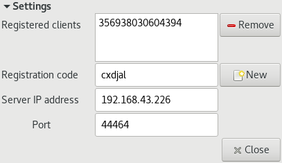

.. |ghini.pocket| replace:: :py:mod:`ghini.pocket`
.. |ghini.desktop| replace:: :py:mod:`ghini.desktop`
.. |verify| replace:: :py:obj:`verify`
.. |register| replace:: :py:obj:`register`
.. |push| replace:: :py:obj:`push`
.. |pull| replace:: :py:obj:`pull`
.. |desktop| replace:: :py:obj:`connect to g.desktop`
.. |OK| replace:: :py:obj:`OK`

Importing and Exporting Data
============================

Ghini offers several formats for exchanging data with other systems, while additional
formats may be provided in the form of plug-ins.

For two formats (CSV and JSON) Ghini offers both import and export.  CSV aims at saving and
restoring whole tables.  JSON is mostly meant for selections, for non-destructive updating
existing data, for combining selections from different databases.

A special case of import-export is handling |ghini.pocket| snapshots, and accepting collected
updates from |ghini.pocket| instances.

There is some support for exporting in Access for Biological Collections Data (ABCD) format,
while export in BGCI format is provided by the Report plug-in in the form of a Mako
Template.

There is also limited support for exporting to an XML format that more
or less reflects exactly the tables and row of the database.

Exporting ABCD and XML will not be covered here.

Backup as Flat-files / CSV
------------------------------

This section is about exporting the complete database as CSV files, one file per table.
These files can be later used to restore your database, to initialize an other Ghini
instance, as a base for migrating your data to a newer Ghini version.

Please note that we also have a QuickCSV reporter, able to produce a single CSV file, where
the user decides, on-the-fly, which fields have to be included in the report.  Here we talk
about creating and (partially) restoring databases.

Creating a backup
^^^^^^^^^^^^^^^^^^^^^^^^

To export the Ghini data to CSV select :menuselection:`Tools-->Backup-->Create` from the
menu.

This tool will ask you to select a directory to export the CSV data.
All of the tables in Ghini will be exported to files in the format
``table_name.txt`` if ``TableName`` is the name of the table where the data
was exported from.

Restoring a backup
^^^^^^^^^^^^^^^^^^^^^^^^^^^^^^

In general it is best to only import CSV files into Ghini that were
previously exported from Ghini.  It is possible to import any CSV file
but that is more advanced that this doc will cover.

To import CSV files into Ghini select :menuselection:`Tools-->Backup-->Restore` from the
menu.

After clicking |OK| on the dialog that ask if you are sure you know what
you're doing a file chooser will open.  In the file chooser select the
files you want to import.

Restoring a backup deletes all previous content from restored tables.

JSON - JavaScript Object Notation
-----------------------------------------

This feature has being developed when a user asked for it.  Their request was quite simple,
but we preferred anyway to lay down the bases for a more generic solution.  At the moment,
everything we ever needed is in place.  Even so, this feature is still quite far from
complete, so if it does not satisfy your needs, please contact the maintainers.

Exporting to JSON
^^^^^^^^^^^^^^^^^^^^^^^^^^

.. image:: images/screenshots/export-to-json.png

when you activate this export tool, you are given the choice to
specify what to export. You can use the current selection to
limit the span of the export, or you can start at the complete
content of a domain, to be chosen among Species, Accession,
Plant.

Exporting *Species* will only export the complete taxonomic
information in your database. *Accession* will export all your
accessions plus all the taxonomic information it refers to:
unreferred to taxa will not be exported. *Plant* will export all
living plants (some accession might not be included), all
referred to locations and taxa.

Importing from JSON
^^^^^^^^^^^^^^^^^^^^^^^^

This is *the* way to import data into an existing database, without
destroying previous content. A typical example of this functionality would
be importing your digital collection into a fresh, just initialized Ghini
database. Converting a database into bauble json interchange format is
beyond the scope of this manual, please contact one of the authors if you
need any further help.

Using the Ghini json interchange format, you can import data which you have
exported from a different Ghini installation.

Importing a Pictures Collection
----------------------------------

We can consider a collection of plant pictures as a particular
form of botanical database, in which each picture is clearly
associated with one specific plant.

Even without using a photo collection software, you can
associate pictures to accessions by following one and the same
clear rule when naming picture files.

For example, ``2018.0020.1 (4) Epidendrum.jpg`` would be the
name of the fourth picture for plant number 1 within accession
2018.0020, identified to rank genus as an Epidendrum.

The :menuselection:`Tools-->Import-->Pictures` functionality
here described is meant for importing an ordered collection of
plant pictures either to initialize a ghini database, or for
periodically adding to it.

Use :menuselection:`Tools-->Import-->Pictures` to activate this
import tool.  Import goes in several steps: parameter
definition; data revision and confirmation; the import step
proper; finally review the import log.  At the first two steps
you can confirm the data and go to the next step by clicking on
the |next| button, or you can go back to the previous step by
clicking on the |prev| button.  Once the import is done and
you're reviewing the log, you can only either confirm —or abort—
the whole transaction.

In the "parameter definition" pane you: select the directory
from which you intend to import pictures; indicate whether to
import pictures recursively; select or create a location which
will be used as default location for new plants; inform the tool
about the rule you've been following when naming picture files.

In the "data revision" pane you are shown a table with as many
rows as the pictures you are importing.  Each row holds as much
information as the tool managed to extract from the picture
name.  You can review the information, correct or confirm, and
indicate whether or not the row should be imported.

In the final "commit or rollback" pane you read the logs relative
to your data import, and decide whether to keep them (commit
them to the database), or undo them (rollback the transaction).

.. image:: images/screenshots/import-picture-log.png

When the Picture Collection importer creates or updates objects,
it also sets a Note that you can use for selecting the objects
involved in the import, and for reviewing if needed.

Importing from a Generic Database
----------------------------------

This functionality is the object of `issue #127
<https://github.com/Ghini/|ghini.desktop|/issues/127>`_, for which
we have no generic solution yet.

If you're interested in importing data from some flat file
(e.g.: Excel spreadsheet) or from any database, contact the
developers.

Managing |ghini.pocket| interaction
============================================

Interaction with |ghini.pocket| is handled following a client server scheme.  When you need to
export to, or import from |ghini.pocket|, you put |ghini.desktop| in server mode, so that it
awaits for requests from registered |ghini.pocket| clients.

|ghini.desktop| server mode
----------------------------------------

You activate server mode on |ghini.desktop| with :menuselection:`Tools-->Pocket Server..`.

While in server mode, |ghini.desktop| is not available for other uses, and |ghini.pocket|
clients will be able to register, request database snapshots, or send collected updates.

.. image::  images/ghini-pocket-client.png

|ghini.pocket| works with a reduced database snapshot, containing only the most significant
elements, under a simplified schema.  |ghini.desktop| produces such a snapshot when it enters
server mode, automatically and in the background.  Production of a snapshot is generally fast,
and a typical Pocket Server session consists of: pushing updates from |ghini.pocket| clients,
refreshing your snapshot on |ghini.desktop|, pulling the new snapshot to each of your clients.

|ghini.desktop| and |ghini.pocket| need to be connected to the same local network.  The server
GUI includes an informative entry for the server IP address, this you obviously don't edit,
and an entry for the port number, which defaults to GHINI/44464.  Make sure that every
configuration on your clients matches the settings on the server.

|ghini.desktop| holds a list of registered |ghini.pocket| clients.  (Check the below section
on the client user interface, for how to register a phone.)  When |ghini.desktop| receives a
valid registration request for a specific IMEI number, the specified IMEI is added to the
list of registered clients and associated to the remote user name.  The registration is
persistent, and is used as a basic identity check for all client-server interaction.  If you
need to use the same phone with a different user name, you must overrule the existing
registration, and to do so, you need the security code as shown in the desktop server
settings.

Start the server on |ghini.desktop| and move your focus to your |ghini.pocket| client.  It is
from the |ghini.pocket| clients that you handle the communication.  After accepting updates
from your |ghini.pocket| clients, refresh the snapshot and update it on all your clients.

When done, stop the server, review the logs, close the Pocket Server window.

|ghini.pocket| user interface
----------------------------------------

|ghini.pocket| options menu has a |desktop| item.  Use it to activate the
"desktop-client" window, which implements all interaction with the |ghini.desktop| server.

The "desktop-client" window contains data fields you have to edit in order to gain access to
the server, and buttons for server communication.  The communication buttons are not enabled
unless you validate your identity.

.. image::  images/ghini-pocket-client.png

|ghini.pocket| implements a very basic authentication check, trusting that your local
network is secure.  In fact the main goal of authentication between pocket and desktop is to
make sure that you know which user is going to be credited with the edits you are supplying
from pocket.

|verify| to check the communication parameters and the registered user name for your phone.
Enter the server IP address, edit if necessary the communication port, and verify whether
your phone is already registered.  If your phone id matches an already registered IMEI
number, the User Name widget will show you the currently registered user name, and the
bottom communication buttons will be enabled.  If no user is registered for your phone, a
notification will briefly flash on your phone, asking you to please register.

|register|, to associate your new user name to your phone IMEI code.  Enter both a User Name,
a Security Code, and press on |register|.  This informs the desktop server that your phone,
and through it all the information you push from your phone to desktop, is associated to your
user name.  Registration is permanent, so if you had already previously registered your phone
with your name, you don't need registering again.  You do need to register if you want to
assign the same phone to a different user.

|pull| to refresh the |ghini.pocket| database with the snapshot from the server.  This also
resets the log, which gets anyway overruled by the new snapshot.  Since this is a
potentially destructive operation, you need to confirm you really mean it.

|push| to send your collected information: inventory log, corrections, pictures.  In
particular if you are sending pictures, this operation will take time.  Please don't be
surprised if copying 20 high resolution pictures, over your high speed local network
connection, ghini is making you wait a couple of minutes: it's the sum that makes the total.

Exposed API
----------------------------------------

This is a technical reference section, you may safely ignore it if you aren't sure what it
is about.

|ghini.desktop| runs an XML-RPC server, exposing the following API1.  All functions but
``verify`` and ``get_snapshot`` return 0 on success; ``verify`` and ``get_snapshot``
return a string on success; for all functions, if the result is numeric, it is an error code.

.. admonition:: verify(client_id)
   :class: toggle

      Return the user name associated to the client.  The result is either a non-empty
      string, or a numeric error code.

.. admonition:: register(client_id, user_name, security_code)
   :class: toggle

      Register the client on the server, associating it to the given user_name, given that
      the provided security_code matches the expected one.

      Overwrite any previous registration of the same client.

      Return 0 if successful, otherwise a numeric error code.

.. admonition:: get_snapshot(client_id)
   :class: toggle

      Return the current ``pocket.db`` snapshot of the database.

      If client is not registered, return a numeric error code.

.. admonition:: put_change(client_id, content, baseline)
   :class: toggle

      Update the ghini database with the content of the collected pocket client logs.

      Content is a complete log file, to be handled as a block.

      Baseline is a timestamp, expressed as seconds since the Unix Epoch.

      Each change line applies to a single plant or accession.  Change lines are composed of
      change atoms, and atoms come in two flavours: additions (plant photos, accession
      verification) and overwrites (location name, location coordinates, quantity).  Photos
      need be sent separately, one per request.  Addition-atoms are always performed, while
      overwrite-atoms are approved, or rejected, based on their timestamp, the baseline
      value, and the last change of the affected object.  In particular, an overwrite-atom
      is rejected if the affected object had been changed since the baseline, except of
      course if the change was part of this put_change action.

      If client is not registered, return a numeric error code.

      Returns a list of numeric values, each corresponding to a log line, indicating whether
      the line was successfully applied, or (partially) rejected.

.. admonition:: put_picture(client_id, name, base64)
   :class: toggle

      Add a picture to the collection.  These are sent after the textual data has been
      updated.  There is no check whether or not the picture is indeed referred to in the
      database.

      If a picture by the same name already exists, the action fails with a numeric error
      code.

      If client is not registered, return a numeric error code.
