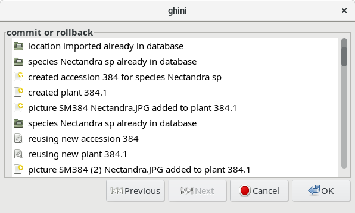

.. |ghini.pocket| replace:: :py:mod:`ghini.pocket`
.. |ghini.desktop| replace:: :py:mod:`ghini.desktop`
.. |verify| replace:: :py:obj:`verify`
.. |register| replace:: :py:obj:`register`
.. |push| replace:: :py:obj:`push`
.. |pull| replace:: :py:obj:`pull`
.. |desktop| replace:: :py:obj:`connect to g.desktop`
.. |OK| replace:: :py:obj:`OK`

Importing and Exporting Data
============================

Ghini offers several formats for exchanging data with other systems, while additional
formats may be provided in the form of plug-ins.

For two formats (CSV and JSON) Ghini offers both import and export.  CSV aims at saving and
restoring whole tables.  JSON is mostly meant for selections, for non-destructive updating
existing data, for combining selections from different databases.

A special case of import-export is handling |ghini.pocket| snapshots, and accepting collected
updates from |ghini.pocket| instances.

There is some support for exporting in Access for Biological Collections Data (ABCD) format,
while export in BGCI format is provided by the Report plug-in in the form of a Mako
Template.

There is also limited support for exporting to an XML format that more
or less reflects exactly the tables and row of the database.

Exporting ABCD and XML will not be covered here.

Backup as Flat-files / CSV
------------------------------

This section is about exporting the complete database as CSV files, one file per table.
These files can be later used to restore your database, to initialize an other Ghini
instance, as a base for migrating your data to a newer Ghini version.

Please note that we also have a QuickCSV reporter, able to produce a single CSV file, where
the user decides, on-the-fly, which fields have to be included in the report.  Here we talk
about creating and (partially) restoring databases.

Creating a backup
^^^^^^^^^^^^^^^^^^^^^^^^

To export the Ghini data to CSV select :menuselection:`Tools-->Backup-->Create` from the
menu.

This tool will ask you to select a directory to export the CSV data.
All of the tables in Ghini will be exported to files in the format
``table_name.txt`` if ``TableName`` is the name of the table where the data
was exported from.

Restoring a backup
^^^^^^^^^^^^^^^^^^^^^^^^^^^^^^

In general it is best to only import CSV files into Ghini that were
previously exported from Ghini.  It is possible to import any CSV file
but that is more advanced that this doc will cover.

To import CSV files into Ghini select :menuselection:`Tools-->Backup-->Restore` from the
menu.

After clicking |OK| on the dialog that ask if you are sure you know what
you're doing a file chooser will open.  In the file chooser select the
files you want to import.

Restoring a backup deletes all previous content from restored tables.

JSON - JavaScript Object Notation
-----------------------------------------

This feature has being developed when a user asked for it.  Their request was quite simple,
but we preferred anyway to lay down the bases for a more generic solution.  At the moment,
everything we ever needed is in place.  Even so, this feature is still quite far from
complete, so if it does not satisfy your needs, please contact the maintainers.

Exporting to JSON
^^^^^^^^^^^^^^^^^^^^^^^^^^

.. image:: images/screenshots/export-to-json.png

when you activate this export tool, you are given the choice to
specify what to export. You can use the current selection to
limit the span of the export, or you can start at the complete
content of a domain, to be chosen among Species, Accession,
Plant.

Exporting *Species* will only export the complete taxonomic
information in your database. *Accession* will export all your
accessions plus all the taxonomic information it refers to:
unreferred to taxa will not be exported. *Plant* will export all
living plants (some accession might not be included), all
referred to locations and taxa.

Importing from JSON
^^^^^^^^^^^^^^^^^^^^^^^^

This is *the* way to import data into an existing database, without
destroying previous content. A typical example of this functionality would
be importing your digital collection into a fresh, just initialized Ghini
database. Converting a database into bauble json interchange format is
beyond the scope of this manual, please contact one of the authors if you
need any further help.

Using the Ghini json interchange format, you can import data which you have
exported from a different Ghini installation.

Importing a Pictures Collection
----------------------------------

We can consider a collection of plant pictures as a particular
form of botanical database, in which each picture is clearly
associated with one specific plant.

Even without using a photo collection software, you can
associate pictures to accessions by following one and the same
clear rule when naming picture files.

For example, ``2018.0020.1 (4) Epidendrum.jpg`` would be the
name of the fourth picture for plant number 1 within accession
2018.0020, identified to rank genus as an Epidendrum.

The :menuselection:`Tools-->Import-->Pictures` functionality
here described is meant for importing an ordered collection of
plant pictures either to initialize a ghini database, or for
periodically adding to it.

Use :menuselection:`Tools-->Import-->Pictures` to activate this
import tool.  Import goes in several steps: parameter
definition; data revision and confirmation; the import step
proper; finally review the import log.  At the first two steps
you can confirm the data and go to the next step by clicking on
the |next| button, or you can go back to the previous step by
clicking on the |prev| button.  Once the import is done and
you're reviewing the log, you can only either confirm —or abort—
the whole transaction.

In the "parameter definition" pane you: select the directory
from which you intend to import pictures; indicate whether to
import pictures recursively; select or create a location which
will be used as default location for new plants; inform the tool
about the rule you've been following when naming picture files.

.. image:: images/screenshots/import-picture-define.png

In the "data revision" pane you are shown a table with as many
rows as the pictures you are importing.  Each row holds as much
information as the tool managed to extract from the picture
name.  You can review the information, correct or confirm, and
indicate whether or not the row should be imported.

.. image:: images/screenshots/import-picture-review.png

In the final "commit or rollback" pane you read the logs relative
to your data import, and decide whether to keep them (commit
them to the database), or undo them (rollback the transaction).

When the Picture Collection importer creates or updates objects,
it also sets a Note that you can use for selecting the objects
involved in the import, and for reviewing if needed.

Importing from a Generic Database
----------------------------------

This functionality is the object of `issue #127
<https://github.com/Ghini/|ghini.desktop|/issues/127>`_, for which
we have no generic solution yet.

If you're interested in importing data from some flat file
(e.g.: Excel spreadsheet) or from any database, contact the
developers.

