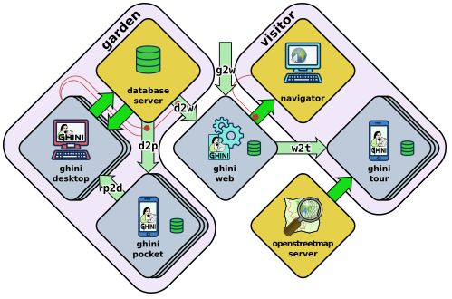

Dear conservator or scientist,
=========================================

You are reading Ghini's presentation letter. Ghini is a libre software project on GitHub,
focusing on botany. Brought to you by a small community of coders, botanists,
translators, and supported by a few institutions around the world, among which,
gardens that have adopted it for all their collection management needs.

The Ghini family is a software suite composed of standalone programs, data servers and
handheld clients, for data management, and publication:

* Ghini's core, ``ghini.desktop``, lets you 

  * enter and correct your data
  * navigate its links,
  * produce reports
  * import and or export using several standard or ad-hoc formats
  * review your taxonomy using online sources

  all according best practices suggested by top gardens, formalized in
  standard formats like ABCD, ITF2, but also as elaborated by our
  developers, based on the feedback of Ghini users.

  ``ghini.desktop`` is developed and continously tested on GNU/Linux, but
  runs equally well on Windows, or OSX. [1]

* ``ghini.pocket`` is your full time garden companion, an Android app
  installed from the Play Store,
  
  * assisting you in collecting or correcting data while in the field, 
  * associate pictures to your plants, and verify taxonomic information.
  * Import your collected data into the desktop client when back in the office,

  ``ghini.pocket`` reduces the time spent in front of your desktop PC to a true minimum.
  
* ``ghini.web`` is a web server and a courtesy data hub service, offering you
  world wide visibility: Export a selection of your data from your desktop database, and
  handle it for publication to the Ghini project, and we will include it at
  http://gardens.ghini.me/, at no cost while we're able to do that, or for a guaranteed
  minimal amount of time if you are able to support our hosting costs. ``ghini.web`` serves
  a world map to help locate participating gardens, and within each garden, its contributed
  georeferenced plants.

* ``ghini.tour``, a geographic tour Android app aimed at visitors, using
  OpenStreetMap as a base map, retrieving its data, gardens and virtual
  panels, from the web data aggregator ``ghini.web``.

All software within the Ghini family is either licensed GNU Public License v2+ or v3+.
It is a strong copyleft license.  In short, the GPL translates
the ethical scientific need to share knowledge, into legal terms. If you want to read more
about it, please refer to https://www.gnu.org/licenses/copyleft.html

Ghini's idea about knowledge and software ownership is that software is procedural knowledge
and as such, should be made a "commons": With software as a commons, "libre software" and
more specifically "Copylefted software", you not only get the source code, you receive the
right to adapt it, and the invitation to study and learn from it, and to share it, both share
forward to colleagues, and share back to the source.  With proprietary software, you are
buying your own ignorance, and with that, your dependency.

This fancy term "copyleft" instead of just "libre software", means the software you received
is libre software with one extra freedom, guaranteeing every right you were granted
upon receiving the software is never lost.

With copylefted software you are free —actually welcome— to employ local software developers
in your neighbourhood to alter the software according to your needs, please do this on
GitHub, fork the code, develop just as openly as the common practice within Ghini, and
whenever you want, open a pull request so your edits can be considered for inclusion in the
main branch. Ghini is mostly continuously unit tested, so before your code is added to the
main branch, it should follow our quality guidelines for contributions. With libre software you
acquire freedom and contribute to it, something that earns you visibility: Your additions stays
yours, you share them back to the community, and will see them completed and made better by
others. Having your code added to the main branch simplifies your upgrade procedure.

You can also contribute to the software by helping translate it into your native language. [5]

Some videos are published on YouTube, highlighting some of the software capabilities. [6]

Share back with the community. Several developers have spent cumulatively many thousand hours
developing this software, and we're sharing with the community.
We hope by this to stimulate a community sentiment in whoever starts using what we have produced.

Thanks for your consideration; please let me know if you have any questions,

Mario Frasca MSc

Many institutions still consider software an investment, an asset that is not to be shared
with others, as if it was some economic good that can't be duplicated, like gold.
As of right now, very few copylefted programs exist for botanic data management:

* ``ghini.desktop``, born as ``bauble.classic`` and made a commons by the Belize Botanical
  Garden.  ``ghini.desktop`` has three more components, a pocket data collecting Android app,
  a Node.js web server, aggregating data from different gardens and presenting it
  geographically, again a geographic tour app aimed at visitors using the web data
  aggregator as its data source. You can find every Ghini component on GitHub:
  http://github.com/Ghini

* Specify 6 and 7, made a Commons by the Kansas University. A bit complex to set up,
  very difficult to configure and tricky to update. The institutions I've met who tried it,
  only the bigger ones, with in-house software management capabilities manage to successfully
  use it. They use it for very large collections. Specify is extremely generic, it adapts
  to herbaria, seed collections, but also to collections of eggs, organic material, fossils,
  preserved dead animals, possibly even viruses, I'm not sure. It is this extreme
  flexibility that makes its configuration such a complex task. Specify is also on GitHub:
  https://github.com/specify and is licensed as GPLv2+.

* Botalista, a French/Swiss cooperation, is GPL as far as rumours go. Its development
  has yet to go public.

* ``bauble.web`` is an experimental web server by the author of ``bauble.classic``.
  ``bauble.classic`` has been included into Ghini, to become ``ghini.desktop``. Bauble uses
  a very permissive license, making it libre, but not copylefted. As much as 50% of
  bauble.web and possibly 30% of ghini.desktop is shared between the two projects. Bauble
  seems to be stagnating, and has not yet reached a production-ready stage.

* ``Taxasoft-BG``, by Eric Gouda, a Dutch botanist, specialist in Bromeliaceae, collection
  manager at the Utrecht botanical garden. It was Mario Frasca who convinced Eric to publish
  what he was doing, licensing it under the GPL, but the repository was not updated
  after 2016, April 13th and Eric forgot to explicitly specify the license.  You find it on
  github: https://github.com/Ejgouda/Taxasoft-BG

Of the above, only ``ghini.desktop`` satisfies these conditions: Copylefted, available,
documented, maintained, easy to install and configure.  Moreover: Cross platform and
internationalized.

*Ghini*, in
honour of Luca Ghini, founder of the first botanical garden in Europe,
and I've broadened the family with a hand-held inventory reviewing tool,
a data aggregator which I'm running as a service at
http://gardens.ghini.me/, and a hand-held app for garden visitors.

In case you're interested in publishing your tree collection on the net, I
would be happy to include your plants, species, coordinates to
http://gardens.ghini.me. Georeferenced textual information panels are also
very welcome, all offered as a courtesy: We're still defining the offer.
The idea behind this is allowing visitors to explore aggregated garden
collections, and the current focus is on trees.

A small example: http://gardens.ghini.me/#garden=Jardín%20el%20Cuchubo

Best regards,

Mario Frasca

[1] http://ghini.readthedocs.io/ - http://ghini.github.io/

[2] https://play.google.com/store/apps/details?id=me.ghini.pocket

[3] http://gardens.ghini.me/

[4] https://play.google.com/store/apps/details?id=me.ghini.tour

[5] https://hosted.weblate.org/projects/ghini/#languages

[6] https://www.youtube.com/playlist?list=PLtYRCnAxpinU_8WEDuRlgsYnNVe4J_4kv
