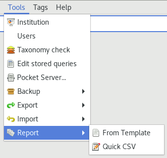
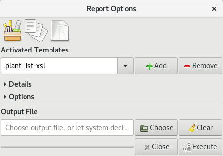
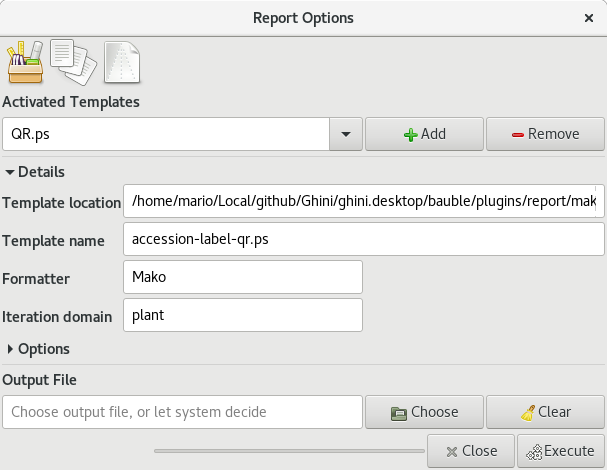
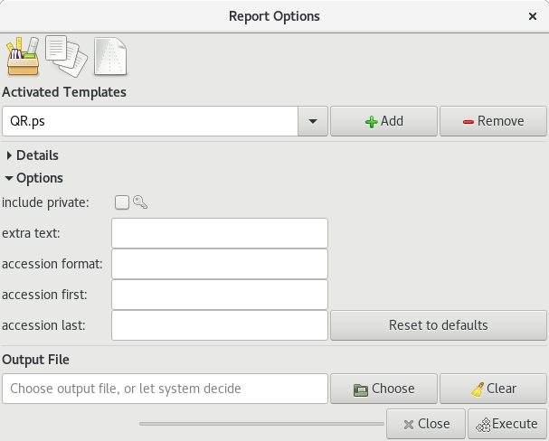
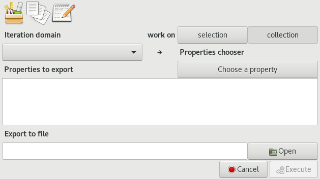

.. |ghini.pocket| replace:: :py:mod:`ghini.pocket`
.. |ghini.desktop| replace:: :py:mod:`ghini.desktop`

Generating reports
==================

A database without exporting facilities is of little use.  Ghini lets you export your data in table format
(files you can open in a spreadsheet program), as labels (to be printed or engraved), as html pages, pdf or
postscript documents, and the list could go on.  Table format files we also call 'flat files', and the most
common example would be CSV files.

The Report Tools
---------------------

Ghini has two Report Tools, one based on templates, and a quick solution for flat file production.  The
``Template`` based tool is as flexible as a programming language can be; the ``Quick CSV`` tool shares much
of its user interface with the query builder.

You activate the Report Tools from the main menu: :menuselection:`Tools-->Report`, then choose either ``From
Template``, or ``Quick CSV``.  Both Report Tools act on the current result in the results view, so you first
select something, then start the Report Tool.

.. admonition::  Selecting the whole collection.
   :class: toggle

      If you want to produce a report regarding your whole collection, you can do it from at least two
      points of view: you may want all the ``Species``, or you may want all the ``Locations``.

      A handy shortcut to get all your species in the selection, go to the home screen, then click on the
      ``Families: in use`` cell.

      If your focus is more on the garden location than on taxonomy and accessions, you would click on the
      ``Locations: total`` cell.

      The `Quick CSV` report tool can act on the whole collection, regardless the content of
      the results view.

Template Based Reports
^^^^^^^^^^^^^^^^^^^^^^^^^^^^^^^^

Activate the :menuselection:`Tools-->Report-->From Template` and you get the following dialog
box (fields may be filled in differently):

You have already selected your objects in the main window, you now here select a report template, then press
on ``Execute`` to produce your report.  Ghini will open the report in the corresponding application, if
installed and enabled.

Ghini comes with a few sample package-templates, and it lets you install your own user-templates.

.. admonition::  package-templates vs. user-templates
   :class: toggle

      Package-templates are integral part of the installation and are overwritten every time you update your
      installation.  User-templates are part of your custom data, just like your ghini configuration, your
      sqlite databases and your plant pictures.  User-templates are persistent as long as you stay in the
      same production line (say, ghini-3.1).

      To install a new template as a user-template, click on ``Add``, choose the file that contains your
      template, confirm.  |ghini.desktop| will copy it to your ghini user directory.

      You can delete installed user-templates, or disable package-templates: select the template name in the
      pull down list, click on ``Remove``.  Removing a user-templates deletes its file from your custom user
      data.  Removing a package-template only disables it for the current user.  You can enable all disabled
      package-templates by opening the ``Add`` dialog box, and clicking on the ``Reset package-templates``
      button

      A user can overrule a package-template, by installing it again as a user-template.  Installed
      user-templates are just text files, you can edit them with any decent text editor.  This allows you to
      alter package-templates, and to keep your changes across updates.  You can use your preferred file
      handling tool to copy or rename your user-templates.

Choosing a template implies the choice of a template language.  |ghini.desktop| supports three template
languages: Jinja2, Mako and XSL.  There is only one formatting engine handling the Jinja2 template language,
and the same goes for Mako.  During installation you indicated which of the several XSL formatting engines
you wanted to have, if any.

Expand the ``Details`` section to see some information about the selected formatter template.

The formatter engine combines selection and template to produce a report.  Each formatter template indicates
its iteration domain, that is what kind of collection objects you focus on in your report.  In the above
example, we are using Jinja2 to report about individual plants, producing —per plant— a postscript label
with a QR code.

Expand the ``Options`` section to see what extra parameters your selected template may require or expects.

In the above example, the plant-labelling formatter lets you override the selection, and produce a set of
labels in your preferred format, for a given range of accession codes.

In general: choose the report you need, specify parameters if required, and produce the report.  Ghini will
open the report in the associated application.

This is as far as generic information can go.  Formatter templates can be very specific, and vary broadly
from each other, most of them are small pieces of software themselves.

Template-less Reports (Quick CSV)
^^^^^^^^^^^^^^^^^^^^^^^^^^^^^^^^^^^

Activate the :menuselection:`Tools-->Report-->Quick CSV` and you get the following dialog box:

Start from the top and work your way to the bottom:

- decide whether you work on the selection or the whole collection,
- choose the iteration domain,
- select the properties to include in the report,
- drag and drop them in the list to get them in the correct order,
- choose the destination file,
- execute.
  
Ghini will open the report, a CSV file, in your preferred spreadsheet program.

Do you really need any further documentation?  If anything isn't clear then please ask.

Technical information
----------------------------------

The remainder of this page provides technical information and links regarding the formatter engines, and
gives hints on writing report templates.  Writing templates comes very close to writing a computer program,
and that's beyond the scope of this manual, but we have hints that will definitely be useful to the
interested reader.

Working with Templates Languages
^^^^^^^^^^^^^^^^^^^^^^^^^^^^^^^^^^^^^^

Common information
................................................

Creating reports with Mako and Jinja2 technically equivalent to creatint a web page from a template.  Both
Mako and Jinja2 are indeed mostly used for dynamic creation of static web pages.  This should be easy to do,
for anyone with a little programming experience.

Ghini instructs the template generator to use the same file extension as the template, stripping the
trailing ``.mako`` / ``.jj2`` part.  The remaining template extension indicates the type of output produced
by the template.  The trailing ``.mako`` / ``.jj2`` helps ghini decide which template generator to use, and
prevents you from mistaking a template for an output file.

For example, to generate an HTML page from a Mako template, you would name the template something like
``report.html.mako``.  Similarly, you would name a template ``report.csv.jj2`` if it uses Jinja2 to generate
a comma separated value file.

A template must declare its iteration domain, that is, on which type of objects it reports.  The iteration
domain is declared in a comment line, something like this (for Mako):

    ``## DOMAIN <name>``

or this (for Jinja2):

     ``{# DOMAIN <name> #}``

Here ``<name>`` is one of ``Species``, ``Accession``, ``Plant``, ``Location``, or ``raw``.  The keyword
``DOMAIN`` needs be all upper case, but the declaration is further case insensitive.

The role of the ``DOMAIN`` declaration is to instruct ghini about the data that the template needs to
receive: when rendering a template, ghini starts by building a raw list containing all top-level objects in
the current result.  If the declared iteration domain is ``raw``, ghini will pass this raw list to the
template.  If the declared iteration domain is a ghini class, ghini will then build a list of all objects in
the iteration domain, associated to the raw list.  E.g.: if you select a couple of locations, and the report
declares ``DOMAIN Accession``, ghini will collect all accessions having plants in one of the selected
locations.

These objects are available to the template as elements of the list ``values``.

A template declaring ``DOMAIN raw`` needs more programming logic.  On the other hand, a small, well-thought
set of such templates can reduce the amount of template names that your users need to handle.

A template may require extra options, that can the user will define at run time.  These are described in
comment lines, like in this Mako example:

  ``## OPTION accession_first: (type: integer, default: '', tooltip: 'start of range.')``
  
The Jinja2 equivalent of the above is:

  ``{# OPTION accession_first: (type: integer, default: '', tooltip: 'start of range.') #}``

As you can see from the example, an option has a name and the three compulsory fields ``type``, ``default``,
``tooltip``.  ``type`` must be the python name of a type, valid at runtime, and initializable from the
default value, and from the text inserted by the user at runtime.  Built-in examples would be ``str``,
``int``, ``float``, ``bool``.  If the user provided value is invalid for the type, or if the user provides
no value, the ``default`` value will be used.  ``tooltip`` is shown when the user places the mouse cursor
over the text, without clicking.

Options are available to the template, collected in the dictionary ``options``.

|ghini.desktop| provides several Postscript and SVG production functions, in the two namespaces ``PS`` and
``SVG``, respectively.

The SVG namespace defines the ``add_text``, ``add_QR`` and ``add_code39`` functions.  The PS namespace
defines the ``add_text``, ``add_QR``, and ``add_image`` functions.  Please refer to sources and examples for
their usage.  There is nothing preventing us from defining an ``add_code39`` function also in the PS
namespace, while defining the ``add_image`` for the SVG namespace is more of a challenge, because of the
raster/vectorial incompatibility.

Working with Jinja2
..........................

Jinja2 is a mainstream, powerful and well documented template language.  Please refer to `Jinja2 online
documentation <http://jinja.pocoo.org/>`_ for information regarding how to write templates.

A good and comprehensive example for Jinja2 within |ghini.desktop| is the ``tortuosa.ps.jj2`` template.  It
shows how to write a template that inherits from a base template, how to define a template domain, how to
include pictures, how to use the ``PS`` and ``SVG`` namespaces and the ``enumerate`` function, included by
default to the environment accessible from your Jinja2 templates.

The ``tortuosa.ps.jj2`` is not precisely a beginner's case.  Please check Mako examples for simpler
templates.

Working with Mako
......................................

The Mako report formatter uses the Mako template language for generating reports.  The Mako templating
system is included in all |ghini.desktop| installation.

Mako is less mainstream than Jinja2, and arguably less good documented, but also quite more flexible than
Jinja2.  They are very similar to each other so most concepts apply to both.  If you're doing something
rather simple, start with Jinja2.  If you stumble against Jinja2 limitations, try Mako.  If you don't
understand how Mako works, spend a couple of hours on Jinja2 documentation, then go back to Mako.

More information about Mako and its language can be found at `makotemplates.org
<http://www.makotemplates.org>`_.

An bare bones sample Mako template is the further uninteresting ``example.csv.mako`` template.  A more
useful example is the ``bgci-upload.csv.mako`` template.  Just as simple, but it accomplishes a useful goal.

A very comprehensive example for Mako within |ghini.desktop| is the ``accession-label-qr.ps.mako`` example.
It shows how to write a template that inherits from a base templates, how to define a template domain.  The
``accession-label-qr.ps.mako`` example also shows how to import pictures, how to import functions from the
available Python environment, and how to use the ``PS`` and ``SVG`` namespaces, included by default to the
environment accessible from your Mako templates.

Working with XSL Stylesheets
^^^^^^^^^^^^^^^^^^^^^^^^^^^^^^^^^^^^^^^^^^

.. admonition:: Not up-to-date, help required.
   :class: toggle

      The current maintainer was never hired to work at this part of the software, and he leaves this
      feature as he found it, both code and user documentation, trying not to break it.  Please contribute,
      with text, screenshots, examples, if you know how to produce reports with XSL.  The below notes date
      back to the old Bauble 1.0.11 docs.  And, oh well, you may state that they say close to nothing.

The XSL report formatter requires an XSL to PDF renderer to
convert the data to a PDF file.  Apache FOP is a free and
open-source XSL->PDF renderer and is recommended.

Installing Apache FOP on GNULinux
...................................

If using Linux, Apache FOP should be installable using your package
manager.  On Debian/Ubuntu it is installable as ``fop`` in Synaptic or
using the following command::

   apt-get install fop

Installing Apache FOP on Windows
................................

You have two options for installing FOP on Windows. The easiest way is to download the prebuilt
`ApacheFOP-0.95-1-setup.exe
<http://code.google.com/p/apache-fop-installer/downloads/detail?name=ApacheFOP-0.95-1-setup.exe&can=2&q=#makechanges>`_
installer.

Alternatively you can download the `archive <http://www.apache.org/dist/xmlgraphics/fop/binaries/>`_.  After
extracting the archive you must add the directory you extracted the archive to to your PATH environment
variable.
