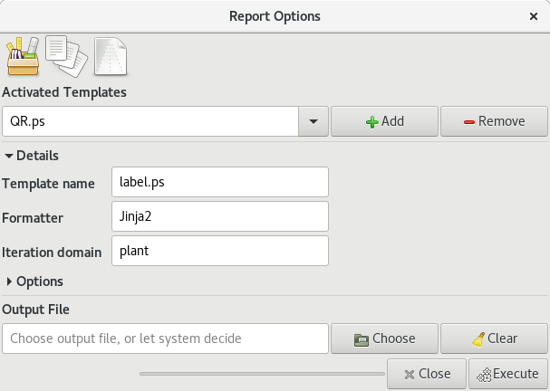

Generating reports
==================

A database without exporting facilities is of little use.  Ghini lets you
export your data in table format (open them in your spreadsheet editor of
choice), as labels (to be printed or engraved), as html pages or pdf or
postscript documents.

The Report Tools
---------------------

Ghini has two Report Tools, one based on templates, and a quick solution for flat file production.  The
``Template`` based tool is as flexible as a programming language can be; the ``Quick CSV`` tool shares much
of its user interface with the query builder.

You activate the Report Tools from the main menu: :menuselection:`Tools-->Report`, then choose either `From
Template`, or `Quick CSV`.  Both Report Tools act on the current result in the results view, so you first
select something, then start the Report Tool.

.. admonition::  Selecting the whole collection.
   :class: toggle

      If you want to produce a report regarding your whole collection, you can do it from at least two
      points of view: you may want all the ``Species``, or you may want all the ``Locations``.

      A handy shortcut to get all your species in the selection, go to the home screen, then click on the
      ``Families: in use`` cell.

      If your focus is more on the garden location than on taxonomy and accessions, you would click on the
      ``Locations: total`` cell.

      The `Quick CSV` report tool can act on the whole collection, regardless the content of
      the results view.

Template Based Reports
^^^^^^^^^^^^^^^^^^^^^^^^^^^^^^^^

Activate the :menuselection:`Tools-->Report-->From Template` and you get the following dialog
box (fields may be filled in differently):

Ghini lets you ``activate`` available reports, and give them the name that makes most sense to you.  Click
on ``Add``, choose a formatter template, and type the name by which you want to activate it.  Activated
templates are static, once configured you are not expected to alter them.

Choosing a formatter template implies a template language.  ghini.desktop supports two template languages:
Mako and XSL.  There is only one formatting engine handling the Mako template language, while during
installation you indicated which of the several XSL formatting engines you wanted to have, if any.

Expand the ``Details`` section to see some information about the selected formatter template.

The formatter engine combines selection and formatter template to produce a report.  Each formatter template
indicates the iteration domain, that is what kind of collection objects you focus on, in your report.  In
the above example, we are reporting about individual plants.

Expand the ``Options`` section to see what extra parameters your selected template may require or expect.

.. image:: images/report-from-template-dialog-options.png

In the above example, the plant-labelling formatter lets you override the selection, and produce a set of
labels with a given format, and in a given range.

In general: choose the report you need, specify parameters if required, and produce the report.  Ghini will
open the report in the associated application.

This is as far as generic information can go.  Formatter templates can be very specific, and deeply vary
from each other, most of them are small pieces of software themselves.  Please check their instructions from
your source.

Template-less Reports (Quick CSV)
^^^^^^^^^^^^^^^^^^^^^^^^^^^^^^^^^^^

Does such a simple tool need any documentation?  Use it, if you don't understand then please ask.

Technical information
----------------------------------

The remainder of this page provides technical information and links regarding the formatter engines, and
gives hints on writing report templates.  Writing templates comes very close to writing a computer program,
and that's beyond the scope of this manual, but we have hints that will definitely be useful to the
interested reader.

Working with Mako Templates
^^^^^^^^^^^^^^^^^^^^^^^^^^^^^^^^^^^^^^

The Mako report formatter uses the Mako template language for
generating reports. More information about Mako and its language can
be found at `makotemplates.org <http://www.makotemplates.org>`_.

The Mako templating system should already be installed on your
computer if Ghini is installed.

Creating reports with Mako is similar in the way that you would create
a web page from a template.  It is much simpler than the XSL
Formatter(see below) and should be relatively easy to create template
for anyone with a little but of programming experience.

The template generator will use the same file extension as the
template which should indicate the type of output the template with
create.  For example, to generate an HTML page from your template you
should name the template something like `report.html`.  If the template
will generate a comma separated value file you should name the
template `report.csv`.

A template must declare its iteration domain, that is, on which type of objects it reports.  The iteration
domain is declared in a Mako comment line, something like this::

     ## DOMAIN <name>

Where ``<name>`` is one of ``Species``, ``Accession``, ``Plant``, ``Location``, or ``raw``.

When activating a template, ghini first of all builds a raw list, containing all top-level objects in
current result.

If the declared iteration domain is ``raw``, ghini will pass the raw list to the template.

If the declared iteration domain is a ghini class, ghini will then build a list of all objects the
iteration domain, associated to the raw list.

In either case, these objects are available to the Mako template as elements of the list ``values``.

A template working with the ``raw`` list needs more programming logic to do what the user expects, but a
well-thought set of such mako templates can reduce the amount of template names that your users need to
handle.

Working with XSL Stylesheets
^^^^^^^^^^^^^^^^^^^^^^^^^^^^^^^^^^^^^^^^^^

The XSL report formatter requires an XSL to PDF renderer to
convert the data to a PDF file. Apache FOP is is a free and
open-source XSL->PDF renderer and is recommended.

Installing Apache FOP on GNULinux
...................................

If using Linux, Apache FOP should be installable using your package
manager.  On Debian/Ubuntu it is installable as ``fop`` in Synaptic or
using the following command::

   apt-get install fop

Installing Apache FOP on Windows
................................

You have two options for installing FOP on Windows. The easiest way is
to download the prebuilt `ApacheFOP-0.95-1-setup.exe <http://code.google.com/p/apache-fop-installer/downloads/detail?name=ApacheFOP-0.95-1-setup.exe&can=2&q=#makechanges>`_ installer.

Alternatively you can download the `archive
<http://www.apache.org/dist/xmlgraphics/fop/binaries/>`_.  After
extracting the archive you must add the directory you extracted the
archive to to your PATH environment variable.
