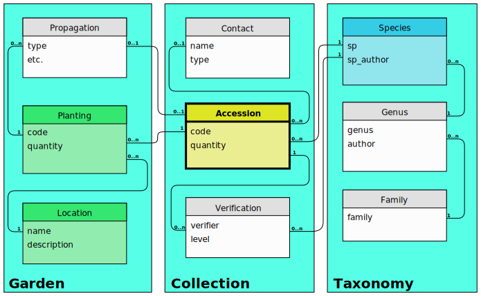
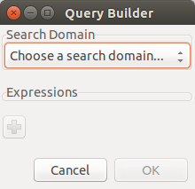

.. _searching-in-bauble:

Searching in Ghini
-------------------

Searching allows you to view, browse and create reports from your
data. You can perform searches by either entering the queries in the
main search entry or by using the Query Builder to create the queries
for you. The results of Ghini searches are listed in the main window.

Search Strategies
=================

Ghini offers four distinct search strategies:

* by value — in all domains;
* by expression — in a few implicit fields in one explicit domain;
* by query — in one domain;
* by binomial name — only searches the Species domain.

All search strategies —with the notable exception of the binomial name
search— are case insensitive.

Search by Value
+++++++++++++++++++++++++++++++++++

Search by value is the simplest way to search. You enter one or more strings
and see what matches. The result includes objects of any type (domain) where
one or more of its fields contain one or more of the search strings.

You don't specify the search domain, all are included, nor do you indicate
which fields you want to match, this is implicit in the search domain.

The following table helps you understand the results and guides you in
formulating your searches.

.. _search-domains:

=============================  =====================  ============
search domain overview
------------------------------------------------------------------
name and shorthands            field                  result type
=============================  =====================  ============
family, fam                    epithet (family)       Family
genus, gen                     epithet (genus)        Genus
species, sp                    epithet (sp) **×**     Species
vernacular, common, vern       name                   Species
geography, geo                 name                   Geography
accession, acc                 code                   Accession
planting, plant                code **×**             Plant
location, loc                  code, name             Location
contact, person, org, source   name                   Contact
collection, col, coll          locale                 Collection
tag, tags                      name                   Tag
=============================  =====================  ============

Examples of searching by value would be: Maxillaria, Acanth,
2008.1234, 2003.2.1, indica.

Unless explicitly quoted, spaces separate search strings. For example if you
search for ``Block 10`` then Ghini will search for the strings Block and 10
and return all the results that match either of these strings. If you want
to search for Block 10 as one whole string then you should quote the string
like ``"Block 10"``.

.. admonition:: × Composite Primary Keys
   :class: note

                A **species** epithet means little without the corresponding
                genus, likewise a **planting** code is unique only within
                the accession to which it belongs.  In database theory
                terminology, epithet and code are not sufficient to form a
                **primary key** for respectively species and planting.
                These domains need a **composite** primary key.

                Search by value lets you look for **plantings** by their
                complete planting code, which includes the accession code.
                Taken together, Accession code and Planting code do provide
                a **composite primary key** for plantings.  For **species**,
                we have introduced the binomial search, described below.

Search by Expression
++++++++++++++++++++++++++++++++++++++++

Searching with expression gives you a little more control over what you are
searching for. You narrow the search down to a specific domain, the software
defines which fields to search within the domain you specified.

An expression is built as ``<domain> <operator> <value>``. For example the
search: ``gen=Maxillaria`` would return all the genera that match the name
Maxillaria. In this case the domain is ``gen``, the operator is ``=`` and
the value is ``Maxillaria``.

The above search domain overview table tells you the names of the search
domains, and, per search domain, which fields are searched.

The search string ``loc like block%`` would return all the Locations for
which name or code start with "block".  In this case the domain is ``loc``
(a shorthand for ``location``), the operator is ``like`` (this comes from
SQL and allows for "fuzzy" searching), the value is ``block%``, the
implicitly matched fields are ``name`` and ``code``.  The percent sign is
used as a wild card so if you search for ``block%`` then it searches for all
values that start with max.  If you search for ``%10`` it searches for all
values that end in ``10``.  The string ``%ck%10`` would search for all value
that contain ``ck`` and end in ``10``.

.. admonition:: When a query takes ages to complete
   :class: note

   You give a query, it takes time to compute, the result contains
   unreasonably many entries.  This happens when you intend to use a
   strategy, but your strings do not form a valid expression.  In this case
   Ghini falls back to *search by value*. For example the search string
   ``gen lik maxillaria`` will search for the strings ``gen``, ``lik``, and
   ``maxillaria``, returning all that match at least one of the three
   criteria.

Binomial search
+++++++++++++++++++++++++++++++++++

You can also perform a search in the database if you know the species, just
by placing a few initial letters of genus and species epithets in the search
engine, correctly capitalized, i.e.: **Genus epithet** with one leading capital
letter, **Species epithet** all lowercase.

This way you can perform the search ``So ha``.

These would be the initials for Solanum hayesii, or Solanum havanense.

Binomial search comes to compensate the limited usefulness of the above
search by expression when trying to look for a species.

It is the correct capitalization **Xxxx xxxx** that informs the
software of your intention to perform a binomial search.  The software's
second guess will be a search by value, which will possibly result in far
more matches than you had expected.

The similar request ``so ha`` will return, in a fresh install, over 3000
objects, starting at Family "Acalyp(**ha**)ceae", ending at Geography
"Western (**So**)uth America".

Search by Query
+++++++++++++++++++++++++++++++++++

Queries allow the most control over searching. With queries you can search
across relations, specific columns, combine search criteria using boolean
operators like ``and``, ``or``, ``not`` (and their shorthands ``&&``,
``||``, ``!``), enclose them in parentheses, and more.

Please contact the authors if you want more information, or if you volunteer
to document this more thoroughly.  In the meanwhile you may start
familiarizing yourself with the core structure of Ghini's database.

   **core structure of Ghini's database**

A few examples:

* plantings of family Fabaceae in location Block 10::

    plant WHERE accession.species.genus.family.epithet=Fabaceae AND location.description="Block 10"

* locations that contain no plants::

    location WHERE plants = Empty

* accessions associated to a species of known binomial name (e.g.: Mangifera indica)::

    accession WHERE species.genus.epithet=Mangifera AND species.epithet=indica

* accessions we propagated in the year 2016::

    accession WHERE plants.propagations._created BETWEEN |datetime|2016,1,1| AND |datetime|2017,1,1|

* accessions we modified in the last three days::

    accession WHERE _last_updated>|datetime|-3|

Searching with queries requires some knowledge of a little syntax and an
idea of the extensive Ghini database table structure. Both you acquire with
practice, and with the help of the Query Builder.

The Query Builder
=================

Ghini offers a Query Builder, that helps you build complex search queries
through a point and click interface.  To open the Query Builder click the
|querybuilder| icon to the left of the search entry or select
:menuselection:`Tools-->Query Builder` from the menu.

.. |querybuilder| image:: querybuilder.png
   :align: middle
   :width: 18

A window will show up, which will lead you through all steps necessary to
construct a correct query that is understood by Ghini's Query Search
Strategy.

.. image:: images/screenshots/qb-choose_property.png
                                                                          
First of all you indicate the search domain, this will allow the Query
Builder complete its graphical user interface, then you add as many logical
clauses as you need, connecting them with a ``and`` or ``or`` binary
operator.

Each clause is formed of three parts: a property that can be reached from
the starting search domain, a comparison operator that you select from the
drop-down list, a value that you can either type or select from the list of
valid values for the field.

Add as many search properties as you need, by clicking on the plus sign.
Select and/or next to the property name to choose how the clauses will be
combined in the search query.

When you are done building your query click OK to perform the search.

At this point the Query Builder writes the query in the search entry, and
executes it. You may now edit the string as if you had typed it
yourself. Notice how the left hand side values are interpreted by the query
builder and enclosed in single quotes if recognized as strings, left alone
if they look like numbers or the two reserved words ``None`` and
``Empty``. You may edit the query and insert quotes if you need them, eg if
you need to literally look for the string ``Empty``.

``None`` is the value of an empty field. It is not the same as the zero
lenght string ``''`` nor the numeric ``0`` nor the boolean ``False`` nor the
set ``Empty``, it indicates that the field has no value at all.

``Empty`` is the empty set. Being it a set, it can be matched against sets
(eg: plants of an accession, or accessions of a species), not against
elements (eg: quantity of a plant or description of a location). However,
the Query Builder does not let you choose a left hand side value stopping at
a set, it expects you to select a field. Choose just any field: at the
moment of producing the query, when the Query Builder meets a clause with
right hand side value the literal string ``Empty``, it will drop the field
name and let you compare the set on the left with ``Empty`` on the right.

We have no literals ``False`` and ``True``. These are typed values, and the
Query Builder does not know how to produce them. Instead of ``False`` type
``0``, and instead of ``True`` type ``1``.

Query Grammar
==================

For those who don't fear a bit of formal precision, the following BNF code
gives you a rather precise idea of the grammar implemented by the Query
Search Strategy.  Some grammatical categories are informally defined; any
missing ones are left to your fertile imagination; literals are included in
single quotes; the grammar is mostly case insensitive, unless otherwise
stated::

    query ::= domain 'WHERE' expression

    domain ::= #( one of our search domains )
    expression ::= signed_clause
                 | signed_clause 'AND' expression
                 | signed_clause 'OR' expression
                 ;
    signed_clause ::= clause
                    | 'NOT' clause  #( not available in Query Builder)
                    ;
    clause ::= field_name binop value  #( available in Query Builder)
             | field_name set_binop value_list
             | aggregated binop value
             | field_name 'BETWEEN' value 'AND' value
             | '(' expression ')'
             ;
    field_name ::= #( path to reach a database field or connected table )
    aggregated ::= aggregating_func '(' field_name ')'
    aggregating_func ::= 'SUM'
                       | 'MIN'
                       | 'MAX'
                       | 'COUNT'
                       ;
    value ::= typed_value
            | numeric_value
            | none_token
            | empty_token
            | string_value
            ;
    typed_value ::= '|' type_name '|' value_list '|'
    numeric_value ::== #( just a number )
    none_token ::= 'None'    #( case sensitive )
    empty_token ::= 'Empty'  #( case sensitive )
    string_value = quoted_string | unquoted_string

    type_name ::= 'datetime' | 'bool' ;  #( only ones for the time being )
    quoted_string ::= '"' unquoted_string '"'
    unquoted_string ::=  #( alphanumeric and more )

    value_list ::= value ',' value_list
                 | value
                 ;
    binop ::= '='
            | '=='
            | '!='
            | '<>'
            | '<'
            | '<='
            | '>'
            | '>='
            | 'LIKE'
            | 'CONTAINS'
            ;
    set_binop ::= 'IN'

Please be aware that Ghini's Query language is quite a bit more complex than
what the Query Builder can produce: Queries you can build with the Query
Builder form a proper subset of the queries recognized by the software::

    query ::= domain 'WHERE' expression

    domain ::= #( one of our search domains )
    expression ::= clause
                 | clause 'AND' expression
                 | clause 'OR' expression
                 ;
    clause ::= field_name binop value
             ;
    field_name ::= #( path to reach a database field or connected table )
    value ::= numeric_value
            | string_value
            ;
    numeric_value ::== #( just a number )
    string_value = quoted_string | unquoted_string ;

    quoted_string ::= '"' unquoted_string '"'
    unquoted_string ::=  #( alphanumeric and more )

    binop ::= '='
            | '=='
            | '!='
            | '<>'
            | '<'
            | '<='
            | '>'
            | '>='
            | 'LIKE'
            | 'CONTAINS'
            ;
