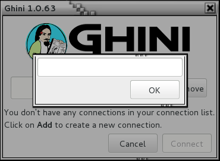
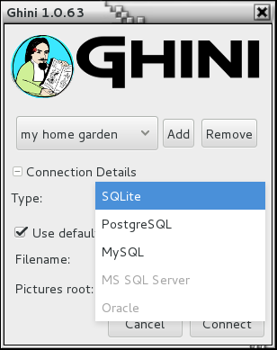

Initial Configuration
-------------------------

After a successful installation, more complex organizations will need
configure their database, and configure Ghini according to their database
configuration. This page focuses on this task. If you don't know what this
is about, please do read the part relative to SQLite.

.. _before-you-start:

Should you SQLite?
===================

Is this the first time you use Ghini, are you going to work in a
stand-alone setting, you have not the faintest idea how to manage a database
management system? If you answered yes to any of the previous, you probably
better stick with SQLite, the easy, fast, zero-administration file-based
database.

With SQLite, you do not need any preparation and you can continue with
`connecting`_.

On the other hand, if you want to connect more than one bauble workstation
to the same database, or if you want to make your data available for other
clients, as could be a web server in a LAMP setting, you should consider
keeping your database in a database management system like `PostgreSQL
<http://www.postgresql.org>`_ or `MySQL/MariaDB <https://mariadb.org/>`_,
both supported by Ghini.

When connecting to a database server as one of the above, you have to
manually do the following: Create at least one user; Create your database;
Give at least one user full permissions on your database; If you plan having
more database users: Give one of your users the ``CREATEROLE`` privilege;
Consider the user with the ``CREATEROLE`` privilege as a super-user, not
meant to handle data directly; Keep your super-user credentials in a very
safe place.

When this is done, Ghini will be able to proceed, creating the tables and
importing the default data set.  The process is database-dependent and it
falls beyond the scope of this manual.

If you already got the chills or sick at your stomach, no need to worry,
just stick with SQLite, you do not miss on features nor performance.

..  admonition:: Some more hints if you need PostgreSQL
    :class: toggle

       Start simple, don't do all at the same time. Review `the online
       manual <https://www.postgresql.org/docs/9.4/static/index.html>`_, or
       download and study `the offline version
       <https://www.postgresql.org/files/documentation/pdf/9.4/postgresql-9.4-A4.pdf>`_.

       As said above, create a database, a user, make this user the owner of
       the database, decide whether you're going to need multiple users, and
       preferably reserve a user for database and normal user creation. This
       super-user should be your only user with ``CREATEROLE``
       privilege.

       All normal users will need all privileges on all tables and
       sequences, something you can do from the
       :menuselection:`Tools-->Users` menu.  If you have any difficulty,
       please `open an issue
       <https://github.com/Ghini/ghini.desktop/issues/new>`_ about it.
       
       Connect using the ``psql`` interactive terminal.  Create a
       ``~/.pgpass`` file (read more about it in `the manual
       <https://www.postgresql.org/docs/9.4/static/libpq-pgpass.html>`_),
       tweak your ``pg_hba.conf`` and ``postgresql.conf`` files, until you
       can connect using the command::

         psql <mydb> --username <myuser> --no-password --host <mydbhost>

       With the above setup, connecting from ghini will be an obvious task.

.. _connecting:

Connecting to a database
========================

When you start Ghini the first thing that comes up is the connection
dialog. 

Quite obviously, if this is the first time you start Ghini, you have no
connections yet and Ghini will alert you about it.

.. image:: images/screenshots/first-time-activation.png

This alert will show at first activation and also in the future if your
connections list becomes empty. As it says: click on **Add** to create your
first connection.

Just insert a name for your connection, something meaningful you associate
with the collection to be represented in the database (for example: “my home
garden”), and click on **OK**. You will be back to the previous screen, but
your connection name will be selected and the Connection Details will have
expanded.

.. image:: images/screenshots/my-first-botanical-garden.png

**specify the connection details**

If you do not know what to do here, Ghini will help you stay safe. Activate the **Use default locations** check box and create your
first connection by clicking on **Connect**.

You may safely skip the remainder of this section for the time being and
continue reading to the following section.

**fine-tune the connection details**

By default Ghini uses the file-based SQLite database.  During the
installation process you had the choice (and you still have after
installation), to add database connectors other than the default SQLite.

In this example, Ghini can connect to SQLite, PostgreSQL and MySQL, but no
connector is available for Oracle or MS SQL Server.

If you use SQLite, all you really need specify is the connection name. If
you let Ghini use the default filename then Ghini creates a database file
with the same name as the connection and ``.db`` extension, and a pictures
folder with the same name and no extension, both in ``~/.bauble`` on
Linux/MacOSX or in ``AppData\Roaming\Bauble`` on Windows.

Still with SQLite, you might have received or downloaded a bauble database,
and you want to connect to it. In this case you do not let Ghini use the
default filename, but you browse in your computer to the location where you
saved the Ghini SQLite database file.

If you use a different database connector, the dialog box will look
different and it will offer you the option to fine tune all parameters
needed to connect to the database of your choice.

If you are connecting to an existing database you can continue to
:ref:`editing-and-inserting-data` and subsequently
:ref:`searching-in-ghini`, otherwise read on to the following section on
initializing a database for Ghini.

If you plan to associate pictures to plants, specify also the *pictures
root* folder. The meaning of this is explained in further detail at
:ref:`plant-pictures` in :ref:`editing-and-inserting-data`.

.. _creating-a-new-database:

Initialize a database
=======================

First time you open a connection to a database which had never been seen by
Ghini before, Ghini will first display an alert:

.. image:: images/screenshots/empty-database.png

immediately followed by a question:

.. image:: images/screenshots/bauble-create-new.png

Be careful when manually specifying the connection parameters: the values
you have entered may refer to an existing database, not intended for use
with Ghini. By letting Ghini initialize a database, the database will be
emptied and all of its content be lost.

If you are sure you want to create a database at this connection then
select "Yes". Ghini will then start creating the database tables and
importing the default data. This can take a minute or two so while all
of the default data is imported into the database so be patient.

Once your database has been created, configured, initialized, you are ready
to start :ref:`editing-and-inserting-data` and subsequently
:ref:`searching-in-bauble`.
