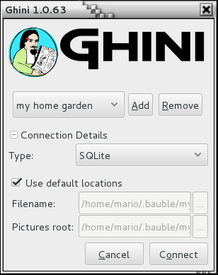
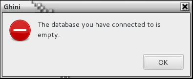
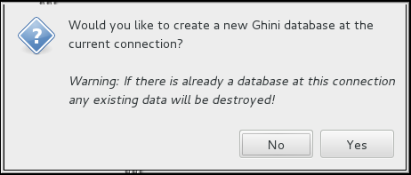

Getting Started
---------------

.. _before-you-start:

Before you start
===================

Is this the first time you use Bauble, are you going to work in a
stand-alone setting, you have not the faintest idea how to manage a database
management system? If you answered yes to any of the previous, you probably
better stick with SQLite, easy, fast, zero-administration file-based
database.

With SQLite, you do not need any preparation and you can continue with
`connecting`_.

On the other hand, if you want to connect more than one bauble workstation
to the same database, or if you want to make your data available for other
clients, as could be a web server in a LAMP setting, you should consider
keeping your database in a database management system like `PostgreSQL
<http://www.postgresql.org>`_ or `MySQL/MariaDB <https://mariadb.org/>`_,
both supported by Bauble.

When connecting to a database server as one of the above, you have to
manually create: at least one bauble user, the database you want bauble to
use, and to give at lest one bauble user full permissions on its
database. When this is done, Bauble will be able to proceed, creating the
tables and importing the default data set.  The process is
database-dependent and it falls beyond the scope of this manual.

If you already got the chills or sick at your stomach, no need to worry,
just stick with SQLite, you do not miss on features nor performance.

.. _connecting:

Connecting to a database
========================

When you start Bauble the first thing that comes up is the connection dialog. 

.. image:: images/screenshots/bauble-closed-conn-dialog.png

From this dialog you can select among the database connections and for each
of them, you can specify the different connection parameters.

    If this is the first time that you are starting Bauble then you will not
    having any connections to choose from.  Bauble will display a message
    box warning you about it:

    .. image:: images/screenshots/first-time-activation.png

    As it says: close the message box, you will return to the connection
    dialog, where you click on **Add** to create your first connection.

.. image:: images/screenshots/enter-a-connection-name.png

**specify the connection details**

If you do not know what to do here, Bauble will help you stay safe. Just
insert a name for your connection, something easy for you to associate with
the collection to be represented in the database, and click on **OK**. You
will be back to the previous screen, but the Connection Details will have
expanded. Activate the **Use default locations** check box and create your
first connection by clicking on **Connect**.

You may safely skip the remainder of this section for the time being and
continue reading to the following section.

**fine-tune the connection details**

By default Bauble uses the file-based SQLite database.  If you use the
default filename then Bauble creates a database file with the same name as
the connection in ``~/.bauble`` on Linux/MacOSX or in
``AppData\Roaming\Bauble`` on Windows.

Bauble allows you to connect to any existing database. If you connect to an
empty database a message will popup asking asking you if you would like to
inizialize it as a new database.

If you are connecting to an existing database you can continue to Inserting
or Searching, otherwise read on to the following section.

If you plan to associate pictures to plants, specify also the *pictures
root* folder. The meaning of this is explained in further detail in the
Plants section. 

.. _creating-a-new-database:

Initialize a database
=======================

First time you open a connection to a database which had never been seen by
Bauble before, Bauble will first display an alert:

immediately followed by a question:

Be careful because if you have entered the wrong connection parameters
it is possible to overwrite an existing database at this connection.

If you are sure you want to create a database at this connection then
select "Yes". Bauble will then start creating the database tables and
importing the default data. This can take a minute or two so while all
of the default data is imported into the database so be patient.

Once your database has been created, configured, initialized, you are ready
to start :ref:`editing-and-inserting-data` and subsequently
:ref:`searching-in-bauble`.
