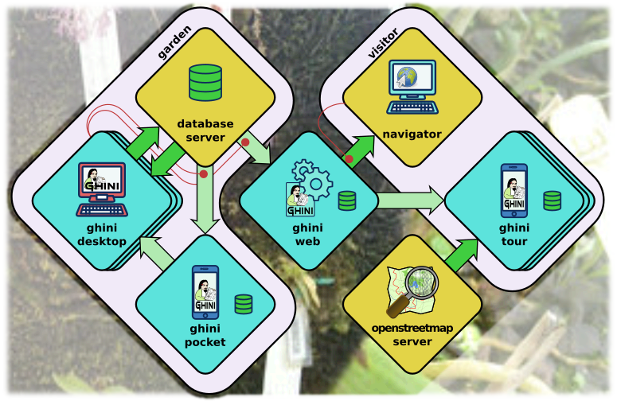

Mission & Vision
==================

Here we state who we are, what we think of our work, what you can expect of
this project.

Who is behind Ghini
..............................................

Ghini is a small set of programs, meant to let collection managers manage
their collection also digitally.

Ghini was born back in 2004 as Bauble, at the Belize Botanical Garden. It
was later adapted to the needs of a few more gardens. Brett Adams, the
original programmer, made this software a commons, by releasing it under a
GPL license.

After years of stagnation Mario Frasca revived the project, and rebranded it
as Ghini in honour of Luca Ghini, founder of the first European botanic
garden and herbarium. Mario Frasca started advocating, travelling,
distributing, developing, expanding, redefining, documenting it, and it is
now Mario Frasca writing this, looking for users, requesting feedback.

Behind Ghini there's not only one developer, but a small but growing global
users community.

Translations are provided by volunteers who mostly stay behind the scenes,
translating missing terms or sentences, and disappearing again.

To make things clearer when we speak of Ghini, but should—and in this
document we will—indicate whether it's Ghini(the software), or Ghini(the
people), unless obviously we mean both things.

Mission
..............................................

Our goal as Ghini Software is to provide free software, of proven quality,
and to let anybody install it if they feel like it.  We also aim at
facilitating access to functional knowledge, in the form of documentation or
by laying the contact among users or between users and software
professionals.

All our sources, software and documentation, are open and free, and we
welcome and stimulate people to use and to contribute.  To facilitate
community forming, all our platforms can be consulted without registration.
Registration is obviously required if you want to contribute.

Ghini welcomes the formation of groups of users, bundling forces to define
and finance further development, and we welcome developers contributing
software, from any corner in the world, and we stimulate and help them
comply with the high quality requirements, before we accept the contributed
code in the software sources.

Vision
..............................................

The Vision serves to indicate the way ahead and projects a future image of
what we want our organization to be, in a realistic and attractive way.  It
serves as motivation because it visualizes the challenge and direction of
necessary changes in order to grow and prosper.

* by the year 2020 
* reference point
* community
* development
* integration with web portal
* geographic information

The Ghini family
..............................................

