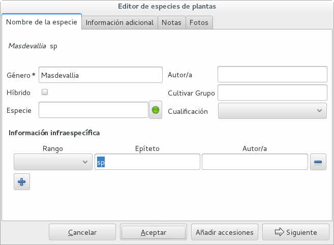

Jardín Botánico de Quito
==================================================

At the JBQ, Jardín Botánico de Quito, we have adopted the Ghini software in
April 2015. Since that time, we have accumulated experience with the
program, and we are ourselves in need to document it, in order to secure the
knowledge to the institution. We are happy to share it.

Overview
---------------------------

- At the JBQ, we work most of all with orchids, family Orchidaceae, one of
  the largest plant families, with no less than 850 genera, organized
  —according to Dressler— in approximately 70 subtribes, 22 tribes, 5
  subfamilies.  How we represent this information is not obvious and needs
  be explained.

  The taxonomy of the Orchidaceae family is continuously being reviewed.
  Genera get added, refused, reorganized, recognized as synonyms, some
  taxonomists prefer grouping species or genera in a new way, others split
  them again and differently, botanists of different nationalities may have
  different views on the matter.  All this sounds very complex and
  specialistic, but it's part of our daily routine, and it can all be stored
  in our Ghini database.

- At the opposite complexity extreme, we often have volunteers who only work
  at the garden for a very short time. It was with them in mind that we have
  developed a `hypersimplified view <goal.html#hypersimplified-view>`_ on
  the ghini database structure.

  The two figures here show all that our temporary collaborators need to know.

  +---------------------------------------------+---------------------------------------------+
  | Taxonomy & Collection                       | Garden                                      |
  +=============================================+=============================================+
  |.. figure:: images/family-to-accession.png   |.. figure:: images/location-to-plant.png     |
  +---------------------------------------------+---------------------------------------------+

- We work on GNU/Linux, a platform that many users don't master, and our
  database is inside of a remote database management system. This implies
  steps that are not obvious to the casual end user.

- Our workflow includes moving plants around in the garden, keep track of
  current locations and history of movements.

- We have many plants which are still only partially identified, at rank
  genus, sometimes not even. This also needs be explained.

- As plants enter the flowering stage, we can review their identification
  directly, or we take pictures of details of the flower, hoping that a
  visiting specialist could help completing the identification.

- Sometimes we have groups of plants accessed separately but clearly
  belonging to the same species, even if we are not able to indicate its
  binomial name with confidence. Ghini helps us here, too.

- Obviously we keep increasing our collection, with plants coming from
  commercial sources, or collected from the wild, more rarely coming from
  expeditions to remote areas of our country, or we receive plants which
  were illegally collected.

- New plants may be relative to species not yet represented in our
  collection. Adding a new species in the database is part of the daily
  routine, too.

- Regularly, we need producing reports about our collection, that the
  Ecuadorian Environment Ministery (MAE) requires and that justify the very
  existence of the garden.

- A serious situation happened once, and we absolutely want to prevent it
  from happening again: a user deleted a genus, with everything that was
  below it, species and accessions, and synonymies.

- At times, the program gives error messages, which are not really relevant,
  but may be surprising. |dontpanic_png| and report to the developers.

- When contacting the developers, they will definitely ask for technical
  information, or at least to see a screenshot.  Help them help you.

Starting a program in Linux
----------------------------------------------------------------------------

to start a program given its name, hit the |loose_png| key next to Alt, or
click on |10000000000000300000002F89E0224ADF9EC09E_png|, then start typing
the name of the program, in our case “Ghini” or just click on the program
symbol |100000000000003100000031BB54CBDFA885EBAC_png|, appearing near the
left margin of your display.

When to update the program
-------------------------------------

The first window presented by Ghini looks like this, if up to date, or that,
if a newer version is available.

============================================== ==============================================
|10000000000001290000011FEE16D735EB3DBF67_png| |10000000000001290000011FEE16D735EB3DBF66_png|
============================================== ==============================================

Nótese que la versión se encuentra en la parte superior. Al momento de tomar
el pantallazo, la versión más actualizada del programa era la 1.0.64, y
nosotros estábamos utilizando la 1.0.63.

The update procedure is simple, we're not explaining here again.

Nótese también, siempre es recomendable trabajar con la última versión del
software.

Choose the database connection
----------------------------------------------------------------------------

Our data security policy prescribes three different user profiles, each of
them will require you to insert a (different) password.

full permission (BD-JBQ)
  only qualified personnel get this kind of access.

insert and update (BD-JBQ-limitado)
  We use this one for those users who come help us for a
  limited time, and who did not get a complete introduction to database
  concepts. It is meant to prevent costly mistakes.

read only (BD-JBQ-lectura)
  it can be shared with anyone visiting the garden

En esta ventana no se ingresa ningún dato, solo hacer clic en “Conectar”
para continuar a la próxima ventana. The software will ask you for the
password corresponding to the connection you selected.

|10000000000000FE00000065C64D791B5CA0099D_png|

Si quieres averiguar los detalles de la conexión, haz clic en el símbolo ▶
al lado de 'Connection Details', ese cambiará en ▼, y la ventana de conexión
se mostrará como una de las siguientes:

============================================== ============================================== ==============================================
|100000000000012F000001A611615FB62F2D003B_png| |100000000000012F000001A611615FB62F2D003D_png| |100000000000012F000001A611615FB62F2D003C_png|
============================================== ============================================== ==============================================

Como puedes ver, estamos conectándonos al mismo servidor de bases de datos,
cada conexión se apoya a la misma base de datos, pero con usuario diferente.

3. Información del banco de datos
----------------------------------------------------------------------------

|100000000000063F00000383F7EAFB008DE6E4E2_png|

Ahora se encuentra dentro del programa.

En la parte superior de esta pantalla se puede encontrar el campo para
ingresar nombres que desea buscar.

|10000000000006090000001FA253BB9470AD4994_png|

- Con el botón |100000000000001C00000020F4C7873186014F2F_png|, en forma de
  casa, puede regresar de sus busquedas a la pantalla principal.
- Con el botón |100000000000001B000000207EC6F9075C9D3669_png|, en forma de
  flecha, puede regresar a su ultima búsqueda.
- Con el botón |100000000000001C0000001FB8A1F75F7A5EF877_png|, en forma de
  engranaje, puede usar el “Query Builder”, con que se puede desarollar una
  búsqueda más compleja en una manera más simple.

|10000000000000E7000000DE22288666D5A0BB1B_png|

|10000000000000AA0000001F983BAA81B6054550_png|

Para buscar algo en el campo de entregar, siempre recuerde de usar comillas!

|100000000000018700000173222371085C3C68FE_png|

En la parte del lado se puede observar un resumen de todas las plantas registradas.

De las 511 familias de plantas, el jardín botánico solo tiene plantas de 7 familias registradas.

De las 25394 géneros de plantas, el jardín botánico solo tiene plantas de 158 géneros registrados.

De las 637 especies entregadas en el banco de datos, solo 623 especies
poseen números (accesiones).

De las 7722 accesiones, que están registrados
para el banco de datos, solo 7675
están en uso de
una manera que la planta
(en fisico)
tiene este número.

En generalmente este número tiene que estar siempre “in use” y “total”

De todos las plantas registradas, todas están usando. (este
número siempre va a estar full “in use”, si hiciste todo bien.)

De las 170 diferentes locaciones registrados, solo 163 tienen plantas ingresadas.

3a. identificación a rango género
----------------------------------------------------------------------------

4. Errores del programa
----------------------------------------------------------------------------
  
y de los códigos en los invernaderos

A. Para el banco de datos de funcionar, el programa se necesite una red con
   el internet. Algunas veces cuando intentas de hacer login en el banco de
   datos, el programa no puede conectarse con el internet y va a darte esta
   ventana con un mensaje error.

   En este caso solo se tiene que intentar realizar el mismo login nuevamente.

   |100000000000020B000000FBCAB1860DB92DF14A_png|

B. Algunas veces sin causa aparente, cuando se hace una búsqueda no se
   ejecuta por completo y puede mostrarse una ventana con un mensaje. En
   este caso solo se tiene que intentar realizar la misma búsqueda
   nuevamente.

   Un ejemplo de una ventana de un mensaje error:

   |10000000000002140000014D050A059AC7EE948A_png|

C. Algunas veces el código en el invernadero no tiene 6 pero 5 números. Para
   realizar tu búsqueda solo añadir un cero que el la primera número.

+--------------------------+----------------------------------+
| Número en el invernadero | Número para entregar la búsqueda |
|                          |                                  |
+--------------------------+----------------------------------+
| 16489                    | “016489”                         |
|                          |                                  |
+--------------------------+----------------------------------+

5. Buscar plantas en la base de datos
----------------------------------------------------------------------------

|10000000000000200000001FDDE6CEA3E00D1E69_png|

Para revisar si una planta con un número (accesión) existe dentro del
banco de datos, se necesita el código con 6 números e ingresarlo en
el campo de entregar. Para que el sistema reconozca la búsqueda, el número
tiene que estar en comillas “ ”. Para confirmar la búsqueda oprime “Enter” o
haga clic a el botón de búsqueda.

Si la planta se encuentra en el banco de datos, se mostrara una ventana en
la parte inferior con los datos de la planta.

|100000000000028900000046F4A2086237E713D3_png|

Si la planta no se encuentra en el banco de datos, se mostrara en la parte
inferior una ventana con el siguiente mensaje

“Couldn’t find anything for search.”

|10000000000001FA0000004653A7D7D565338235_png|

Nota al margen: La mayoria de las plantas ingresadas son del typo con el
nombre de la especies

“Zzz sp”.

|100000000000022A000000458A066B65AA124983_png|

La especies “Zzz sp” es solo un sostenedor del lugar, y la especie
correcta se puede
cambiar y actualizar.

6. Eliminar plantas muertas del banco de datos
----------------------------------------------------------------------------

Se recomienda que
una vez
a la
semana,
se revisen todas las plantas para poder eliminar las plantas muertas tanto del invernadero como del banco de datos.

Tome el
código
(con 6 números) de la planta muerta
e ingreselo en el campo. Para que el sistema inicie la búsqueda, el número se tiene que escribir entre comillas “ ”. Para confirmar la búsqueda oprimir “Enter” o hacer clic a el botón de búsqueda.

A.
Si la planta, si
se encuentra
en el banco de datos,
se mostrara una ventana en la parte inferior con los datos de la misma.

|10000000000001CF000000487F16C7F2613D9F58_png|

Para eliminar este número, hacer clic derecho.

Se mostraran tres opciones:
Edit, Add plant, Delete

Hacer clic en “Delete” y confirmar esta selección con “Si”.

Si se buscara
nuevamente el mismo número,
no se encontraran datos:

|100000000000025700000050925C1488E03E0617_png|

B.  Si la planta no se encuentra en el banco de datos, se mostrara en la
parte inferior una ventana con la siguiente frase:

“Couldn't find anything for search.”

En ese caso no proceder a ninguna accion dentro del programa.

7. Cambiar la especies
----------------------------------------------------------------------------

(nombre de las especies)
de una planta en el banco de datos

Si se indificase una planta, se puede cambiar el nombre de la planta, si
esta planta antes poseía el nombre “Zzz sp.”

|10000000000002210000006F5DB278661D3E4122_png|

|10000000000002F6000002418FFC04A01AA401D9_png|

|10000000000002D800000060D6575EB671D3EE00_png|

cambiar
▼ “Type of material”

cambiar
▼ “Quantity” a 1

si nombre es correcto

cambiar el
▼
nombre del especies

|10000000000002D600000063D9253419CBC84114_png|

cambiar
▼ Location 1

▼

|10000000000002F8000002441BD2C4C420A3E971_png|

|10000000000001FE0000006F90B0DF98BB2933D6_png|

8. Entregar una nueva accesión en el banco de datos
----------------------------------------------------------------------------

Si se encontrara una planta con un código (accesión) el cual no se encuentra ingresado en el banco de datos,
se tiene que ingresar este nuevo código
(accesión) en el banco de datos.

|1000000000000257000000504EC4536B148C3228_png|

Para
poder ingresar un nuevo código (accesión) se siguen los siguientes pasos:

* número de la accesión o código
  (ej. invernadero 2)

* nombre de la especie (opcional)

Para hacer un ejemplo, en el siguiente caso, tenemos inicialmente los
siguientes datos:

Número (accesión) que no está
ingresado
todavía
–
008440

Nombre de la especies que quiero
ingresar

–
Dendrobium Hybrido (Emma White)

Lugar donde la planta
se encuentra
–
Invernadero 1 (calor)

Para ingresar la accesión o el código, buscar la especie o el género en el
campo de entregar (en el caso que no saber el nombre de la especie buscar
por “Zzz sp”).  Para que el sistema realice la búsqueda, la especie tiene
que escribirse entre comillas “ ”.

|1000000000000181000000477149EC5BD0AE7C2D_png|

|100000000000001C000000223E57C07B2AA8A9E0_png|

Para abrir las especies de Dendrobium hacer clic en el triangulo gris.

|1000000000000174000000C0752C792970DEFAA2_png|

Los tres nombres de la especies van a
mostrarse en la parte inferior.

- Dendrobium cruentum,
- Dendrobium hibrido,
- Dendrobium sp.

Dado que la especie en este ejemplo
es un hibrido, hacer
clic
derecho.

Se mostraran estas tres: Edit, Add
accession, Delete

Hago clic en “Add accession”.

|10000000000002F4000002409EE0B06C300048EF_png|

Se abrira esta ventana
llamada
“Accession editor”.

Cambiar el número del “Accession ID \*” al código que se le asigne a la nueva
planta.

Cambiar el “Type of material” a “Plant” (Siempre!!).

Cambiar el “Quantity” a “1” (Siempre!!).

Cambiar el lugar de la planta a “Intended Locations” a “Location 1”
el nombre del lugar.

Para entender las abreviaturas de las lugares de las plantas, aquí una
lista:

CAC-B
*x*: Solo las cactáceas afuera de los orquidarios en el jardín

CRV:

IC-*xx*: orquidarios de calor en el jardín
(1A a 9C son lugares
especificos entre del
orquidario)

IF-xx: orquidarios de frio en el jardín (1A a 5I son lugares especificos
entre del orquidario)

INV1: invernadero 1 (calor)

INV2: invernadero 2 (frio)

INV3: invernadero 3 (calor)

|10000000000002F900000241C5DB1B4F082036B6_png|

Después de que estos 4 campos estén editados, hacer clic en “Add plants”.

Se abrira la ventana llamada
“Plant Editor”.

|10000000000001FC0000018F4B27179B9456E1CF_png|

El código (accesión) y nombre todavía están guardados.

Cambiar el “Quantity” a “1” (Siempre!!).

Cambiar el “Location” al nombre del lugar (Siempre el mismo
que se ingreso
en el Accession editor antes!).

|10000000000001FE0000018B06FC9E8A824B1FF3_png|

Después de que estos 4 campos están editados, se quiere ingresar el dato,
que el hibrido de este Dendrobium se llama “Emma White”.

Hacer clic en “Notes” e ingresr este dato .

|10000000000001FF0000018ADAD9076709514282_png|
|100000000000020000000189AEBD77174C6E5272_png|

Después, hacer clic en “Aceptar” y listo.

Ahora la planta con ese nombre y número es parte del banco de datos.

|10000000000001D5000000C7CF644BA0B1AB3FFF_png|

9. Añadir un nuevo nombre de una especie al banco de datos y añadir un nuevo número
--------------------------------------------------------------------------------------

Si se encuentra una planta y se identifica la especie pero no es parte del
banco de datos y tampo posee un código.

En el siguiente ejemplo, la planta encontrada fue identificada como Lepanthes alopex.

Si no se sabe la especie, se puede ingresar con la especie “Zzz sp”

Se puede asignar a la nueva planta un código o una accesión (6 números)

Nota: los códigos o las accesiónes con reutilizables fisica y digitalmentente, después de ser borrados en el banco de datos, a causa de la muerte de la planta que lo poseia.

|100000000000016400000045749C9F8ECA72440A_png|

Si se reutiliza un código o una accesión, recuerde verificar que no se encuentre en el banco de datos.

|1000000000000152000001B12C2FDE60BD2B710B_png|

Se encontro que la planta de ejemplo es de especie *Lepanthes alopex*,
si se busca en el banco de datos el género lepanhtes y se nota que dentro de este género no está registrada esta especie. Se tendra que añadir como una nueva especie.

Para añadir una nueva especie, dar clic derecho sobre la especie Lepanthes (sombreada de rojo) y se mostraran las siguientes opciones:

Edit, Add species, Delete

Nunca selecionar “Delete”!!!

ya que se selecciona delete se borraran todos los datos pertenecientes a la especie.

|1000000000000293000001C3EC6A9DC0A1D0CA68_png|
|1000000000000293000001C423766E7D365A1489_png|

>

Al añadir el nombre de una especie nueva siempre escribir todo con minusculas, además asegurarse de que el nombre cientifico esté bien escrito.

Es obligatorio añadir también el nombre del autor, y para eso se necesita buscar la nueva especie en el banco de datos online llamado Tropicos (http://tropicos.org/)

Si no se puede añadir la especie, porque la especie todavía existe, el fondo
del campo de “Species” va a estar rojo.

Hacer clic en “Add accession”.  Se va a abrir la ventana llamada “Accession
Editor”.

|10000000000002F8000002432C9DDC622203371C_png|

El nombre de la especie nueva está en el campo “Name” todavía.

Cambiar el número del “Accession ID \*” a tu accesión.

Cambiar el “Type of material” a “Plant” (Siempre!!).

Cambiar el “Quantity” a “1” (Siempre!!).

Cambiar el lugar de la planta a “Intended Locations” a “Location 1” al nombre del lugar.

Hace clic a “Add plants”.

Va a abrir el “Plant Editor”.

|10000000000001FC00000188EA514D5068AE7449_png|

Entrar
en el “Plant Editor”.

El número (accesión) y nombre todavía está guardado.

Cambiar en
“Quantity” a “1” (Siempre!!).

Cambiar en
“Location”
al nombre del lugar (Siempre el mismo que entregado en el Accession editor antes!).

Hacer
clic
en
“Aceptar”.

10. Cambiar el lugar de una planta en el banco de datos
----------------------------------------------------------------------------

Si se encuentra una planta con una accesión en un
lugar diferente al que está registrado en el banco de datos, se tiene que cambiar el lugar.

En este ejemplo
se
encontró
que la planta de especies “Acineta sp.”con la accesión “012142”, está en el Invernadero 1, pero está guardado en el banco de datos en ICAlm3.

Ahora
se debe cambiar
el lugar de esta planta en el banco de datos.

*▼Información entregado▼  ▼información*

*guardado ▼*

|10000000000006060000019593F061B072210692_png|

Para cambiar el lugar
se tiene que
cambiar el lugar de la accesión primero, y después el lugar de la planta.

Primero hacer
clic derecho con el raton a la accesión (sombreado
rojo en
la
foto). Luego se mostraran las
tres opciones: “Edit, Add
plants, Delete” . Hacer
clic
en
“Edit”. El “Accession Editor” va abrirse.

|10000000000002F40000023FAB6C820BDCD352F2_png|
|10000000000002F800000244F5DF43FE222813B5_png|

►

*Cambiar:*

Accession ID, Type of material y Quantity, Location1

o

solo Location1

►

Hace clic a “Aceptar”, para guardar la información.

Después hace clic derecho con el raton, la planta (abajo, fondo blanco en el
foto). Las siguientes tres opciones se mostraran: “Edit, Branch, Delete” va
a abrir. Hacer clic en “Edit”.  La ventana de “Plant Editor” va abrirse.

|10000000000001FC0000018990A54A65E0BC26C2_png|
|10000000000001FC0000018808F152DBEDDAA04B_png|

►

*Cambiar:*

Accession
type, Quantity,
y
Location

o solo Location

►

Hace clic en “Aceptar”, para guardar la información y listo

después puedes verificar que la positon “Location” está cambiada.

Dice “Living Plants: 1 in INV1” & “Intended Location: (INV1)

Tambien se puede ver en “Properties” cuando esta accesión fue cambiada la
ultima vez.

|1000000000000608000002D2BA2D181475D5AD7B_png|

*▼ Aquí! ▼*

11. Decargar información sobre el banco de datos por una informe
----------------------------------------------------------------------------

Cada año el jardín botánico tiene que entregar una informe
(informe anual de manejo y mantenimiento de colección de orquideas)
que tiene la información del banco de datos y sobre eso las plantas registradas.

Para realizar eso, solo se pone esto en el campo de entregar en el banco de
datos::

  genus where species.accessions._created between |datetime|2017,1,1| and |datetime|2018,1,1|

or::

  accession where _created between |datetime|2017,1,1| and |datetime|2018,1,1|

(tienes que adaptarse el año)

Después esta búsqueda, tiene que esperar un
momento
para que el programa puede
arrojar
los resultados.

.. |10000000000006090000001FA253BB9470AD4994_png| image:: images/10000000000006090000001FA253BB9470AD4994.png
    :width: 470px
    :height: 31px

.. |1000000000000257000000504EC4536B148C3228_png| image:: images/1000000000000257000000504EC4536B148C3228.png
    :width: 12.157cm
    :height: 1.625cm

.. |10000000000002F8000002432C9DDC622203371C_png| image:: images/10000000000002F8000002432C9DDC622203371C.png
    :width: 7.447cm
    :height: 5.674cm

.. |100000000000003100000031BB54CBDFA885EBAC_png| image:: images/100000000000003100000031BB54CBDFA885EBAC.png
    :width: 38px
    :height: 38px

.. |10000000000006060000019593F061B072210692_png| image:: images/10000000000006060000019593F061B072210692.png
    :width: 16.274cm
    :height: 4.274cm

.. |10000000000001FC00000188EA514D5068AE7449_png| image:: images/10000000000001FC00000188EA514D5068AE7449.png
    :width: 7.521cm
    :height: 5.805cm

.. |10000000000002F800000244F5DF43FE222813B5_png| image:: images/10000000000002F800000244F5DF43FE222813B5.png
    :width: 7.063cm
    :height: 5.39cm

.. |10000000000001290000011FEE16D735EB3DBF66_png| image:: images/10000000000001290000011FEE16D735EB3DBF66.png
    :width: 6.832cm
    :height: 6.602cm

.. |10000000000001290000011FEE16D735EB3DBF67_png| image:: images/10000000000001290000011FEE16D735EB3DBF67.png
    :width: 6.832cm

.. |10000000000001D5000000C7CF644BA0B1AB3FFF_png| image:: images/10000000000001D5000000C7CF644BA0B1AB3FFF.png
    :width: 10.148cm
    :height: 4.306cm

.. |100000000000020B000000FBCAB1860DB92DF14A_png| image:: images/100000000000020B000000FBCAB1860DB92DF14A.png
    :width: 13.838cm
    :height: 6.641cm

.. |100000000000001C0000001FB8A1F75F7A5EF877_png| image:: images/100000000000001C0000001FB8A1F75F7A5EF877.png
    :width: 20px
    :height: 20px

.. |1000000000000293000001C3EC6A9DC0A1D0CA68_png| image:: images/1000000000000293000001C3EC6A9DC0A1D0CA68.png
    :width: 7.489cm
    :height: 5.126cm

.. |10000000000002D600000063D9253419CBC84114_png| image:: images/10000000000002D600000063D9253419CBC84114.png
    :width: 9.841cm
    :height: 1.342cm

.. |10000000000001FE0000018B06FC9E8A824B1FF3_png| image:: images/10000000000001FE0000018B06FC9E8A824B1FF3.png
    :width: 8.474cm
    :height: 6.563cm

.. |100000000000001C000000223E57C07B2AA8A9E0_png| image:: images/100000000000001C000000223E57C07B2AA8A9E0.png
    :width: 0.741cm
    :height: 0.9cm

.. |10000000000002F8000002441BD2C4C420A3E971_png| image:: images/10000000000002F8000002441BD2C4C420A3E971.png
    :width: 7.893cm
    :height: 6.024cm

.. |100000000000025700000050925C1488E03E0617_png| image:: images/100000000000025700000050925C1488E03E0617.png
    :width: 12.157cm
    :height: 1.625cm

.. |10000000000000AA0000001F983BAA81B6054550_png| image:: images/10000000000000AA0000001F983BAA81B6054550.png
    :width: 4.045cm
    :height: 0.737cm

.. |10000000000000200000001FDDE6CEA3E00D1E69_png| image:: images/10000000000000200000001FDDE6CEA3E00D1E69.png
    :width: 0.847cm
    :height: 0.82cm

.. |100000000000016400000045749C9F8ECA72440A_png| image:: images/100000000000016400000045749C9F8ECA72440A.png
    :width: 9.419cm
    :height: 1.826cm

.. |10000000000002F40000023FAB6C820BDCD352F2_png| image:: images/10000000000002F40000023FAB6C820BDCD352F2.png
    :width: 7.108cm
    :height: 5.406cm

.. |10000000000000FE00000065C64D791B5CA0099D_png| image:: images/10000000000000FE00000065C64D791B5CA0099D.png
    :width: 6.72cm
    :height: 2.672cm

.. |100000000000063F00000383F7EAFB008DE6E4E2_png| image:: images/100000000000063F00000383F7EAFB008DE6E4E2.png
    :width: 492px
    :height: 373px

.. |10000000000001FC0000018808F152DBEDDAA04B_png| image:: images/10000000000001FC0000018808F152DBEDDAA04B.png
    :width: 6.966cm
    :height: 5.375cm

.. |10000000000002D800000060D6575EB671D3EE00_png| image:: images/10000000000002D800000060D6575EB671D3EE00.png
    :width: 9.777cm
    :height: 1.289cm

.. |10000000000002F4000002409EE0B06C300048EF_png| image:: images/10000000000002F4000002409EE0B06C300048EF.png
    :width: 12.933cm
    :height: 9.853cm

.. |10000000000002140000014D050A059AC7EE948A_png| image:: images/10000000000002140000014D050A059AC7EE948A.png
    :width: 14.076cm
    :height: 8.811cm

.. |10000000000001FA0000004653A7D7D565338235_png| image:: images/10000000000001FA0000004653A7D7D565338235.png
    :width: 12.324cm
    :height: 1.706cm

.. |10000000000002210000006F5DB278661D3E4122_png| image:: images/10000000000002210000006F5DB278661D3E4122.png
    :width: 11.028cm
    :height: 2.247cm

.. |100000000000012F000001A611615FB62F2D003B_png| image:: images/100000000000012F000001A611615FB62F2D003B.png
    :width: 5.741cm

.. |100000000000012F000001A611615FB62F2D003C_png| image:: images/100000000000012F000001A611615FB62F2D003C.png
    :width: 5.741cm

.. |100000000000012F000001A611615FB62F2D003D_png| image:: images/100000000000012F000001A611615FB62F2D003D.png
    :width: 5.741cm

.. |1000000000000293000001C423766E7D365A1489_png| image:: images/1000000000000293000001C423766E7D365A1489.png
    :width: 7.258cm
    :height: 4.979cm

.. |10000000000001FC0000018990A54A65E0BC26C2_png| image:: images/10000000000001FC0000018990A54A65E0BC26C2.png
    :width: 7.142cm
    :height: 5.525cm

.. |10000000000002F900000241C5DB1B4F082036B6_png| image:: images/10000000000002F900000241C5DB1B4F082036B6.png
    :width: 15.907cm
    :height: 12.06cm

.. |1000000000000608000002D2BA2D181475D5AD7B_png| image:: images/1000000000000608000002D2BA2D181475D5AD7B.png
    :width: 17cm
    :height: 7.948cm

.. |100000000000018700000173222371085C3C68FE_png| image:: images/100000000000018700000173222371085C3C68FE.png
    :width: 8.26cm
    :height: 7.837cm

.. |10000000000001FF0000018ADAD9076709514282_png| image:: images/10000000000001FF0000018ADAD9076709514282.png
    :width: 8.181cm
    :height: 6.308cm

.. |10000000000000E7000000DE22288666D5A0BB1B_png| image:: images/10000000000000E7000000DE22288666D5A0BB1B.png
    :width: 6.112cm
    :height: 5.874cm

.. |10000000000000300000002F89E0224ADF9EC09E_png| image:: images/10000000000000300000002F89E0224ADF9EC09E.png
    :width: 38px
    :height: 38px

.. |10000000000001CF000000487F16C7F2613D9F58_png| image:: images/10000000000001CF000000487F16C7F2613D9F58.png
    :width: 9.857cm
    :height: 1.533cm

.. |100000000000001B000000207EC6F9075C9D3669_png| image:: images/100000000000001B000000207EC6F9075C9D3669.png
    :width: 20px
    :height: 20px

.. |10000000000002F6000002418FFC04A01AA401D9_png| image:: images/10000000000002F6000002418FFC04A01AA401D9.png
    :width: 8.105cm
    :height: 6.17cm

.. |1000000000000174000000C0752C792970DEFAA2_png| image:: images/1000000000000174000000C0752C792970DEFAA2.png
    :width: 9.843cm
    :height: 5.08cm

.. |100000000000020000000189AEBD77174C6E5272_png| image:: images/100000000000020000000189AEBD77174C6E5272.png
    :width: 8.056cm
    :height: 6.184cm

.. |100000000000001C00000020F4C7873186014F2F_png| image:: images/100000000000001C00000020F4C7873186014F2F.png
    :width: 20px
    :height: 20px

.. |100000000000022A000000458A066B65AA124983_png| image:: images/100000000000022A000000458A066B65AA124983.png
    :width: 14.658cm
    :height: 1.826cm

.. |1000000000000181000000477149EC5BD0AE7C2D_png| image:: images/1000000000000181000000477149EC5BD0AE7C2D.png
    :width: 10.186cm
    :height: 1.879cm

.. |10000000000001FC0000018F4B27179B9456E1CF_png| image:: images/10000000000001FC0000018F4B27179B9456E1CF.png
    :width: 7.308cm
    :height: 5.74cm

.. |1000000000000152000001B12C2FDE60BD2B710B_png| image:: images/1000000000000152000001B12C2FDE60BD2B710B.png
    :width: 6.646cm
    :height: 8.514cm

.. |100000000000028900000046F4A2086237E713D3_png| image:: images/100000000000028900000046F4A2086237E713D3.png
    :width: 15.383cm
    :height: 1.658cm

.. |10000000000001FE0000006F90B0DF98BB2933D6_png| image:: images/10000000000001FE0000006F90B0DF98BB2933D6.png
    :width: 11.642cm
    :height: 2.533cm

.. |dontpanic_png| image:: images/dontpanic.png

.. |loose_png| image:: images/windows-key.png
   :width: 28px
   :height: 28px
