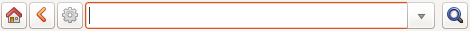

Quito Botanical Garden
==================================================

At the JBQ, Quito Botanical Garden, we have adopted the Ghini software in
April 2015. Since that time, we have accumulated experience with the
program, and we are ourselves in need to document it, in order to secure the
knowledge to the institution. We are happy to share it.

technical
^^^^^^^^^^^^^^^^^^^^

- We work on GNU/Linux, a platform that many users don't master, and our
  database is inside of a remote database management system. This implies
  steps that are not obvious to the casual end user.

  ..  admonition:: how to start a program
      :class: toggle

         to start a program given its name, hit the |loose_png| key next to Alt, or
         click on |10000000000000300000002F89E0224ADF9EC09E_png|, then start typing
         the name of the program, in our case “Ghini” or just click on the program
         symbol |100000000000003100000031BB54CBDFA885EBAC_png|, appearing near the
         left margin of your display.

  ..  admonition:: database server
      :class: toggle

         We chose for a centralised PostgreSQL database server. This way we
         are protected from concurrent conflicting changes, and all changes
         are simultaneously available on all ghini clients.  We did need to
         outsource database server management.

- Understanding when to update

  ..  admonition:: Details
      :class: toggle

         The first window presented by Ghini looks like this. Normally, you
         don't need do anything in this window, just press enter and get
         into the main program screen.

         Occasionally, at the top of the screen an information text will
         appear, telling you that a newer version is available on-line.

         ============================================== ==============================================
         |10000000000001290000011FEE16D735EB3DBF67_png| |10000000000001290000011FEE16D735EB3DBF66_png|
         ============================================== ==============================================

         The update procedure is simple, and it depends on the operating
         system you use, we're not explaining here again.

         It is generally a good idea updating the software.  If in doubt,
         contact the author, or write to the group.

- understanding ghini initial screen

  ..  admonition:: Details
      :class: toggle

         At the moment of writing, our initial screen looked like this:

         |100000000000063F00000383F7EAFB008DE6E4E2_png|

         The table in the right half of the screen presents a summary of all
         the registered plants can be observed.  Each entry printed in bold
         is a link to the query selecting the corresponding objects.

         |100000000000018700000173222371085C3C68FE_png|

         The lower half of the right hand side contains a set of stored
         queries.  While you can edit them to your liking, our hints include
         selecting those accessions that have not been identified at rank
         species.  And one for the database history.

         |100000000000018700000173222371085C3C68FF_png|

         At the top of this screen you can find the field in which you would
         enter your searches.

         |10000000000006090000001FA253BB9470AD4994_png|

         - With the |100000000000001C00000020F4C7873186014F2F_png| button,
           in the form of a house, you can return from your searches to the
           main screen.
         - With the |100000000000001B000000207EC6F9075C9D3669_png| button,
           in the form of an arrow, you can return to your last search.
         - With the |100000000000001C0000001FB8A1F75F7A5EF877_png| button,
           in the form of a gear, you can start the "Query Builder", which
           helps you compose complex searchs in a simple, graphical way.

- We often have volunteers who only work at the garden for a very short
  time. It was with them in mind that we have developed a `hypersimplified
  view <goal.html#hypersimplified-view>`_ on the ghini database structure.

  ..  admonition:: Details
      :class: toggle

         The two figures here show all that our temporary collaborators need to know.

         +---------------------------------------------+---------------------------------------------+
         | Taxonomy & Collection                       | Garden                                      |
         +=============================================+=============================================+
         |.. figure:: images/family-to-accession.png   |.. figure:: images/location-to-plant.png     |
         +---------------------------------------------+---------------------------------------------+

- At times, the program gives error messages. |dontpanic_png|, retry, or
  report to the developers.

  ..  admonition:: network problems
      :class: toggle

         In order to work, the program needs a stable network connection to
         the database server. It can happen: you start the program, and it
         can't connect to our database server. You would then get a rather
         explicit but very badly typeset error message.

         |100000000000020B000000FBCAB1860DB92DF14A_png|

         Just ignore it and try again.

  ..  admonition:: search fails with error
      :class: toggle

         Sometimes and without any apparent cause, a search will not run
         successfully, and a window with an error message will be
         displayed. In this case you only have to try to perform the same
         search again.

         An example of such an error message:

         |10000000000002140000014D050A059AC7EE948A_png|

  ..  admonition:: search does not return something I just inserted
      :class: toggle

         Accession codes starting with zero and composed of just numbers, as
         for example ``016489`` are considered by the software as numbers,
         so if you don't enclose the search string in quotes, any leading 0
         will be stripped and the value will not be found.

         Try again, but enclose your search string in single or double
         quotes.

         +-----------------------+------------------------+
         | Número en la etiqueta | Texto para la búsqueda |
         |                       |                        |
         +-----------------------+------------------------+
         | 16489                 | “016489”               |
         |                       |                        |
         +-----------------------+------------------------+

         Please note: when you look for a Plant code, not an Accession, the
         leading zero becomes optional, so in the above example it's maybe
         easier to type ``16489.1``.

- A serious situation happened once, and we absolutely want to prevent it
  from happening again: a user deleted a genus, with everything that was
  below it, species and accessions, and synonymies.

  ..  admonition:: solving it with user permissions
      :class: toggle

         We haven't yet conclusively decided how to solve this one. One way
         would be to have different connection profiles, associated to
         different database users, each user with all needed permissions.

         full permission (BD-JBQ)
           only qualified personnel get this kind of access.

         insert and update (BD-JBQ-limitado)
           We use this one for those users who come help us for a
           limited time, and who did not get a complete introduction to database
           concepts. It is meant to prevent costly mistakes.

         read only (BD-JBQ-lectura)
           it can be shared with anyone visiting the garden

         You select the connection at startup, and the software asks you
         for the password corresponding to the connection you selected.

         |10000000000000FE00000065C64D791B5CA0099D_png|

         If you want to review the details of the connection, click on the ▶
         next to 'Connection Details', it will change to ▼, and the
         connection window will be displayed as one of the following:

         ============================================== ============================================== ==============================================
         |100000000000012F000001A611615FB62F2D003B_png| |100000000000012F000001A611615FB62F2D003D_png| |100000000000012F000001A611615FB62F2D003C_png|
         ============================================== ============================================== ==============================================

         As you can see, we are connecting to the same database server, each
         connection uses the same database on the server, but with different
         user.

  ..  admonition:: thinking further about it
      :class: toggle

         On the other hand, we are questioning if it is at all appropriate,
         letting any user delete something at such high level as a family,
         or a genus, or, for that matters, of anything connected to
         accessions in the collection.

         The ghini way to question the software features, is by opening a
         `corresponding issue
         <https://github.com/Ghini/ghini.desktop/issues/218>`_.

- When contacting the developers, they will definitely ask for technical
  information, or at least to see a screenshot.  Help them help you.

  ..  admonition:: Taking a screenshot
      :class: toggle

         On Linux there are three ways to create a screenshot, all involve
         hitting the 'PrtSc' key.  The most practical one is possibly
         hitting the 'PrtSc' key in combination with Ctrl and Shift. This
         will start an interactive screen copy tool. You select a rectangle
         and the area is copied in the clipboard.  Paste it in the email
         you're writing, or in the chat line where the developers are trying
         to help you.

  ..  admonition:: where are the logs
      :class: toggle

         Ghini continuously saves a very informative log file, in the
         ``~/.bauble/bauble.log`` file.  Don't bother opening it, just send
         it over.  It contains loads of technical information.

  ..  admonition:: continous unmanned alerting
      :class: toggle

         An other option is to activate the sentry handler. It will notify
         our sentry server of any serious situations in the software.  If
         you registered, the developers will know how to contact you if
         necessary.

         To the healthy paranoid: we're not monitoring what you're doing,
         we're monitoring how our software works.  You can always opt out.

         You activate the Sentry handler in the ``:prefs`` page: look for
         the row with name ``bauble.use_sentry_handler``, if the value is
         not what you wish, double click on the line and it will change to
         the other value.

taxonomy
^^^^^^^^^^^^^^^^^^^^

- introduction

  ..  admonition:: Orchidaceae taxonomic complexity
      :class: toggle

         At the JBQ, we work most of all with orchids, family Orchidaceae, one of the
         largest plant families, with no less than 850 genera, organized —according
         to Dressler— in approximately 70 subtribes, 22 tribes, 5 subfamilies.  How
         we represent this information is not obvious and needs be explained.

         The taxonomy of the Orchidaceae family is continuously being reviewed.
         Genera get added, refused, reorganized, recognized as synonyms, some
         taxonomists prefer grouping species or genera in a new way, others split
         them again and differently, botanists of different nationalities may have
         different views on the matter.  All this sounds very complex and
         specialistic, but it's part of our daily routine, and it can all be stored
         in our Ghini database.

- identifying at rank Genus, or Family

  ..  admonition:: Details
      :class: toggle

         Ghini-1.0 prescribes that an accession is identified at rank
         species, in all cases. The current maintainer acknowledges that
         this is a mistake, coming from the early Bauble days, and which
         Ghini-1.0 has in common with other botanic software. Until this is
         fixed, we rely on established practices.

         If an accession is identified at rank genus, we add a fictive
         species in that genus, we don't specify its species epithet (we
         don't know that) and we add an unranked epithet in the
         infraspecific information section, like this:

         .. figure:: images/genus_sp-editing.png

         When displayed in a search result, it shows like this:

         .. figure:: images/genus_sp-explained.svg

         If an accession is only identified at rank family, we need a
         fictive genus, to which we can add the fictive species. Since our
         garden is primarily focusing on Orchidaceae, we use the very short
         name **Zzz** for the fictive genus within the family, like this:

         .. figure:: images/zzz-explained.svg

         The current maintainer suggests to use the prefix **Zzz-** and
         behind the prefix to write the family name, possibly removing the
         trailing **e**.  Removal of the trailing **e** is useful in order
         not to get results that include genus names when you as for stuff
         ending in **aceae**.  In practice, we have a **Zzz** genus in the
         Orchidaceae family, and in the other 6 families represented in our
         digital collection, we follow this suggested practice.

- identifying at a rank that is not allowed by the software (eg: Subtribe, or Subfamily)

  ..  admonition:: subtribe
      :class: toggle

         We sometimes can't identify a taxon at rank genus, but we do manage
         to be more precise than just "it's an orchid". Quite often we are
         able to indicate the subtribe, this is useful when you want to produce
         hybrids.

         The software does not let us store ranks which are intermediate
         between family and genus, so we need to invent something, and this
         is what we do:

         We insert a fictive genus, naming it as the subtribe, prefixing it
         with 'Zzx-', like in this example:

         .. figure:: images/tribe_sp-explained.svg

         This Zzx-Laeliinae is some genus in the Laeliinae subtribe.

         In order to be able to select genera by subtribe, we also add a
         note to the Zzx-Laeliinae fictive genus as well as for all real
         genera in that subtribe, note category subtribus, note value the
         subtribe name.

         This allows for queries like:

         ``genus where notes.note=Laeliinae``

         We are very much looking forward to seeing that `issue-9
         <https://github.com/Bauble/bauble.classic/issues/9>`_ solved!

  ..  admonition:: subfamily, tribe
      :class: toggle

         Just as we reserved the prefix Zzx- for subtribe, we reserve the
         prefixes Zzy- for tribe, Zzw- for subfamily.

         In praticular, the subfamily information is relevant, because there
         are subfamilies within the Orchidaceae family which are not further
         separated.

- Editing the Accession identification - the Species details

  ..  admonition:: placeholder species for individual accessions
      :class: toggle

         Scenario one describes the identification of a single accession,
         which had been associated to a "generic", placeholder species,
         something like “*Zzz* sp” or “*Vanda* sp”;

         In this case, when the plant species becomes known, we change the
         association in the accession, selecting a different species.

         .. figure:: images/accession-vanda_sp.png

         We do not edit the species, because there might be totally
         unrelated accessions connected to the same placeholder species.

  ..  admonition:: unknown species for multiple accessions
      :class: toggle

         A different case is when we have a whole batch of accessions, all
         obviously the same species, but we haven't been able to identify it. In
         this case, we associate the accessions with an incompletely specified
         species, something like “*Zzz* sp-59”, preferably adding the taxonomist's
         name, who made the association.

         A species like “*Vanda* sp-018599” is not a placeholder species,
         it is a very concrete species, which we haven't yet identified.

         .. figure:: images/genus_sp_author-editing.png

         In this case, when the species gets identified (and it could even be a
         species nova), we directly edit the species, so all accessions that refer
         to it get the change.

- A new plants is relative to a species not yet in our collection.

  ..  admonition:: last minute species
      :class: toggle

         We start this from the Accession window and it's very simple, just
         click on the **+** next to the species name, we get into the
         Species window.

Let the database fit the garden
^^^^^^^^^^^^^^^^^^^^^^^^^^^^^^^^^

- A never-ending task is reviewing what we have in the garden and
  have it match what we have in the database.

  ..  admonition:: Details
      :class: toggle

         When we adopted ghini, we imported into it all that was properly
         described in a filemaker database. That database focused solely on
         Orchids and even so it was far from complete.  In practice, we
         still meet labeled plants in the garden which have never been
         inserted in the database.

         From time to time, we manage to get resources to review the garden,
         comparing it to the collection in the database, and the main
         activity is to insert accession codes to the database, take
         pictures of the plant in question, and note its location, all tasks
         that are described in the remainder of this section.

- Naming convention in garden locations

  ..  admonition:: Details
      :class: toggle

         ========== ======================================================
         code       description
         ========== ======================================================
         CAC-B *x*  Solo las cactáceas afuera de los orquidearios en 
                    el jardín
         ---------- ------------------------------------------------------
         CRV:       Nepenthaceae exibition
         ---------- ------------------------------------------------------
         IC-*xx*:   orquidearios de calor en el jardín (1A a 9C son 
                    lugares especificos entre del orquideario)
         ---------- ------------------------------------------------------
         IF-xx:     orquidearios de frío en el jardín (1A a 5I son
                    lugares específicos dentro del orquideario)
         ---------- ------------------------------------------------------
         INV1:      invernadero 1 (calor)
         ---------- ------------------------------------------------------
         INV2:      invernadero 2 (frío)
         ---------- ------------------------------------------------------
         INV3:      invernadero 3 (calor)
         ========== ======================================================

- Adding an Accession for a Plant

  Obviously we keep increasing our collection, with plants coming from
  commercial sources, or collected from the wild, more rarely coming from
  expeditions to remote areas of our country, or we receive plants which
  were illegally collected.

  Sometimes we have to add plants to the digital collection, just because we
  have them physically, found in the garden, with or without its label, but
  without their digital counterpart.

  ..  admonition:: existing plant, found in the garden with its own label
      :class: toggle

         This activity starts with a plant, which was found at a specific
         garden location, an accession label, and the knowledge that the
         accession code is not in the database.

         .. image:: images/plant.png

         .. image:: images/target.png

         .. image:: images/accession-008440.png

         |1000000000000257000000504EC4536B148C3228_png|

         For this example, let's assume we are going to insert this
         information in the database.

         ========== ============================ ========================
         Accession  Species                      Location
         ========== ============================ ========================
         008440     *Dendrobium* ×'Emma White'   Invernadero 1 (calor)
         ========== ============================ ========================

         We go straight into the Accession Editor, start typing the species
         name in the corresponding field.  Luckly, the species was already
         in the database, otherwise we would use the **Add** button next to
         the entry field.

         .. image:: images/accession-select_taxon.png

         We select the correct species, and we fill in a couple more fields,
         leaving the rest to the default values:

         ============= ================= ========= =============
         Accession ID  Type of Material  Quantity  Provenance
         ============= ================= ========= =============
         008440        Plant             1         Unknown
         ============= ================= ========= =============

         After this, we continue to the Plant editor, by clicking on **Add
         Plants**.

         We do not fill in the Accession's "**Intended Locations**", because
         we don't know what was the original intention when the plant was
         first acquired.

         In the Plant Editor, we insert the Quantity and the Location.  And
         we're done.

         The plant is now part of the database:

         |10000000000001D5000000C7CF644BA0B1AB3FFF_png|

  ..  admonition:: new plant entering the garden
      :class: toggle

         This activity starts with a new Plant, just acquired from a known
         Source, a plant label, and an intended Location in the garden.

         We mostly do the same as for the case that a plant is found in the
         garden, there are two differences: (1) we know the source of the
         plant; (2) acquiring this plant was a planned action, and we intend
         to place it at a specific location in the garden.

         Again, we go straight into the Accession Editor, start typing the
         species and we either select if from the completion list or we add
         it on the fly.

         ============= ================= ========= ============
         Accession ID  Type of Material  Quantity  Source
         ============= ================= ========= ============
         033724        Plant             1         specified
         ============= ================= ========= ============

         After this, we continue to the Plant editor, by clicking on **Add
         Plants**.

         In the Plant Editor, we insert the Quantity and the Location.

         Please note that the plant may be initially placed in a greenhouse,
         before it reaches its intended location in the garden.

  ..  admonition:: existing plant, found in the garden without its label
      :class: toggle

         When this happens, we can't be sure the plant had never been in the
         collection, so we act as if we were re-labeling the plant. This is
         described in the next section.

- When we physically associate a label to a plant, there's always the chance
  that something happens either to the plant (it may die) or to the label
  (it may become unreadable), or to the association (they may be
  separated). We have software-aided protocols for these events.

  ..  admonition:: we find a dead plant
      :class: toggle

         Whenever a plant is found dead, we collect its label and put it in a box
         next to the main data insertion terminal, the box is marked “dead plants”.

         Definitely at least once a week, the box is emptied and the database is
         updated with this information.

         Dead plants aren't *removed* from the database, they stay there but get a
         **quantity** zero. If the cause of death is known, this is also written in
         the database.

         Please once again remember that a **Plant** is not an **Accession** and
         please remember we do not remove objects from the database, we just add to
         their history.

         Insert the complete plant code (something like ``012345.1``, or
         ``2017.0001.3``, and you don't need leading zeros nor quotes), right click
         on the corresponding row, and click on **edit**. change the quantity to 0,
         fill in the reason and preferably also the date of change.

  ..  admonition:: we find a plant without a label
      :class: toggle

         we can't be sure the plant had been in the collection or not.  We
         assume it was, and that its label was lost.

         Losing a plant label is unfortunate, but it just regularly happens.
         What we do is to put a new label to the plant, and to clearly state
         that the label is a replacement of an original one.  We then handle
         the case as if it was a new accession, plus we add a note to the
         accession, category “label”, text “relabeled”.

         We work with plastified paper labels, prepare them in batches of 72
         (what fits on a A4 sheet), and keep them in a dedicated box.

         Just tie the new label to the plant, and proceed as one of the
         above cases.

- producing or reproducing labels

  ..  admonition:: refreshing plant labels
      :class: toggle

         Sometimes we refresh the labels, for example all that is in a
         greenhouse, or maybe just a set of plants because their labels risk
         becoming unreadable.

         In the first case it's easy selecting all plants in the Location,
         we just type the location name, or give the search ``location like
         <location name>``.

         The second case it's a bit trickier.  What we do is to create a
         temporary **Tag**, and use it to tag all plants that were found in
         need for a new label.

         Given the selection, we start the report tool, using the mako
         ``accession-label.svg`` template.  We reset its options to default
         values, and since we're using a simple printer, we set the colour
         to ``black`` instead of ``blue``, which is meant for engraving.

  ..  admonition:: preparing labels for non-database plants
      :class: toggle

         To prepare the batch of 72 labels, we use a mako report template,
         named accession-label.svg.  This template accepts parameters, this
         is an example that would produce labels from 025801 all the way
         to 025872.

         .. image:: images/label-batch_72.png

         Labels come for us in two flavours: (1) either new plants just
         being acquired by the garden; (2) or plants in the garden, found
         without a label. We disinguish the two cases by adding a 'ret'
         extra text for relabeled plants.

- Our workflow includes moving plants around in the garden, keep track of
  current locations and history of movements.

  ..  admonition:: Details
      :class: toggle

- As plants enter the flowering stage, we can review their identification
  directly, or we take pictures of details of the flower, hoping that a
  visiting specialist could help completing the identification.

  ..  admonition:: Details
      :class: toggle

- Regularly, we need producing reports about our collection that the
  Ecuadorian Environment Ministery (MAE) requires and that justify the very
  existence of the garden.

  ..  admonition:: Details
      :class: toggle

         Each year the botanic garden has to submit a report (annual report
         of management and maintenance of orchids collection) complying to
         the requirements of the Ecuadorian Ministry of the Environment.

         To this end, we start selecting the plants we have to include in the report. It might be all acquisition in the past year::

           accession where _created between |datetime|2017,1,1| and |datetime|2018,1,1|

         or all plants within a location, or all plants belonging to a
         species, or just everything (but this will take time)::

           plant where location = 'abc'
           plant where accession.species.epithet='muricata' and accession.species.genus.epithet='Annona'
           plant like %

         Having selected the database objects which we want in the report,
         we start the report tool, which acts on the selection.

5. Buscar plantas en la base de datos
----------------------------------------------------------------------------

|10000000000000200000001FDDE6CEA3E00D1E69_png|

Para revisar si una planta con un número (accesión) existe dentro del
banco de datos, se necesita el código con 6 números e ingresarlo en
el campo de entregar. Para que el sistema reconozca la búsqueda, el número
tiene que estar en comillas “ ”. Para confirmar la búsqueda oprime “Enter” o
haga clic a el botón de búsqueda.

Si la planta se encuentra en el banco de datos, se mostrara una ventana en
la parte inferior con los datos de la planta.

|100000000000028900000046F4A2086237E713D3_png|

Si la planta no se encuentra en el banco de datos, se mostrara en la parte
inferior una ventana con el siguiente mensaje

“Couldn’t find anything for search.”

|10000000000001FA0000004653A7D7D565338235_png|

9. Añadir un nuevo nombre de una especie al banco de datos y añadir un nuevo número
--------------------------------------------------------------------------------------

Si se encuentra una planta y se identifica la especie pero no es parte del
banco de datos y tampo posee un código.

En el siguiente ejemplo, la planta encontrada fue identificada como Lepanthes alopex.

Si no se sabe la especie, se puede ingresar con la especie “Zzz sp”

Se puede asignar a la nueva planta un código o una accesión (6 números)

|1000000000000152000001B12C2FDE60BD2B710B_png|

Se encontro que la planta de ejemplo es de especie *Lepanthes alopex*,
si se busca en el banco de datos el género lepanhtes y se nota que dentro de este género no está registrada esta especie. Se tendra que añadir como una nueva especie.

Para añadir una nueva especie, dar clic derecho sobre el género Lepanthes (sombreado de rojo) y se mostraran las siguientes opciones:

Edit, Add species, Delete

Nunca selecionar “Delete”!!! ya que si selecciona delete se borraran todos
los datos pertenecientes a todas especies en el género.

|1000000000000293000001C3EC6A9DC0A1D0CA68_png|
|1000000000000293000001C423766E7D365A1489_png|

>

Al añadir el nombre de una especie nueva siempre escribir todo con minusculas, además asegurarse de que el nombre cientifico esté bien escrito.

Es obligatorio añadir también el nombre del autor, y para eso se necesita buscar la nueva especie en el banco de datos online llamado Tropicos (http://tropicos.org/)

Si no se puede añadir la especie, porque la especie todavía existe, el fondo
del campo de “Species” va a estar rojo.

Hacer clic en “Add accession”.  Se va a abrir la ventana llamada “Accession
Editor”.

|10000000000002F8000002432C9DDC622203371C_png|

El nombre de la especie nueva está en el campo “Name” todavía.

Cambiar el número del “Accession ID \*” a tu accesión.

Cambiar el “Type of material” a “Plant” (Siempre!!).

Cambiar el “Quantity” a “1” (Siempre!!).

Cambiar el lugar de la planta a “Intended Locations” a “Location 1” al nombre del lugar.

Hace clic a “Add plants”.

Va a abrir el “Plant Editor”.

|10000000000001FC00000188EA514D5068AE7449_png|

Entrar
en el “Plant Editor”.

El número (accesión) y nombre todavía está guardado.

Cambiar en
“Quantity” a “1” (Siempre!!).

Cambiar en
“Location”
al nombre del lugar (Siempre el mismo que entregado en el Accession editor antes!).

Hacer
clic
en
“Aceptar”.

10. Cambiar el lugar de una planta en el banco de datos
----------------------------------------------------------------------------

While revising the garden, we find a plant at a location that is not what
the database says.  We update the database information.

For example, the plant belonging to accession “012142”, species “*Acineta*
sp”, was found in “Invernadero 1”, while the database says it is in “ICAlm3”.

All we do is find the Plant in the database and update its information.  We
do not chang anything in the initial Accession information, just the current
Plant information.

We type the accession code in the search entry field, with quotes, hit
enter. The search results now shows the accession, and it tells us how many
plants belong to it.  Click on the squared **+** in the results row, so we
now also see a row for the plant belonging to the accession.

Right click on the Plant row, the three options will show: “Edit, Split,
Delete”, select Edit, you land in the Plant Editor.

Just correct the Location field, and click on OK.

Tambien se puede ver en “Properties” cuando esta accesión fue cambiada la
ultima vez.

|1000000000000608000002D2BA2D181475D5AD7B_png|

.. |1000000000000257000000504EC4536B148C3228_png| image:: images/1000000000000257000000504EC4536B148C3228.png

.. |10000000000006060000019593F061B072210692_png| image:: images/10000000000006060000019593F061B072210692.png
    :width: 16.274cm
    :height: 4.274cm

.. |10000000000001FC00000188EA514D5068AE7449_png| image:: images/10000000000001FC00000188EA514D5068AE7449.png
    :width: 7.521cm
    :height: 5.805cm

.. |10000000000002F800000244F5DF43FE222813B5_png| image:: images/10000000000002F800000244F5DF43FE222813B5.png
    :width: 7.063cm
    :height: 5.39cm

.. |10000000000001290000011FEE16D735EB3DBF66_png| image:: images/10000000000001290000011FEE16D735EB3DBF66.png
    :width: 6.832cm
    :height: 6.602cm

.. |10000000000001290000011FEE16D735EB3DBF67_png| image:: images/10000000000001290000011FEE16D735EB3DBF67.png
    :width: 6.832cm

.. |10000000000001D5000000C7CF644BA0B1AB3FFF_png| image:: images/10000000000001D5000000C7CF644BA0B1AB3FFF.png
    :width: 10.148cm
    :height: 4.306cm

.. |100000000000020B000000FBCAB1860DB92DF14A_png| image:: images/100000000000020B000000FBCAB1860DB92DF14A.png
    :width: 13.838cm
    :height: 6.641cm

.. |100000000000001C0000001FB8A1F75F7A5EF877_png| image:: images/100000000000001C0000001FB8A1F75F7A5EF877.png
    :width: 20px
    :height: 20px

.. |10000000000002D600000063D9253419CBC84114_png| image:: images/10000000000002D600000063D9253419CBC84114.png
    :width: 9.841cm
    :height: 1.342cm

.. |10000000000001FE0000018B06FC9E8A824B1FF3_png| image:: images/10000000000001FE0000018B06FC9E8A824B1FF3.png
    :width: 8.474cm
    :height: 6.563cm

.. |100000000000001C000000223E57C07B2AA8A9E0_png| image:: images/100000000000001C000000223E57C07B2AA8A9E0.png
    :width: 0.741cm
    :height: 0.9cm

.. |10000000000002F8000002441BD2C4C420A3E971_png| image:: images/10000000000002F8000002441BD2C4C420A3E971.png
    :width: 7.893cm
    :height: 6.024cm

.. |100000000000025700000050925C1488E03E0617_png| image:: images/100000000000025700000050925C1488E03E0617.png
    :width: 12.157cm
    :height: 1.625cm

.. |10000000000000AA0000001F983BAA81B6054550_png| image:: images/10000000000000AA0000001F983BAA81B6054550.png
    :width: 4.045cm
    :height: 0.737cm

.. |10000000000000200000001FDDE6CEA3E00D1E69_png| image:: images/10000000000000200000001FDDE6CEA3E00D1E69.png
    :width: 0.847cm
    :height: 0.82cm

.. |100000000000016400000045749C9F8ECA72440A_png| image:: images/100000000000016400000045749C9F8ECA72440A.png
    :width: 9.419cm
    :height: 1.826cm

.. |10000000000002F40000023FAB6C820BDCD352F2_png| image:: images/10000000000002F40000023FAB6C820BDCD352F2.png
    :width: 7.108cm
    :height: 5.406cm

.. |10000000000000FE00000065C64D791B5CA0099D_png| image:: images/10000000000000FE00000065C64D791B5CA0099D.png
    :width: 6.72cm
    :height: 2.672cm

.. |100000000000063F00000383F7EAFB008DE6E4E2_png| image:: images/100000000000063F00000383F7EAFB008DE6E4E2.png
    :width: 492px
    :height: 373px

.. |10000000000001FC0000018808F152DBEDDAA04B_png| image:: images/10000000000001FC0000018808F152DBEDDAA04B.png
    :width: 6.966cm
    :height: 5.375cm

.. |10000000000002D800000060D6575EB671D3EE00_png| image:: images/10000000000002D800000060D6575EB671D3EE00.png
    :width: 9.777cm
    :height: 1.289cm

.. |10000000000002F4000002409EE0B06C300048EF_png| image:: images/10000000000002F4000002409EE0B06C300048EF.png
    :width: 12.933cm
    :height: 9.853cm

.. |10000000000002140000014D050A059AC7EE948A_png| image:: images/10000000000002140000014D050A059AC7EE948A.png
    :width: 14.076cm
    :height: 8.811cm

.. |10000000000001FA0000004653A7D7D565338235_png| image:: images/10000000000001FA0000004653A7D7D565338235.png
    :width: 12.324cm
    :height: 1.706cm

.. |10000000000002210000006F5DB278661D3E4122_png| image:: images/10000000000002210000006F5DB278661D3E4122.png
    :width: 11.028cm
    :height: 2.247cm

.. |100000000000012F000001A611615FB62F2D003B_png| image:: images/100000000000012F000001A611615FB62F2D003B.png
    :width: 5.741cm

.. |100000000000012F000001A611615FB62F2D003C_png| image:: images/100000000000012F000001A611615FB62F2D003C.png
    :width: 5.741cm

.. |100000000000012F000001A611615FB62F2D003D_png| image:: images/100000000000012F000001A611615FB62F2D003D.png
    :width: 5.741cm

.. |1000000000000293000001C423766E7D365A1489_png| image:: images/1000000000000293000001C423766E7D365A1489.png
    :width: 7.258cm
    :height: 4.979cm

.. |10000000000001FC0000018990A54A65E0BC26C2_png| image:: images/10000000000001FC0000018990A54A65E0BC26C2.png
    :width: 7.142cm
    :height: 5.525cm

.. |10000000000002F900000241C5DB1B4F082036B6_png| image:: images/10000000000002F900000241C5DB1B4F082036B6.png
    :width: 15.907cm
    :height: 12.06cm

.. |1000000000000608000002D2BA2D181475D5AD7B_png| image:: images/1000000000000608000002D2BA2D181475D5AD7B.png

.. |100000000000018700000173222371085C3C68FE_png| image:: images/100000000000018700000173222371085C3C68FE.png
    :width: 8.26cm

.. |100000000000018700000173222371085C3C68FF_png| image:: images/100000000000018700000173222371085C3C68FF.png
    :width: 8.26cm

.. |10000000000001FF0000018ADAD9076709514282_png| image:: images/10000000000001FF0000018ADAD9076709514282.png
    :width: 8.181cm
    :height: 6.308cm

.. |10000000000000E7000000DE22288666D5A0BB1B_png| image:: images/10000000000000E7000000DE22288666D5A0BB1B.png
    :width: 6.112cm
    :height: 5.874cm

.. |10000000000000300000002F89E0224ADF9EC09E_png| image:: images/10000000000000300000002F89E0224ADF9EC09E.png
    :width: 38px
    :height: 38px

.. |10000000000001CF000000487F16C7F2613D9F58_png| image:: images/10000000000001CF000000487F16C7F2613D9F58.png
    :width: 9.857cm
    :height: 1.533cm

.. |100000000000001B000000207EC6F9075C9D3669_png| image:: images/100000000000001B000000207EC6F9075C9D3669.png
    :width: 20px
    :height: 20px

.. |10000000000002F6000002418FFC04A01AA401D9_png| image:: images/10000000000002F6000002418FFC04A01AA401D9.png
    :width: 8.105cm
    :height: 6.17cm

.. |1000000000000174000000C0752C792970DEFAA2_png| image:: images/1000000000000174000000C0752C792970DEFAA2.png
    :width: 9.843cm
    :height: 5.08cm

.. |100000000000020000000189AEBD77174C6E5272_png| image:: images/100000000000020000000189AEBD77174C6E5272.png
    :width: 8.056cm
    :height: 6.184cm

.. |100000000000001C00000020F4C7873186014F2F_png| image:: images/100000000000001C00000020F4C7873186014F2F.png
    :width: 20px
    :height: 20px

.. |100000000000022A000000458A066B65AA124983_png| image:: images/100000000000022A000000458A066B65AA124983.png
    :width: 14.658cm
    :height: 1.826cm

.. |1000000000000181000000477149EC5BD0AE7C2D_png| image:: images/1000000000000181000000477149EC5BD0AE7C2D.png
    :width: 10.186cm
    :height: 1.879cm

.. |10000000000001FC0000018F4B27179B9456E1CF_png| image:: images/10000000000001FC0000018F4B27179B9456E1CF.png
    :width: 7.308cm
    :height: 5.74cm

.. |1000000000000152000001B12C2FDE60BD2B710B_png| image:: images/1000000000000152000001B12C2FDE60BD2B710B.png
    :width: 6.646cm
    :height: 8.514cm

.. |100000000000028900000046F4A2086237E713D3_png| image:: images/100000000000028900000046F4A2086237E713D3.png
    :width: 15.383cm
    :height: 1.658cm

.. |10000000000001FE0000006F90B0DF98BB2933D6_png| image:: images/10000000000001FE0000006F90B0DF98BB2933D6.png
    :width: 11.642cm
    :height: 2.533cm

.. |dontpanic_png| image:: images/dontpanic.png

.. |loose_png| image:: images/windows-key.png
   :width: 28px
   :height: 28px
