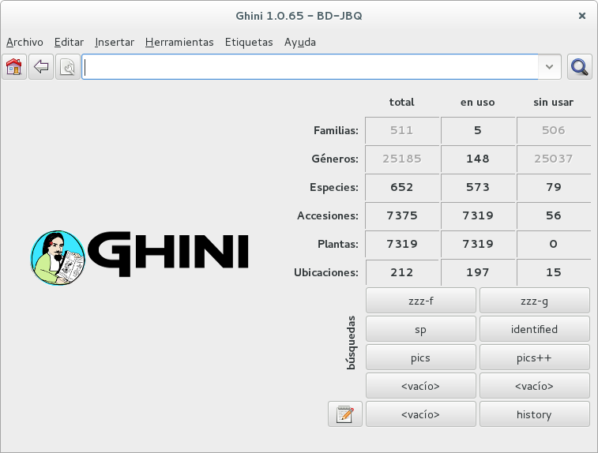
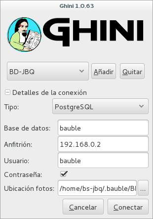
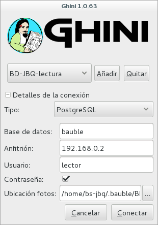
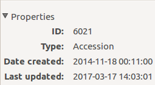

Quito Botanical Garden
==================================================

At the JBQ, Quito Botanical Garden, we have adopted the Ghini software in
April 2015. Since that time, we have accumulated experience with the
program, and we are ourselves in need to document it, in order to secure the
knowledge to the institution. We are happy to share it.

Technical
^^^^^^^^^^^^^^^^^^^^

- We work on GNU/Linux, a platform that many users don't master, and our
  database is inside of a remote database management system. This implies
  steps that are not obvious to the casual end user.

  ..  admonition:: How to start a program
      :class: toggle

         To start a program given its name, hit the |loose_png| key next to Alt, or
         click on |10000000000000300000002F89E0224ADF9EC09E_png|, then start typing
         the name of the program, in our case “Ghini” or just click on the program
         symbol |100000000000003100000031BB54CBDFA885EBAC_png|, appearing near the
         left margin of your display.

  ..  admonition:: Database server
      :class: toggle

         We chose for a centralised PostgreSQL database server. This way we
         are protected from concurrent conflicting changes, and all changes
         are simultaneously available on all ghini clients.  We did need to
         outsource database server management.

  ..  admonition:: adding a new user
      :class: toggle

         Ghini keeps track of the user performing all sort of edits to the
         database, and at the garden, apart from the stable users, we have
         all sorts of temporary users writing to the database, that we
         decided we would let Ghini help us keep track of database events.

         Since we work using PostgreSQL, the users that Ghini stores in the
         database history are the database users, not the system users.

         Each user knows their own password, and only knows that one. Our
         super-user, responsible for the database content, also has the
         ``bauble`` fictional user password, which we only only use to
         create other users.

         We do not use account names like ``voluntario``, because such
         accounts do not help us associate the name to the person.

  ..  admonition:: — adding a new system user (linux/osx)
      :class: toggle

         Adding a system user is not strictly necessary, as ghini does not
         use it in the logs, however, adding a system user allows for
         separation of preferences, configured connections, search history.
         On some of our systems we have a single shared account with several
         configured connections, on other systems we have one account per
         user.

         On systems with one account per user, our users have a single
         configured connection, and we hold the database password in the
         ``/home/<account>/.pgpass`` file.  This file is only readable for
         the ``<account>`` owner.

         On systems with a shared account, the user must select their own
         connection and type the corresponding password.

         These are the steps to add system users::

           sudo -k; sudo adduser test
           sudo adduser test adm; sudo adduser test sudo
           sudo adduser test sambashare; sudo adduser test ghini

  ..  admonition:: — adding a new database user
      :class: toggle

         Ghini has a very minimal interface to user management, it only
         works with postgresql and it very much lacks maintainance.  We have
         opened issues that will allow us use it, for the time being we use
         the ``create-role.sh`` script::

           #!/bin/bash
           USER=$1
           PASSWD=$2
           shift 2
           cat <<EOF | psql bauble -U bauble $@
           create role $USER with login password '$PASSWD';
           alter role $USER with login password '$PASSWD';
           grant all privileges on all tables in schema public to $USER;
           grant all privileges on all sequences in schema public to $USER;
           grant all privileges on all functions in schema public to $USER;
           EOF

         The redundant ``alter role`` following the ``create role`` lets us
         apply the same script also for correcting existing accounts.

         Our ghini database is called ``bauble``, and ``bauble`` is also the
         name of our database super user, the only user with ``CREATEROLE``
         privilege.

         For example, the following invocation would create the user
         ``willem`` with password ``orange``, on the ``bauble`` database
         hosted at 192.168.5.6::

           ./create-role.sh willem orange -h 192.168.5.6

- Understanding when to update

  ..  admonition:: Updating the system
      :class: toggle

         Ubuntu updates are a lot lighter and easier than with Windows. So
         whenever the system suggests an update, we let it do that.
         Generally, there's no need to wait during the update nor to reboot
         after it's done.

  ..  admonition:: Updating ghini
      :class: toggle

         The first window presented by Ghini looks like this. Normally, you
         don't need do anything in this window, just press enter and get
         into the main program screen.

         |10000000000001290000011FEE16D735EB3DBF67_png|

         Occasionally, at the top of the screen an information text will
         appear, telling you that a newer version is available on-line.

         |10000000000001290000011FEE16D735EB3DBF66_png|

         The update procedure is simple, and it depends on the operating
         system you use, we're not explaining here again.

         It is generally a good idea updating the software.  If in doubt,
         contact the author, or write to the group.

- understanding ghini initial screen

  ..  admonition:: Complete screen
      :class: toggle

         At the moment of writing, our initial screen looked like this:

         |100000000000063F00000383F7EAFB008DE6E4E2_png|

         Apart from the main application menu, Ghini offers three special
         interface sections with information and tools to explore the
         database.

  ..  admonition:: Numeric overview
      :class: toggle

         The table in the right half of the screen presents a summary of all
         the registered plants can be observed.  Each entry printed in bold
         is a link to the query selecting the corresponding objects.

         |100000000000018700000173222371085C3C68FE_png|

  ..  admonition:: Stored queries
      :class: toggle

         The lower half of the right hand side contains a set of stored
         queries.  While you can edit them to your liking, our hints include
         selecting those accessions that have not been identified at rank
         species.  And one for the database history.

         |100000000000018700000173222371085C3C68FF_png|

  ..  admonition:: Query and action buttons
      :class: toggle

         At the top of this screen you can find the field in which you would
         enter your searches.

         |10000000000006090000001FA253BB9470AD4994_png|

         - With the |100000000000001C00000020F4C7873186014F2F_png| button,
           in the form of a house, you can return from your searches to the
           main screen.
         - With the |100000000000001B000000207EC6F9075C9D3669_png| button,
           in the form of an arrow, you can return to your last search.
         - With the |100000000000001C0000001FB8A1F75F7A5EF877_png| button,
           in the form of a gear, you can start the "Query Builder", which
           helps you compose complex searches in a simple, graphical way.

- We often have volunteers who only work at the garden for a very short
  time. It was with them in mind that we have developed a `hyper-simplified
  view <goal.html#hypersimplified-view>`_ on the ghini database structure.

  ..  admonition:: Details
      :class: toggle

         The two figures here show all that our temporary collaborators need to know.

         +---------------------------------------------+---------------------------------------------+
         | Taxonomy & Collection                       | Garden                                      |
         +=============================================+=============================================+
         |.. figure:: images/family-to-accession.png   |.. figure:: images/location-to-plant.png     |
         +---------------------------------------------+---------------------------------------------+

- At times, the program gives error messages. |dontpanic_png|, retry, or
  report to the developers.

  ..  admonition:: Network problems
      :class: toggle

         In order to work, the program needs a stable network connection to
         the database server. It can happen: you start the program, and it
         can't connect to our database server. You would then get a rather
         explicit but very badly typeset error message.

         |100000000000020B000000FBCAB1860DB92DF14A_png|

         Just ignore it and try again.

  ..  admonition:: Search fails with error
      :class: toggle

         Sometimes and without any apparent cause, a search will not run
         successfully, and a window with an error message will be
         displayed. In this case you only have to try to perform the same
         search again.

         An example of such an error message:

         |10000000000002140000014D050A059AC7EE948A_png|

  ..  admonition:: Search does not return something I just inserted
      :class: toggle

         Accession codes starting with zero and composed of just numbers, as
         for example ``016489`` are considered by the software as numbers,
         so if you don't enclose the search string in quotes, any leading 0
         will be stripped and the value will not be found.

         Try again, but enclose your search string in single or double
         quotes.

         +-----------------------+------------------------+
         | Number on the label   | corresponding search   |
         +-----------------------+------------------------+
         | 16489                 | '016489'               |
         +-----------------------+------------------------+

         Please note: when you look for a Plant code, not an Accession, the
         leading zero becomes optional, so in the above example it's maybe
         easier to type ``16489.1``.

- A serious situation happened once, and we absolutely want to prevent it
  from happening again: a user deleted a genus, with everything that was
  below it, species and accessions, and synonyms.

  ..  admonition:: Solving it with user permissions
      :class: toggle

         We propose to have different connection profiles, associated to
         different database users, each user with all needed permissions.

         Full permission (BD-JBQ)
           Only qualified personnel get this kind of access.

         Insert and update (BD-JBQ-limitado)
           We use this one for those users who come help us for a
           limited time, and who did not get a complete introduction to database
           concepts. It is meant to prevent costly mistakes.

         Read only (BD-JBQ-lectura)
           it can be shared with anyone visiting the garden

         You select the connection at start-up, and the software asks you
         for the password corresponding to the connection you selected.

         |10000000000000FE00000065C64D791B5CA0099D_png|

         If you want to review the details of the connection, click on the ▶
         next to 'Connection Details', it will change to ▼, and the
         connection window will be displayed as one of the following:

         ============================================== ============================================== ==============================================
         |100000000000012F000001A611615FB62F2D003B_png| |100000000000012F000001A611615FB62F2D003D_png| |100000000000012F000001A611615FB62F2D003C_png|
         ============================================== ============================================== ==============================================

         As you can see, we are connecting to the same database server, each
         connection uses the same database on the server, but with different
         user.

  ..  admonition:: Thinking further about it
      :class: toggle

         On the other hand, we are questioning if it is at all appropriate,
         letting any user delete something at such high level as a family,
         or a genus, or, for that matters, of anything connected to
         accessions in the collection.

         The ghini way to question the software features, is by opening a
         `corresponding issue
         <https://github.com/Ghini/ghini.desktop/issues/218>`_.

- When contacting the developers, they will definitely ask for technical
  information, or at least to see a screen-shot.  Help them help you.

  ..  admonition:: Taking a screen-shot
      :class: toggle

         On Linux there are three ways to create a screen-shot, all involve
         hitting the 'PrtSc' key.  The most practical one is possibly
         hitting the 'PrtSc' key in combination with Ctrl and Shift. This
         will start an interactive screen copy tool. You select a rectangle
         and the area is copied in the clipboard.  Paste it in the email
         you're writing, or in the chat line where the developers are trying
         to help you.

  ..  admonition:: Where are the logs
      :class: toggle

         Ghini continuously saves a very informative log file, in the
         ``~/.bauble/bauble.log`` file.  Don't bother opening it, just send
         it over.  It contains loads of technical information.

  ..  admonition:: Continuous unmanned alerting
      :class: toggle

         An other option is to activate the sentry handler. It will notify
         our sentry server of any serious situations in the software.  If
         you registered, the developers will know how to contact you if
         necessary.

         To the healthy paranoid: we're not monitoring what you're doing,
         we're monitoring how our software works.  You can always opt out.

         You activate the Sentry handler in the ``:prefs`` page: look for
         the row with name ``bauble.use_sentry_handler``, if the value is
         not what you wish, double click on the line and it will change to
         the other value.

Taxonomy
^^^^^^^^^^^^^^^^^^^^

- Introduction

  ..  admonition:: Orchidaceae taxonomic complexity
      :class: toggle

         At the JBQ, we work most of all with orchids, family Orchidaceae, one of the
         largest plant families, with no less than 850 genera, organized —according
         to Dressler— in approximately 70 subtribes, 22 tribes, 5 subfamilies.  How
         we represent this information is not obvious and needs be explained.

         The taxonomy of the Orchidaceae family is continuously being reviewed.
         Genera get added, refused, reorganized, recognized as synonyms, some
         taxonomists prefer grouping species or genera in a new way, others split
         them again and differently, botanists of different nationalities may have
         different views on the matter.  All this sounds very complex and
         specialistic, but it's part of our daily routine, and it can all be stored
         in our Ghini database.

- Identifying at rank Genus, or Family

  ..  admonition:: At rank genus
      :class: toggle

         Ghini-1.0 prescribes that an accession is identified at rank
         species, in all cases. The current maintainer acknowledges that
         this is a mistake, coming from the early Bauble days, and which
         Ghini-1.0 has in common with other botanic software. Until this is
         fixed, we rely on established practices.

         If an accession is identified at rank genus, we add a fictive
         species in that genus, we don't specify its species epithet (we
         don't know that) and we add an unranked epithet in the
         infraspecific information section, like this:

         .. figure:: images/genus_sp-editing.png

         When displayed in a search result, it shows like this:

         .. figure:: images/genus_sp-explained.svg

  ..  admonition:: At rank family
      :class: toggle

         If an accession is only identified at rank family, we need a
         fictive genus, to which we can add the fictive species. Since our
         garden is primarily focusing on Orchidaceae, we use the very short
         name **Zzz** for the fictive genus within the family, like this:

         .. figure:: images/zzz-explained.svg

         The current maintainer suggests to use the prefix **Zzz-** and
         behind the prefix to write the family name, possibly removing the
         trailing **e**.  Removal of the trailing **e** is useful in order
         not to get results that include genus names when you as for stuff
         ending in **aceae**.

         Apart from the aforementioned **Zzz** genus in the Orchidaceae
         family, we follow this suggested practice, so for example our
         collection would include *Zzz-cactacea* or *Zzz-bromeliacea*.

         Remember: our **Zzz** genus is a fictive genus in the
         **Orchidaceae** family, do not use it as unspecified genus in other
         families.

- Identifying at a rank that is not allowed by the software (eg: Subtribe, or Subfamily)

  ..  admonition:: At rank subtribe
      :class: toggle

         We sometimes can't identify a taxon at rank genus, but we do manage
         to be more precise than just "it's an orchid". Quite often we are
         able to indicate the subtribe, this is useful when you want to produce
         hybrids.

         The software does not let us store ranks which are intermediate
         between family and genus, so we need to invent something, and this
         is what we do:

         We insert a fictive genus, naming it as the subtribe, prefixing it
         with 'Zzx-', like in this example:

         .. figure:: images/tribe_sp-explained.svg

         This Zzx-Laeliinae is some genus in the Laeliinae subtribe.

         In order to be able to select genera by subtribe, we also add a
         note to the Zzx-Laeliinae fictive genus as well as for all real
         genera in that subtribe, note category subtribus, note value the
         subtribe name.

         This allows for queries like:

         ``genus where notes.note=Laeliinae``

         We are very much looking forward to seeing that `issue-9
         <https://github.com/Bauble/bauble.classic/issues/9>`_ solved!

  ..  admonition:: At rank subfamily, tribe
      :class: toggle

         Just as we reserved the prefix Zzx- for subtribe, we reserve the
         prefixes Zzy- for tribe, Zzw- for subfamily.

         In particular, the subfamily information is relevant, because there
         are subfamilies within the Orchidaceae family which are not further
         separated.

- Editing the Accession identification - the Species details

  ..  admonition:: Placeholder species for individual accessions
      :class: toggle

         Scenario one describes the identification of a single accession,
         which had been associated to a "generic", placeholder species,
         something like “*Zzz* sp” or “*Vanda* sp”;

         In this case, when the plant species becomes known, we change the
         association in the accession, selecting a different species.

         .. figure:: images/accession-vanda_sp.png

         We do not edit the species, because there might be totally
         unrelated accessions connected to the same placeholder species.

  ..  admonition:: Unknown species for multiple accessions
      :class: toggle

         A different case is when we have a whole batch of accessions, all
         obviously the same species, but we haven't been able to identify it. In
         this case, we associate the accessions with an incompletely specified
         species, something like “*Zzz* sp-59”, preferably adding the taxonomist's
         name, who made the association.

         A species like “*Vanda* sp-018599” is not a placeholder species,
         it is a very concrete species, which we haven't yet identified.

         .. figure:: images/genus_sp_author-editing.png

         In this case, when the species gets identified (and it could even be a
         species nova), we directly edit the species, so all accessions that refer
         to it get the change.

- A new plants is relative to a species not yet in our collection.

  ..  admonition:: Last minute species
      :class: toggle

         We start this from the Accession window and it's very simple, just
         click on the **+** next to the species name, we get into the
         Species window.

- Adding a species and using online taxonomic services

  ..  admonition:: Adding a new species — the plant list.
      :class: toggle

         We start the obvious way: type the genus epithet, possibly select
         it from the completion list, then type the species epithet, or at
         least your best guess.

         .. image:: images/tpl-1-best_guess.png

         Next to the species epithet field there's a small button,
         |green_ball|, which connects us to the plant list.  Click on it, a
         message area appears at the top of the window.

         .. image:: images/tpl-2-querying.png

         Depending on the speed of your internet connection, but also on how
         close your best guess is to a correct published name, the top area
         will change to something like this:

         .. image:: images/tpl-3-results.png

         Accept the hint and it will be as if you had typed the data yourself.

         .. image:: images/tpl-4-accepted.png

  ..  admonition:: Reviewing a whole selection — TNRS.
      :class: toggle

         This is described in the manual, it's extremely useful, don't
         forget about it.

Let the database fit the garden
^^^^^^^^^^^^^^^^^^^^^^^^^^^^^^^^^

- A never-ending task is reviewing what we have in the garden and
  have it match what we have in the database.

  ..  admonition:: Details
      :class: toggle

         When we adopted ghini, we imported into it all that was properly
         described in a filemaker database. That database focused solely on
         Orchids and even so it was far from complete.  In practice, we
         still meet labeled plants in the garden which have never been
         inserted in the database.

         From time to time, we manage to get resources to review the garden,
         comparing it to the collection in the database, and the main
         activity is to insert accession codes to the database, take
         pictures of the plant in question, and note its location, all tasks
         that are described in the remainder of this section.

- Naming convention in garden locations

  ..  admonition:: Details
      :class: toggle

         ========== ======================================================
         code       description
         ========== ======================================================
         CAC-B *x*  Reserved to cactus plants next to the orchids 
                    exposition glasshouses.
         ---------- ------------------------------------------------------
         CRV:       Nepenthaceae exibition
         ---------- ------------------------------------------------------
         IC-*xx*:   orquidearios de calor en el jardín (1A a 9C son
                    lugares especificos entre del orquideario)
         ---------- ------------------------------------------------------
         IF-xx:     orquidearios de frío en el jardín (1A a 5I son
                    lugares específicos dentro del orquideario)
         ---------- ------------------------------------------------------
         INV1:      invernadero 1 (calor)
         ---------- ------------------------------------------------------
         INV2:      invernadero 2 (frío)
         ---------- ------------------------------------------------------
         INV3:      invernadero 3 (calor)
         ========== ======================================================

- Adding an Accession for a Plant

  Obviously we keep increasing our collection, with plants coming from
  commercial sources, or collected from the wild, more rarely coming from
  expeditions to remote areas of our country, or we receive plants which
  were illegally collected.

  Sometimes we have to add plants to the digital collection, just because we
  have them physically, found in the garden, with or without its label, but
  without their digital counterpart.

  ..  admonition:: Existing plant, found in the garden with its own label
      :class: toggle

         This activity starts with a plant, which was found at a specific
         garden location, an accession label, and the knowledge that the
         accession code is not in the database.

         .. image:: images/plant.png

         .. image:: images/target.png

         .. image:: images/accession-008440.png

         |1000000000000257000000504EC4536B148C3228_png|

         For this example, let's assume we are going to insert this
         information in the database.

         ========== ============================ ========================
         Accession  Species                      Location
         ========== ============================ ========================
         008440     *Dendrobium* ×'Emma White'   Invernadero 1 (calor)
         ========== ============================ ========================

         We go straight into the Accession Editor, start typing the species
         name in the corresponding field.  Luckily, the species was already
         in the database, otherwise we would use the **Add** button next to
         the entry field.

         .. image:: images/accession-select_taxon.png

         We select the correct species, and we fill in a couple more fields,
         leaving the rest to the default values:

         ============= ================= ========= =============
         Accession ID  Type of Material  Quantity  Provenance
         ============= ================= ========= =============
         008440        Plant             1         Unknown
         ============= ================= ========= =============

         After this, we continue to the Plant editor, by clicking on **Add
         Plants**.

         We do not fill in the Accession's "**Intended Locations**", because
         we don't know what was the original intention when the plant was
         first acquired.

         In the Plant Editor, we insert the Quantity and the Location.  And
         we're done.

         The plant is now part of the database:

         |10000000000001D5000000C7CF644BA0B1AB3FFF_png|

  ..  admonition:: New accession: plant just entering the garden
      :class: toggle

         This activity starts with a new Plant, just acquired from a known
         Source, a plant label, and an intended Location in the garden.

         We mostly do the same as for the case that a plant is found in the
         garden, there are two differences: (1) we know the source of the
         plant; (2) acquiring this plant was a planned action, and we intend
         to place it at a specific location in the garden.

         Again, we go straight into the Accession Editor, start typing the
         species and we either select if from the completion list or we add
         it on the fly.

         ============= ================= ========= ============
         Accession ID  Type of Material  Quantity  Source
         ============= ================= ========= ============
         033724        Plant             1         specified
         ============= ================= ========= ============

         After this, we continue to the Plant editor, by clicking on **Add
         Plants**.

         In the Plant Editor, we insert the Quantity and the Location.

         Please note that the plant may be initially placed in a greenhouse,
         before it reaches its intended location in the garden.

  ..  admonition:: Existing plant, found in the garden without its label
      :class: toggle

         When this happens, we can't be sure the plant had never been in the
         collection, so we act as if we were re-labeling the plant.  This is
         discussed in the next section, but we fall back to the case of a
         new accession.

- When we physically associate a label to a plant, there's always the chance
  that something happens either to the plant (it may die) or to the label
  (it may become unreadable), or to the association (they may be
  separated). We have software-aided protocols for these events.

  ..  admonition:: We find a dead plant
      :class: toggle

         Whenever a plant is found dead, we collect its label and put it in a box
         next to the main data insertion terminal, the box is marked “dead plants”.

         Definitely at least once a week, the box is emptied and the database is
         updated with this information.

         Dead plants aren't *removed* from the database, they stay there but get a
         **quantity** zero. If the cause of death is known, this is also written in
         the database.

         Please once again remember that a **Plant** is not an **Accession** and
         please remember we do not remove objects from the database, we just add to
         their history.

         Insert the complete plant code (something like ``012345.1``, or
         ``2017.0001.3``, and you don't need leading zeros nor quotes), right click
         on the corresponding row, and click on **edit**. change the quantity to 0,
         fill in the reason and preferably also the date of change.

         If you need add any details about the plant death, please use a
         **note**, and re-use the note category "death_cause".

         Plants with **quantity** zero are shown with a different colour in
         the results view.  This helps distinguish them from live plants.

  ..  admonition:: We find a plant without a label
      :class: toggle

         We can't be sure the plant had ever been in the collection or not.
         We assume it had, and that its label was lost.

         Losing a plant label is unfortunate, but it just sometimes happens.
         What we do is to put a new label to the plant, and to clearly state
         that the label is a replacement of an original one.

         We then handle the case as if it was a new accession, plus we add a
         note to the accession, category “label”, text “relabeled”.

- Keeping track of different sources of plant material

  ..  admonition::  What different sources we can have
      :class: toggle

         In this botanical garden, we receive plants from different types of
         origin. It could be from expeditions (plants coming from nature,
         collected with legal permission from MAE - Ecuadorian Environment
         Ministry), donated plants mostly coming as gifts from
         collectors or orchid commercialization enterprises, purchased,
         or confiscated plants (usually coming from MAE raids around the
         country).

  ..  admonition::  If the plant comes from a wild source
      :class: toggle

         The accession editor offers the option "origin" option. When a
         plant is traceable to a wild source, we can specified its specific
         origin. We want to comply with ITF2, and ghini-1.0 only partly
         respects that standard. The ITF2 complying options are:

         - Wild: Accession of wild source.
         - Cultivated: Propagule(s) from a wild source plant.
         - Not Wild: Accession not traceable to a wild source.
         - Insufficient data

         In the case of a donated plant, it is better to put detail information
         just as a note in the plant accession; in the case of a plant with an
         unknown origin, we select the Insufficient data option.

  ..  admonition::  Using the source tab in the accession editor
      :class: toggle

         In this section we can create or use a contact, our source of plant
         material. It could be from an expedition to a collecting place, and
         in this case we would specify the region and the expedition name,
         or could be the name of the person or enterprise donating a
         specific batch of plants.

         .. image:: images/accession-source-collection.png

         Once you choose or create the contact information, this section
         deploys more options, here you can specify the region, where you
         can choose the country of origin, and a specific location within
         the region, georeferencing information (including the GPS data),
         habitat description collector name. For the last one, I recommend
         also to write the specific date next to the collector name
         (eg. Luis Baquero 11/10/2016).

  ..  admonition::  Donated, bought or confiscated plants
      :class: toggle

         However useful for expeditions or for donors where the main
         information is geographic, this source tab is not very practical in
         our remaining cases: we handle three more categories: confiscated,
         purchased and donated, for these categories the options available in
         the source tab do not apply: too much information and not to the point.

         In these cases, we add a set of notes, according to the case.

  ..  admonition::  — Donated plants
      :class: toggle

         If the plant was donated by individual, we add the individual among
         our contacts and specify it as source, then we add the notes:

         =================================== ======================================
         category                            text
         =================================== ======================================
         source-type                         gift
         source-detail                       Contribución científica al JBQ
         =================================== ======================================

  ..  admonition::  — Bought plants
      :class: toggle

         If the plant was bought, we add the previous owner among our
         contacts and specify it as source, then we add the notes:

         =================================== ======================================
         category                            text
         =================================== ======================================
         source-type                         purchase
         source-detail                       optional, free text
         factura                             the invoice number
         =================================== ======================================

  ..  admonition::  — Confiscated plants
      :class: toggle

         If the plant was confiscated, we add the previous owner among our
         contacts and specify it as source, then we add the notes:

         =================================== ========================================
         category                            text
         =================================== ========================================
         source-type                         confiscated
         source-detail                       possibly, legal details, law number ...
         =================================== ========================================

- Producing or reproducing labels

  ..  admonition:: Refreshing plant labels
      :class: toggle

         Sometimes we refresh the labels, for example all that is in a
         greenhouse, or maybe just a set of plants because their labels risk
         becoming unreadable.

         In the first case it's easy selecting all plants in the Location,
         we just type the location name, or give the search ``location like
         <location name>``.

         The second case it's a bit trickier.  What we do is to create a
         temporary **Tag**, and use it to tag all plants that were found in
         need for a new label.

         Given the selection, we start the report tool, using the mako
         ``accession-label.svg`` template.  We reset its options to default
         values, and since we're using a simple printer, we set the colour
         to ``black`` instead of ``blue``, which is meant for engraving.

  ..  admonition:: Preparing labels for non-database plants
      :class: toggle

         To prepare the batch of 72 labels, we use a mako report template,
         named ``accession-label.svg``.  This template accepts parameters,
         this is an example that would produce labels from 025801 all the
         way to 025872.

         .. image:: images/label-batch_72.png

         Labels come for us in two flavours: (1) either new plants just
         being acquired by the garden; (2) or plants in the garden, found
         without a label. We distinguish the two cases by adding a 'ret'
         extra text for relabeled plants.

         We keep two boxes with labels of the two types, ready to be used.

- Our garden has two exposition greenhouses, and several warm and cold
  greenhouses where we keep the largest part of our collection.  Plants are
  moved to the exposition when flowering and back to the "warehouse" when
  less interesting for the exposition. For each plant in our collection we
  need to know its current locations and history of movements.

  ..  admonition:: Planned action
      :class: toggle

         The action starts by moving the plants around, and collecting the
         plant code either on paper, or in our mobile app, if we had one.

         We then go to the desktop terminal and revise all plants one by one
         changing their location in the database.  It is important that the
         date of the location change is correctly memorized, because this
         tells us how long a plant stays in the exposition.

         If we had a mobile app, we would just upload the info to the server
         and we would be done.

  ..  admonition:: Ex-post correction
      :class: toggle

         While revising the garden, we find a plant at a location that is not what
         the database says.  We update the database information.

         For example, the plant belonging to accession “012142”, species “*Acineta*
         sp”, was found in “Invernadero 1”, while the database says it is in “ICAlm3”.

         All we do is find the Plant in the database and update its information.  We
         do not change anything in the initial Accession information, just the current
         Plant information.

         We type the accession code in the search entry field, with quotes, hit
         enter. The search results now shows the accession, and it tells us how many
         plants belong to it.  Click on the squared **+** in the results row, so we
         now also see a row for the plant belonging to the accession.

         Right click on the Plant row, the three options will show: “Edit, Split,
         Delete”, select Edit, you land in the Plant Editor.

         Just correct the Location field, and click on OK.

         The InfoBox contains information about the last change to the
         object:

         |1000000000000608000002D2BA2D181475D5AD7B_png|

         For plants, even more interesting, it builds a history of changes,
         list that includes Location changes, or Quantity changes.

         .. image:: images/1000000000000608000002D2BA2D181475D5AD7C.png

- As plants enter the flowering stage, we can review their identification
  directly, or we take pictures of details of the flower, hoping that a
  visiting specialist could help completing the identification.

  ..  admonition:: Adding pictures
      :class: toggle

         We are practicing with ODK Collect, a small program running on
         hand-held android devices.  Ghini's use of ODK Collect hasn't yet
         frozen to a best practice.  Do have a look at the `corresponding
         issue <https://github.com/Ghini/ghini.desktop/issues/243>`_ on
         github.

- Regularly, we need producing reports about our collection that the
  Ecuadorian Environment Ministry (MAE) requires and that justify the very
  existence of the garden.

  ..  admonition:: Producing reports
      :class: toggle

         Each year the botanic garden has to submit a report (annual report
         of management and maintenance of orchids collection) complying to
         the requirements of the Ecuadorian Ministry of the Environment.

         To this end, we start selecting the plants we have to include in the report.
         It might be all acquisition in the past year::

           accession where _created between |datetime|2017,1,1| and |datetime|2018,1,1|

         or all plants within a location, or all plants belonging to a
         species, or just everything (but this will take time)::

           plant where location = 'abc'
           plant where accession.species.epithet='muricata' and accession.species.genus.epithet='Annona'
           plant like %

         Having selected the database objects which we want in the report,
         we start the report tool, which acts on the selection.

Searching the database
^^^^^^^^^^^^^^^^^^^^^^^^^^^^^^

You search the database in order to edit the data further, or because you
want to produce a report. Anyway you start with typing something in the
search field

|10000000000006090000001FA253BB9470AD4994_png|

and you hope to see your result in the search result view.

  ..  admonition:: Search in order to edit (plant or accession)
      :class: toggle

         When searching in order to edit, you want to be very specific, and select as
         few objects as possible. The most fine-tuned search is the one based on
         plant number: you know the code, you get one object.

         If your plant is not there, the screen would look like this:

         .. image:: images/plant-017701-not_found.png

         Other example, plant ``007701.1`` is in the database:

         .. image:: images/plant-007701-found.png

         All fields with a darker background in the infobox on the right
         hand side are hyperlinks to other objects in the database. Clicking
         on them will either replace the text in the search field and
         execute the query, or will simply add the object to the results.

         Clicking on the accession does the latter.

         .. image:: images/plant-007701-accession.png

         We now have both Plant or Accession in the search result view and
         we can now edit either or both.

  ..  admonition:: Search in order to report
      :class: toggle

         When searching in order to create a report, you want to be both
         specific (you don't want to report about irrelevant objects) and
         broad (you don't want to report about a single object).

         Sometimes the report itself suggests the query, as for example: all
         plants in greenhouse 3; or: all plants belonging to endangered
         species (we store this information in a note associated to the
         species); or: all plants added to the collection this year; ::

           plant where location.code = INV3
           plant where accession.species.notes.note="endangered"
           plant where accession._created > |datetime|2017,1,1|

         Otherwise a flexible way to achieve this is to work with **Tags**.

  ..  admonition:: Using **Tags** as enhanced searching
      :class: toggle

         Sometimes we have to take the same action on objects of the same
         type, but we don't manage to quickly think of a search query that
         would group all that we need and exclude all we do not need.

         This is one possible use of **Tags**.  We start with a selection,
         we tag all objects in the selection under a new temporary
         tag. Let's say we call it "temporary".

         We continue searching and adding objects to the temporary tag until
         the tag identifies all that we need.

         Finally from the Tags menu we select the one we just created (in
         our example this corresponds to the search ``tag="temporary"``) and
         we can invoke the report.

         When we're done with a temporary tag, there's no point in leaving
         it around, so we just delete it.

         .. image:: images/tag-delete.png

  ..  admonition:: Be aware of the available search strategies
      :class: toggle

         This is nicely documented, "più non dimandare" and `read the docs
         <searching.html>`_.

.. |10000000000006090000001FA253BB9470AD4994_png| image:: images/10000000000006090000001FA253BB9470AD4994.png
    :width: 470px
    :height: 31px

.. |1000000000000257000000504EC4536B148C3228_png| image:: images/1000000000000257000000504EC4536B148C3228.png

.. |10000000000002F8000002432C9DDC622203371C_png| image:: images/10000000000002F8000002432C9DDC622203371C.png
    :width: 7.447cm
    :height: 5.674cm

.. |100000000000003100000031BB54CBDFA885EBAC_png| image:: images/100000000000003100000031BB54CBDFA885EBAC.png
    :width: 38px
    :height: 38px

.. |10000000000001290000011FEE16D735EB3DBF66_png| image:: images/10000000000001290000011FEE16D735EB3DBF66.png
    :width: 6.832cm
    :height: 6.602cm

.. |1000000000000293000001C3EC6A9DC0A1D0CA68_png| image:: images/1000000000000293000001C3EC6A9DC0A1D0CA68.png
    :width: 7.489cm
    :height: 5.126cm

.. |100000000000012F000001A611615FB62F2D003D_png| image:: images/100000000000012F000001A611615FB62F2D003D.png
    :width: 5.741cm

.. |100000000000018700000173222371085C3C68FE_png| image:: images/100000000000018700000173222371085C3C68FE.png
    :width: 8.26cm

.. |100000000000018700000173222371085C3C68FF_png| image:: images/100000000000018700000173222371085C3C68FF.png
    :width: 8.26cm

.. |10000000000000300000002F89E0224ADF9EC09E_png| image:: images/10000000000000300000002F89E0224ADF9EC09E.png
    :width: 38px
    :height: 38px

.. |100000000000001B000000207EC6F9075C9D3669_png| image:: images/100000000000001B000000207EC6F9075C9D3669.png
    :width: 20px
    :height: 20px

.. |dontpanic_png| image:: images/dontpanic.png

.. |loose_png| image:: images/windows-key.png
   :width: 28px
   :height: 28px

..  LocalWords:  Ghini
